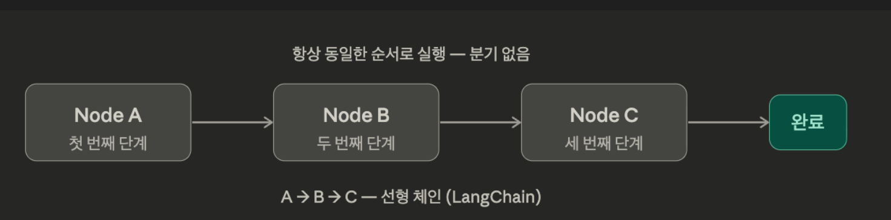
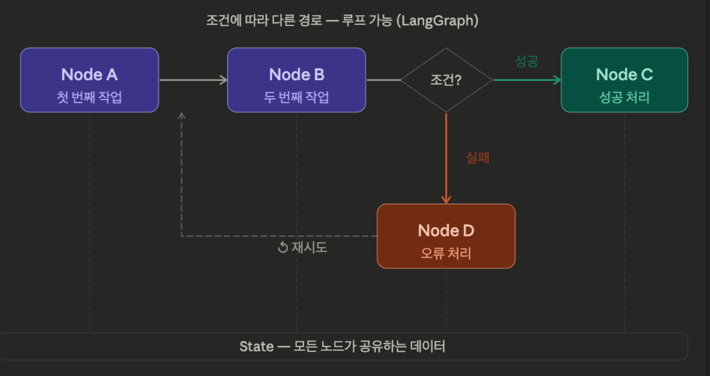

## Chain의 한계

LCEL Chain은 **직선 파이프라인**이다.

```
입력 → A → B → C → 출력
```

이 구조에서 **불가능한 것**들이 있다.

| 한계 | 설명 | 예시 |
| --- | --- | --- |
| **조건 분기** | 중간에 경로를 나눌 수 없음 | 환불 요청이면 A, 일반 문의면 B |
| **반복** | 이전 단계로 돌아갈 수 없음 | 검색 결과 부족 시 질문 바꿔서 재검색 |
| **상태 관리** | 여러 단계에 걸친 중간 결과 누적 불가 | 리서치 → 누적 → 추가 리서치 → 종합 |
| **사람의 개입** | 중간에 멈추고 확인 받을 수 없음 | 결제 전 사람의 승인 대기 |

### 억지로 구현하면

"검색 결과가 부족하면 질문을 바꿔서 다시 검색"하는 로직을 Chain으로 시도해보자.

```python
from langchain_chroma import Chroma
from langchain_openai import OpenAIEmbeddings, ChatOpenAI
from langchain_core.prompts import ChatPromptTemplate
from langchain_core.output_parsers import StrOutputParser
from langchain_core.runnables import RunnablePassthrough

embeddings = OpenAIEmbeddings(model="text-embedding-3-small")
llm = ChatOpenAI(model="gpt-4o-mini", temperature=0)

vectorstore = Chroma(
    embedding_function=embeddings,
    collection_name="spri_ai_brief",
    persist_directory="./chroma_db",
)
retriever = vectorstore.as_retriever(search_kwargs={"k": 3})

def format_docs(docs):
    return "\n\n".join(doc.page_content for doc in docs)
```

```python
from langchain_core.messages import HumanMessage

question = "AI 반도체 시장의 전망은?"
max_retries = 3

for attempt in range(max_retries):
    docs = retriever.invoke(question)
    context = format_docs(docs)

    check = llm.invoke([
        HumanMessage(
            content=f"질문: {question}\n\n검색 결과:\n{context}\n\n"
            "이 검색 결과가 질문에 답변하기에 충분한가? 'yes' 또는 'no'로만 답해."
        )
    ])

    print(f"[시도 {attempt + 1}] 질문: {question}")
    print(f"  충분한가? {check.content}")

    if "yes" in check.content.lower():
        break

    rewrite = llm.invoke([
        HumanMessage(
            content=f"'{question}'이라는 질문으로 문서를 검색했지만 충분한 결과가 없었다. "
            "같은 의도이지만 다른 표현으로 질문을 다시 작성해줘. 질문만 출력해."
        )
    ])
    question = rewrite.content

print(f"\n→ Chain 밖에서 Python 루프로 제어하고 있다.")
print("→ Chain의 장점(재사용, 스트리밍, 트레이싱)을 잃는다.")
```

## Workflow vs Agent

AI 애플리케이션의 제어 방식은 **스펙트럼** 위에 있다.

```
개발자가 흐름 결정                                    LLM이 흐름 결정
├──────────────────────────────────────────────────────────┤
Chain       Workflow        Agent           Autonomous Agent
(직선)       (분기+루프)     (LLM이 판단)            (완전 자율)
```

| 방식 | 제어 주체 | 예시 |
| --- | --- | --- |
| **Chain** | 개발자가 모든 흐름을 고정 | 번역 → 요약 → 출력 |
| **Workflow** | 개발자가 분기/루프 설계 | 검색 결과 부족하면 재검색 |
| **Agent** | LLM이 다음 행동을 결정 | 어떤 Tool을 몇 번 쓸지 LLM이 판단 |

Chain은 스펙트럼의 가장 왼쪽이다. **LangGraph는 이 스펙트럼 전체를 구현할 수 있는 프레임워크**다.

## LangGraph 핵심 개념

LangGraph는 3가지 개념으로 구성된다.

| 개념 | 역할 | 비유 |
| --- | --- | --- |
| **State** | 전체 흐름에서 공유하는 데이터 | 칠판 — 모든 노드가 읽고 쓸 수 있음 |
| **Node** | 각 처리 단계 (Python 함수) | 작업자 — State를 받아서 처리하고 결과를 돌려줌 |
| **Edge** | 노드 간의 연결 | 화살표 — 다음에 어떤 노드로 갈지 결정 |





## 설치

`# uv add langgraph`

## 기본 그래프

LLM 하나를 노드로 사용하는 가장 기본적인 그래프를 만들어보자.

```
START → chatbot → END
```

### State 정의

State는 그래프 전체에서 공유하는 데이터 구조다. `TypedDict`로 정의한다.

`TypedDict`는 Python 표준 라이브러리(`typing`)에 포함된 타입으로, **딕셔너리의 키와 값 타입을 명시**할 수 있다.

```python
# 일반 dict — 어떤 키가 있는지, 값이 무슨 타입인지 알 수 없음
state = {"name": "홍길동", "age": 30}

# TypedDict — 키 이름과 타입이 명확
class State(TypedDict):
    name: str
    age: int
```

런타임에는 일반 `dict`와 동일하게 동작하지만, IDE 자동완성과 타입 검사를 지원한다.

잘 모르겠으면 State, Annotated = Langgraph 문법이다. 라고 생각하자.

```python
from typing import Annotated, TypedDict
from langgraph.graph import StateGraph, START, END
from langgraph.graph.message import add_messages

class State(TypedDict):
    messages: Annotated[list, add_messages]
```

`Annotated[list, add_messages]`는 **reducer** 패턴이다.

**Reducer**란 "이전 값과 새 값을 받아서 합치는 함수"다. 값을 덮어쓰는 대신, **어떻게 합칠지**를 정의한다.

```
reducer(기존 값, 새 값) → 합쳐진 값
```

`Annotated`의 두 번째 인자가 이 reducer 함수 역할을 한다.

- `list` = 타입
- `add_messages` = reducer 함수 — 이 필드가 업데이트될 때 **덮어쓰기가 아니라 추가**

```python
# reducer 없음 (기본 동작: 덮어쓰기)
messages: list  # {"messages": [새 메시지]} → 기존 메시지 사라짐

# reducer 있음 (add_messages)
messages: Annotated[list, add_messages]  # {"messages": [새 메시지]} → 기존 + 새 메시지
```

### Node 정의

노드는 **Python 함수**다. State를 받아서 업데이트할 내용을 반환한다.

```python
from langchain_openai import ChatOpenAI

llm = ChatOpenAI(model="gpt-4o-mini", temperature=0)

def chatbot(state: State):
    return {"messages": [llm.invoke(state["messages"])]}
```

노드 함수의 패턴은 항상 동일하다.

1. `state`를 인자로 받는다
2. state에서 필요한 데이터를 꺼내 처리한다
3. 업데이트할 필드를 dict로 반환한다

반환된 dict는 State에 **병합**된다. `messages`에 `add_messages` reducer가 있으므로 기존 메시지에 새 메시지가 추가된다.
즉 chatbot을 사용하면 기존의 메시지에 추가된 메시지가 담긴 state가 나온다는 것.

### Graph 구성 + Edge 연결

```python
# 그래프 생성
graph_builder = StateGraph(State)

# 노드 추가 (이름, 함수)
graph_builder.add_node("chatbot", chatbot)

# 엣지 추가
graph_builder.add_edge(START, "chatbot")  # 시작 → chatbot
graph_builder.add_edge("chatbot", END)    # chatbot → 종료

# 컴파일
graph = graph_builder.compile()
```

순서를 정리하면:

1. `StateGraph(State)` — State 스키마로 그래프 생성
2. `add_node(이름, 함수)` — 노드 등록
3. `add_edge(출발, 도착)` — 노드 간 연결
4. `compile()` — 실행 가능한 그래프로 변환
하나의 그래프로 변환. 이후 이걸 실행하게 된다.

### 시각화

LangGraph는 그래프 구조를 이미지로 시각화할 수 있다.

`IPython.display`는 Jupyter 노트북 전용 모듈이다. 일반 Python 스크립트에서는 파일로 저장해야 한다.

```python
# .py 파일에서 사용할 경우
png_data = graph.get_graph().draw_mermaid_png()
with open("graph.png", "wb") as f:
    f.write(png_data)
```

### 실행

메시지는 `.from_messages()`처럼 `(역할, 텍스트)` 튜플로 사용할 수 있다.

| 튜플 | 변환 결과 |
| --- | --- |
| `("human", "안녕")` | `HumanMessage(content="안녕")` |
| `("ai", "반가워")` | `AIMessage(content="반가워")` |
| `("system", "너는 봇")` | `SystemMessage(content="너는 봇")` |

결과의 각 메시지 객체는 `.type` 속성으로 종류를 확인할 수 있다. (`"human"`, `"ai"`, `"system"`)

```python
result = graph.invoke({"messages": [("human", "LangGraph가 뭐야?")]})

for msg in result["messages"]:
    print(f"{msg.type}: {msg.content[:200]}")
```

현재 graph는 start → chatbot → end로 이루어진 그래프임. 그래서 “message”가 start, chatbot, end에 각각 순차적으로 들어가게 됨. 단, 현재 start, end는 별 기능 없이 그냥 시작 종료임.

Langgraph는 휴먼메시지, AI메시지 이렇게 쓰기 보다는 튜플 형태로 (“human”, “메시지”) 이렇게 쓰면 알아서 변환해주는데, 이런 문법을 선호함.

## 그래프: 조건부 분기

Chain에서 불가능했던 **조건 분기**를 구현해보자.

시나리오: 사용자 입력의 언어를 감지해서 한국어면 한국어로, 영어면 영어로 답변하는 그래프.

```
START → detect_language → 한국어? → answer_ko → END
                          영어?  → answer_en → END
```

```python
class RouterState(TypedDict):
    question: str
    language: str
    answer: str
```

```python
def detect_language(state: RouterState):
    question = state["question"]
    result = llm.invoke(f"다음 문장의 언어가 한국어면 'ko', 영어면 'en'으로만 답해: {question}")
    return {"language": result.content.strip().lower()}

def answer_ko(state: RouterState):
    result = llm.invoke(f"한국어로 답변해줘: {state['question']}")
    return {"answer": result.content}

def answer_en(state: RouterState):
    result = llm.invoke(f"Answer in English: {state['question']}")
    return {"answer": result.content}
```

`add_edge`는 다음 노드가 고정되어 있지만, `add_conditional_edges`는 **함수의 반환값에 따라 다음 노드가 결정**된다.

```python
# 고정 연결
add_edge("A", "B")  # A 다음은 항상 B

# 조건부 연결
add_conditional_edges(
    "A",              # 출발 노드
    routing_function,  # State를 받아 문자열을 반환하는 함수
    {                  # 반환값 → 도착 노드 매핑
        "go_b": "B",
        "go_c": "C",
    },
)
```

```python
def route_by_language(state: RouterState):
    """language에 따라 다음 노드를 결정하는 라우팅 함수"""
    if "ko" in state["language"]:
        return "answer_ko"
    else:
        return "answer_en"

graph_builder = StateGraph(RouterState)

graph_builder.add_node("detect_language", detect_language)
graph_builder.add_node("answer_ko", answer_ko)
graph_builder.add_node("answer_en", answer_en)

graph_builder.add_edge(START, "detect_language")
graph_builder.add_conditional_edges(
    "detect_language",    # 출발 노드
    route_by_language,    # 라우팅 함수
    {                     # 반환값 → 도착 노드 매핑
        "answer_ko": "answer_ko",
        "answer_en": "answer_en",
    },
)
graph_builder.add_edge("answer_ko", END)
graph_builder.add_edge("answer_en", END)

router_graph = graph_builder.compile()
```

`display(Image(router_graph.get_graph().draw_mermaid_png()))`

```python
# 한국어 입력
result = router_graph.invoke({"question": "파이썬의 장점이 뭐야?"})
print(f"언어: {result['language']}")
print(f"답변: {result['answer'][:200]}")
print()

# 영어 입력
result = router_graph.invoke({"question": "What are the benefits of Python?"})
print(f"언어: {result['language']}")
print(f"답변: {result['answer'][:200]}")
```

`stream`으로 실행하면 노드별 출력을 순서대로 받을 수 있다. 노드가 여러 개인 그래프에서 각 단계의 결과를 확인할 때 유용하다.

```python
for event in router_graph.stream({"question": "파이썬의 장점이 뭐야?"}):
    for node_name, value in event.items():
        print(f"[{node_name}] {value}")
        print()
```

## 그래프: 루프

Chain에서 불가능했던 **반복**을 구현해보자.

시나리오: 숫자를 맞추는 게임. LLM이 1~100 사이의 숫자를 추측하고, 정답이 아니면 힌트를 받아 다시 시도한다.

```
START → guess → check → 정답? → END
                  ↑      오답? → guess로 돌아감
```

```python
class GuessState(TypedDict):
    target: int
    guess: int
    low: int
    high: int
    attempts: int

def make_guess(state: GuessState):
    low = state.get("low", 1)
    high = state.get("high", 100)
    result = llm.invoke(f"{low}~{high} 사이의 숫자를 하나만 골라. 숫자만 답해.")
    guess = int("".join(filter(str.isdigit, result.content)))
    return {"guess": guess, "attempts": state.get("attempts", 0) + 1}

def check_answer(state: GuessState):
    target = state["target"]
    guess = state["guess"]
    if guess < target:
        return {"low": guess + 1}
    elif guess > target:
        return {"high": guess - 1}
    else:
        return {}

def is_correct(state: GuessState):
    if state["guess"] == state["target"]:
        print("성공")
        return "end"
    if state["attempts"] >= 5:
        print("시도 횟수 초과. 실패!")
        return "end"
    return "retry"

graph_builder = StateGraph(GuessState)

graph_builder.add_node("guess", make_guess)
graph_builder.add_node("check", check_answer)

graph_builder.add_edge(START, "guess")
graph_builder.add_edge("guess", "check")
graph_builder.add_conditional_edges(
    "check",
    is_correct,
    {
        "retry": "guess",  # 오답이면 다시 guess로
        "end": END,
    },
)

guess_graph = graph_builder.compile()
```

start → guess → check → end 순으로 진행됨.
guess 노드에서 LLM이 숫자를 말하면, 그 숫자를 state.guess 에 저장. 이후 check 노드로 넘어가서 target랑 비교.
결과에 따라 low, high 값을 변경하고 다시 guess 노드로 보내거나 정답인 경우 종료. 

`display(Image(guess_graph.get_graph().draw_mermaid_png()))`

```python
for event in guess_graph.stream({"target": 37}):
    for node_name, value in event.items():
        if node_name == "guess":
            print(f"--- 시도 {value['attempts']} ---")
        print(f"[{node_name}] {value}")
    print()
```

핵심 포인트:

- `add_conditional_edges`에서 `"retry": "guess"`로 **이전 노드로 돌아가는 엣지**를 만들 수 있다
- `attempts`로 무한 루프를 방지한다 — 실무에서도 반드시 탈출 조건이 필요하다
- State에 중간 결과(`hint`, `attempts`)가 자동으로 누적된다

## Reducer

State 필드에 reducer를 지정하면 업데이트 방식을 제어할 수 있다.

```python
import operator

from langchain_core.messages import AIMessage

class ReducerDemo(TypedDict):
    name: str                                    # reducer 없음 → 덮어쓰기
    messages: Annotated[list, add_messages]       # add_messages → 메시지 추가 (같은 ID면 교체)
    logs: Annotated[list, operator.add]           # operator.add → 리스트 이어붙이기

def step_a(state: ReducerDemo):
    return {
        "name": "A가 설정",
        "messages": [HumanMessage(content="안녕", id="msg-1")],
        "logs": ["A 실행"],
    }

def step_b(state: ReducerDemo):
    return {
        "name": "B가 덮어씀",
        "messages": [AIMessage(content="반가워!", id="msg-2")],
        "logs": ["B 실행"],
    }

def step_c(state: ReducerDemo):
    return {
        "name": "C가 덮어씀",
        "messages": [HumanMessage(content="안녕 → 잘가로 교체됨", id="msg-1")],  # 같은 ID → 교체
        "logs": ["C 실행"],
    }

demo_builder = StateGraph(ReducerDemo)
demo_builder.add_node("a", step_a)
demo_builder.add_node("b", step_b)
demo_builder.add_node("c", step_c)
demo_builder.add_edge(START, "a")
demo_builder.add_edge("a", "b")
demo_builder.add_edge("b", "c")
demo_builder.add_edge("c", END)

demo_graph = demo_builder.compile()
result = demo_graph.invoke({"messages": [], "logs": []})

print(f"name: {result['name']}")
print(f"logs: {result['logs']}")
print("messages:")
for msg in result["messages"]:
    print(f"  {msg.type} (id={msg.id}): {msg.content}")
```

```markdown
reducer 선택 가이드:

| 상황 | reducer | 동작 |
|------|---------|------|
| 최신 값만 필요 (이름, 상태 등) | 없음 | 덮어쓰기 |
| 대화 메시지 누적 | `add_messages` | 메시지 추가 + **같은 ID면 교체** |
| 로그, 결과 목록 누적 | `operator.add` | 단순 리스트 이어붙이기 (`+`) |

`add_messages`와 `operator.add`는 둘 다 리스트에 추가하지만, `add_messages`는 같은 ID의 메시지가 이미 있으면 교체한다. 메시지 수정/삭제가 필요할 때 이 동작이 중요하다.

State 스키마를 잘 설계하면 이후 모든 노드가 깔끔해진다. 이 부분은 앞으로 계속 반복된다.
```

## Chain vs LangGraph

|  | Chain | LangGraph |
| --- | --- | --- |
| 흐름 | 직선 (A → B → C) | 분기 + 루프 가능 |
| 상태 | 이전 단계 출력만 전달 | State로 전체 공유 |
| 제어 | 고정된 순서 | 조건에 따라 동적 결정 |
| 디버깅 | 각 단계 출력 확인 | 그래프 시각화 + 노드별 트레이싱 |
| 적합한 경우 | 단순 파이프라인 | 분기, 반복, 상태 관리가 필요한 경우 |