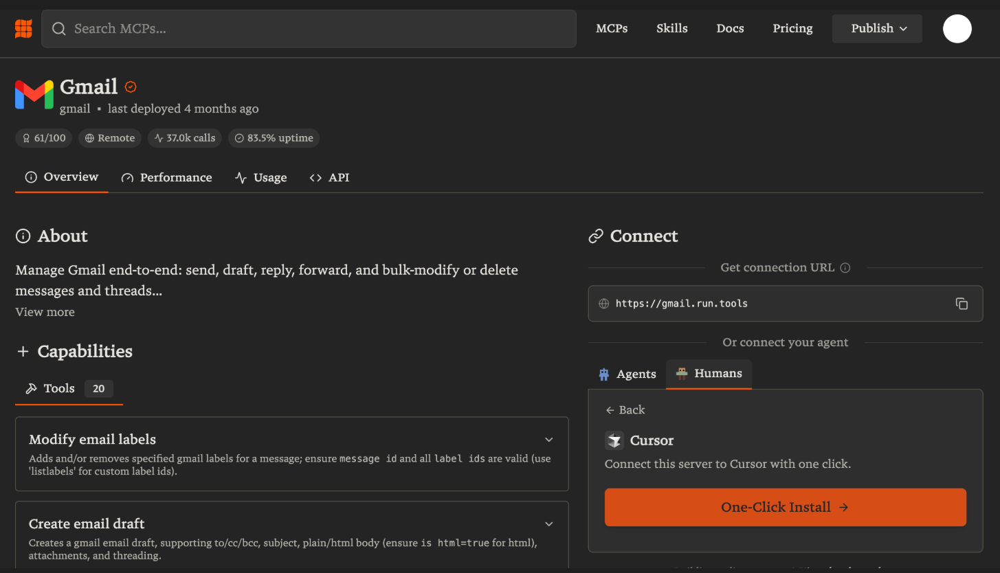
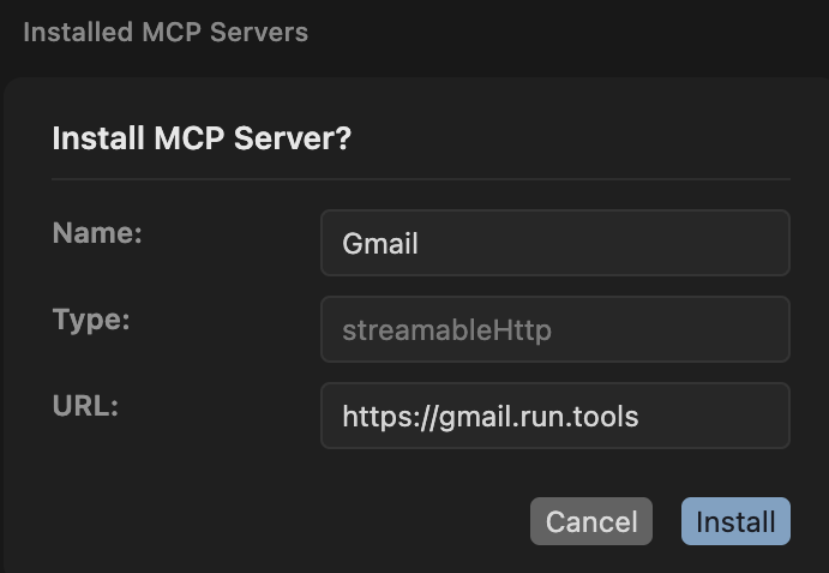
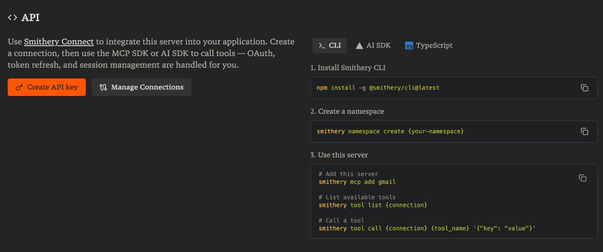
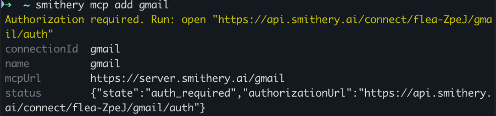
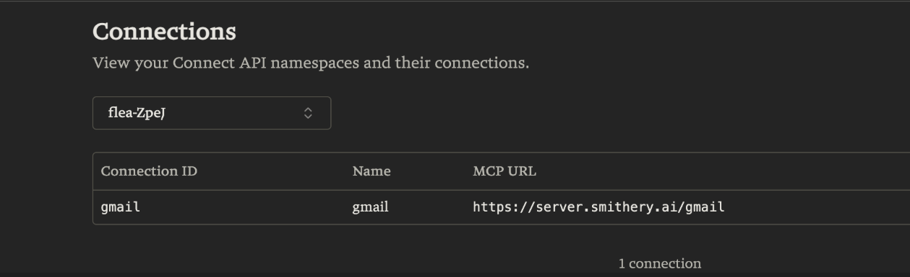

## MCP란

MCP는 AI Agent가 외부 Tool을 사용하는 방식을 **표준화**하는 프로토콜이다. **"AI의 USB-C"** 라고 불린다.

USB-C 이전에는 기기마다 충전 케이블이 달랐다. USB-C가 등장하면서 하나의 포트로 통일되었다. MCP는 이와 같은 역할을 한다.

**MCP 이전:**

```
Agent A → 자체 Tool 구현 (파일 읽기)
Agent B → 또 다른 Tool 구현 (파일 읽기)  ← 같은 기능을 중복 구현
Agent C → 또 다른 Tool 구현 (파일 읽기)
```

**MCP 이후:**

```
Cursor (MCP 클라이언트)             ─┐
Claude Code (MCP 클라이언트)        ─┼→ MCP 서버 (파일 읽기 Tool) ← 한 번만 구현
내 LangGraph Agent (MCP 클라이언트)  ─┘
```

MCP 서버는 3가지를 노출할 수 있다.

| 종류 | 설명 | 예시 |
| --- | --- | --- |
| **Tool** | Agent가 호출할 수 있는 함수 | 파일 읽기, 검색, API 호출 |
| **Resource** | 데이터 소스 (읽기 전용). LLM의 context에 데이터를 주입할 때 사용 | 파일 목록, DB 테이블 정보 |
| **Prompt** | 미리 정의된 프롬프트 템플릿 | 코드 리뷰 프롬프트 |

실무에서는 **Tool**이 가장 많이 사용된다.

### 활용 가능한 MCP 서버들

이미 공개된 MCP 서버가 많다. 직접 API 연동 코드를 작성할 필요 없이, MCP 서버를 연결하면 바로 사용할 수 있다.

| MCP 서버 | 설명 | 활용 예시 |
| --- | --- | --- |
| **Gmail** | 메일 조회, 전송, 검색 | "안 읽은 메일 요약해줘" |
| **GitHub** | 이슈, PR, 코드 검색 | "최근 열린 이슈 목록을 요약해줘" |
| **Slack** | 메시지 조회, 전송 | "오늘 #general 채널에서 중요한 내용을 정리해줘" |
| **Notion** | 페이지, DB 조회/수정 | "회의록 DB에서 이번 주 회의 내용을 가져와줘" |
| **PostgreSQL** | DB 스키마 조회, 쿼리 실행 | "users 테이블의 최근 가입자 수를 알려줘" |
| **Brave Search** | 웹 검색 | "LangGraph 최신 업데이트 내용을 검색해줘" |

> [smithery.ai](https://smithery.ai/)에서 MCP 서버를 검색하고 바로 설치할 수 있다. [github.com/modelcontextprotocol/servers](https://github.com/modelcontextprotocol/servers)에서 MCP 서버 목록을 확인할 수 있다.
> 

## Cursor에서 MCP 써보기

[smithery.ai](http://smithery.ai/) 가입 후 원하는 mcp 선택 -> 우측의 humans -> cursor -> one click install



커서에서 설치 확인 및 agent에서 명령(커서 열리고 좀 시간 지나면 나옴)



### 설정 파일로 관리하기

GUI 대신 프로젝트 루트에 `.cursor/mcp.json` 파일을 직접 작성할 수도 있다.

```json
{
  "mcpServers": {
    "Gmail": {
      "type": "http",
      "url": "<https://gmail.run.tools>",
      "headers": {}
    }
  }
}
```

### 여러 서버를 동시에 연결하기

MCP 서버는 여러 개를 동시에 연결할 수 있다. AI가 상황에 맞는 Tool을 알아서 선택해서 호출한다.

## LangGraph Agent에 MCP 연결

Cursor 같은 AI 도구뿐 아니라, 우리가 만드는 LangGraph Agent에도 MCP를 연결할 수 있다.

`langchain-mcp-adapters` 라이브러리가 MCP Tool을 LangChain Tool로 변환해준다.

```bash
uv add langchain-mcp-adapters mcp
```

```python
from dotenv import load_dotenv

load_dotenv()
```

`MultiServerMCPClient`로 MCP 서버에 연결하고, `get_tools()`로 LangChain Tool을 받아서 Agent에 넣는다.

smitery에서 gmail mcp 최하단의 api guide를 따라간다.



- npm install -g @smithery/cli@latest
- smithery mcp add gmail
add 후 나오는 url을 클릭하여 연결한다.



우측 상단의 아이콘 -> my connections에서 연결 확인이 가능하다.



```python
import os
from langchain_mcp_adapters.client import MultiServerMCPClient
from langchain_openai import ChatOpenAI
from langchain.agents import create_agent

client = MultiServerMCPClient(
    {
        "gmail": {
            # "url": "https://api.smithery.ai/connect/{namespace}/{mcp_name}/mcp",
            "url": "https://api.smithery.ai/connect/swordtail-xKV3/gmail/mcp",
            "transport": "streamable_http",
            "headers": {
                "Authorization": f"Bearer {os.environ['SMITHERY_API_KEY']}",
            },
        },
    }
)

tools = await client.get_tools()
print("MCP에서 가져온 Tool 목록:")
for tool in tools:
    print(f"  - {tool.name}: {tool.description}")
```

```python
llm = ChatOpenAI(model="gpt-4o-mini", temperature=0)
agent = create_agent(llm, tools)

email = "example@example.com"
result = await agent.ainvoke(
    {"messages": [("user", f"{email}에게 테스트 이메일 보내줘")]}
)
print(result["messages"][-1].content)
```

## 그런데, 정말 MCP가 필요할까?

위 코드를 `@tool`로 직접 만들면 Gmail API를 직접 연동해야 한다. OAuth 인증, API 호출, 응답 파싱까지 모두 직접 구현해야 하는 것이다.

|  | `@tool` 직접 구현 | MCP 연동 |
| --- | --- | --- |
| **코드량** | API 인증 + 호출 + 파싱 직접 구현 | 초기 설정 후 연결 코드만 작성 |
| **실행** | Agent 프로세스 안에서 직접 실행 | 별도 서버와 통신 |
| **유연성** | 자유롭게 커스텀 가능 | MCP 서버가 제공하는 Tool만 사용 |
| **재사용** | 이 프로젝트에서만 | Cursor, Claude Code 등에서도 사용 가능 |

Gmail, Slack, Notion처럼 이미 MCP 서버가 만들어져 있는 서비스는 MCP로 연결하는 것이 간편하다. 반면 우리 서비스에 특화된 로직은 `@tool`로 직접 만드는 것이 낫다.