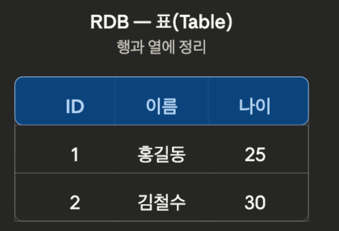
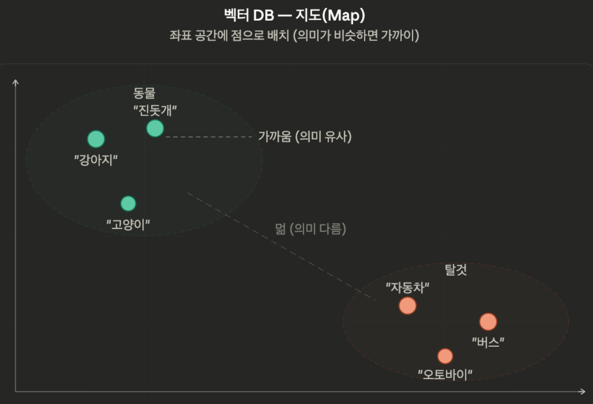

# 벡터 DB와 검색

```python
from dotenv import load_dotenv

load_dotenv()
```

## 벡터 DB란?

이전 시간에 텍스트를 임베딩 벡터로 변환하는 방법을 배웠다. 이제 이 벡터들을 **저장**하고 **검색**해야 한다.

일반적인 데이터베이스(MySQL, PostgreSQL 등)는 정확한 값의 일치(`WHERE name = '홍길동'`)나 범위 검색(`WHERE age > 20`)에 최적화되어 있다. 하지만 벡터 검색은 다르다. "이 벡터와 가장 비슷한 벡터 k개를 찾아줘"라는 **유사도 검색**이 필요하다.

1536차원짜리 벡터 10만 개가 있다고 해보자. 질문이 들어올 때마다 10만 개를 하나하나 비교하면 너무 느리다. 벡터 DB는 이 문제를 효율적으로 해결하기 위해 만들어진 전용 데이터베이스이다.

### 직관적으로 이해하기: 표 vs 지도

RDB가 데이터를 **표(Table)** 형태로 관리한다면, 벡터 DB는 데이터를 **지도(Map)** 처럼 관리한다.

[RDB] - 엑셀 시트처럼 행과 열에 정리



[벡터 DB] - 좌표 공간에 점으로 배치 (의미가 비슷하면 가까이)



물리적으로는 벡터 DB도 결국 서버의 디스크에 데이터가 쌓인다. 하지만 논리적으로는 각 데이터가 **다차원 좌표 공간에서 위치를 점유**하는 구조이다. 이 좌표에서의 **위치가 곧 의미**이고, **검색은 거리를 재는 것**이다.

### 왜 일반 DB로는 부족한가?

|  | 일반 DB | 벡터 DB |
| --- | --- | --- |
| **검색 방식** | 정확한 값 매칭 (=, >, <) | 유사도 기반 근사 검색 |
| **인덱스** | B-Tree, Hash | HNSW, IVF 등 벡터 전용 인덱스 |
| **데이터** | 숫자, 문자열, 날짜 | 고차원 벡터 (수백~수천 차원) |
| **결과** | 조건에 맞는 정확한 결과 | "가장 비슷한" 근사 결과 |

일반 DB에서 벡터 유사도를 계산하려면 모든 행에 대해 코사인 유사도를 계산해야 한다. 이는 O(n)으로, 데이터가 늘어날수록 선형으로 느려진다.

### ANN (Approximate Nearest Neighbor)

벡터 DB의 핵심은 **근사 최근접 이웃(ANN)** 알고리즘이다. 100% 정확한 결과 대신 99%+ 정확도를 허용하는 대신, 검색 속도를 **수십~수백 배** 빠르게 만든다.

```
Exact Search (전수 조사):  벡터 10만 개 × 1536차원 → 모두 비교 → 느림
ANN (근사 검색):           인덱스로 후보를 빠르게 좁힘 → 빠름
```

대표적인 ANN 인덱싱 방식:

| 알고리즘 | 원리 | 특징 |
| --- | --- | --- |
| **HNSW** | 그래프 기반. 벡터들을 노드로, 가까운 벡터끼리 간선으로 연결한 다층 그래프 | 검색 정확도와 속도 모두 우수하지만 메모리 사용량이 큼. Chroma 기본 방식 |
| **IVF** | 벡터 공간을 여러 클러스터로 나누고, 질문 벡터가 속한 클러스터 주변만 검색 | 메모리 효율적이라 대규모 데이터에 유리하지만 정확도가 약간 낮을 수 있음. FAISS에서 주로 사용 |

> 실무에서 ANN의 내부 동작을 직접 구현할 일은 없다. 중요한 건 "벡터 DB가 어떻게 빠른 검색을 가능하게 하는지"의 원리를 이해하는 것이다.
> 

### 벡터 DB의 동작 흐름

```
[저장]
문서 → 청킹 → 임베딩 모델 → 벡터 + 메타데이터 → 벡터 DB에 저장 (인덱스 구축)

[검색]
질문 → 임베딩 모델 → 질문 벡터 → 벡터 DB에서 ANN 검색 → 상위 k개 문서 반환
```

저장할 때 벡터뿐 아니라 **원본 텍스트**와 **메타데이터**(출처, 페이지 번호 등)도 함께 저장한다. 검색 결과로 벡터가 아닌 원본 텍스트를 돌려받아야 LLM에 전달할 수 있기 때문이다.

### 메타데이터 (Metadata)

벡터 DB에 저장되는 데이터는 크게 세 가지로 구성된다.

| 구성 요소 | 설명 | 예시 |
| --- | --- | --- |
| **벡터** | 임베딩 모델이 생성한 좌표값. 유사도 검색에 사용 | `[0.12, -0.34, 0.56, ...]` |
| **원본 텍스트** | 벡터의 원래 문서 내용. LLM에 전달할 때 사용 | `"연차는 최소 1일 전에 신청..."` |
| **메타데이터** | 벡터에 붙이는 이름표. 필터링에 사용 | `{"source": "사내규정.pdf", "page": 3}` |

**메타데이터는 임베딩되지 않는다.** 좌표 공간에 점을 찍은 뒤, 그 점에 포스트잇을 붙여놓는 것과 같다. 유사도 검색의 대상이 아니라, 검색 결과를 **필터링**할 때 사용한다.

```
검색 과정:
1. 메타데이터 필터링: "user_id가 'kim'인 데이터만 골라냄"  ← 정확한 매칭 (RDB처럼)
2. 벡터 검색: "골라낸 것 중에서 질문과 가장 가까운 k개 반환"  ← 유사도 기반
```

메타데이터를 쓰는 이유는 벡터 검색만으로는 **"이 데이터가 누구 것인지"**, **"어떤 문서에서 왔는지"** 를 구분할 수 없기 때문이다. 대표적인 사용 사례:

- **멀티테넌트**: 사용자별로 업로드한 문서가 다를 때, `user_id`로 필터링하여 본인 문서만 검색
- **문서 구분**: 여러 PDF를 하나의 컬렉션에 저장하고, `source`로 특정 문서만 검색
- **페이지 범위**: 특정 페이지 범위의 내용만 검색

> LangChain의 Document Loader들은 메타데이터를 **자동으로 생성**한다. 예를 들어 `PyPDFLoader`는 `source`(파일 경로)와 `page`(페이지 번호)를 자동으로 넣어준다. 따로 지정하지 않아도 이 정보로 바로 필터링할 수 있다. 추가 메타데이터가 필요하면 Document 객체의 `metadata` 딕셔너리에 직접 추가하면 된다.
> 

> 메타데이터에 넣을 정보는 **필터링이 필요한 속성**만 포함하면 된다. 만약 메타데이터의 내용으로도 "의미 검색"을 하고 싶다면, 해당 내용을 원본 텍스트에 포함시켜 함께 임베딩해야 한다.
> 

### 벡터 DB 비교

| 벡터 스토어 | 특징 |
| --- | --- |
| **Chroma** | 가볍고 간단. 설치가 쉽고 로컬 파일로 저장. 서버 없이 바로 사용 가능 |
| pgvector | PostgreSQL 확장. 기존 DB에 벡터 검색을 추가할 때 유용 |
| FAISS | Meta의 라이브러리. 대규모 벡터에 빠름. 서버 없이 로컬에서 동작 |
| Pinecone | 클라우드 매니지드 서비스. 운영 부담 없음 |

우리는 **Chroma**를 사용한다. 별도 서버 설치 없이 `pip install langchain-chroma`만 하면 바로 사용할 수 있다. 데이터는 로컬 폴더에 파일로 저장되며, 프로그램을 다시 실행해도 유지된다.

## Chroma 실습

```python
from langchain_chroma import Chroma
from langchain_openai import OpenAIEmbeddings
from langchain_community.document_loaders import PyPDFLoader
from langchain_text_splitters import RecursiveCharacterTextSplitter
import chromadb

COLLECTION_NAME = "spri_ai_brief"  # 컬렉션 이름 (RDB의 테이블에 해당)
PERSIST_DIR = "./chroma_db"  # 저장 폴더 경로 (RDB의 데이터베이스에 해당)

embeddings = OpenAIEmbeddings(model="text-embedding-3-small")

# 문서 로드 → 분할
loader = PyPDFLoader("data/SPRi AI Brief_9월호_산업동향_0909_F.pdf")
docs = loader.load()

splitter = RecursiveCharacterTextSplitter(chunk_size=500, chunk_overlap=50)
chunks = splitter.split_documents(docs)

print(f"총 {len(chunks)}개 청크를 벡터 DB에 저장합니다...")

# 기존 컬렉션이 있으면 삭제 (중복 방지)
client = chromadb.PersistentClient(path=PERSIST_DIR)
if COLLECTION_NAME in [c.name for c in client.list_collections()]:
    client.delete_collection(COLLECTION_NAME)

# 벡터 스토어 생성 + 문서 저장
vectorstore = Chroma.from_documents(
    documents=chunks,
    embedding=embeddings,
    collection_name=COLLECTION_NAME,
    persist_directory=PERSIST_DIR,
    
)

print("저장 완료!")
```

### 유사도 검색

벡터 스토어에 저장된 문서 중 질문과 가장 유사한 것을 찾는다.

```python
# 유사도 검색
query = "즈푸 AI의 AI 모델 이름이 뭐야?"
results = vectorstore.similarity_search(query, k=3)

print(f"질문: {query}\n")
for i, doc in enumerate(results):
    print(f"--- 결과 {i+1} (페이지 {doc.metadata.get('page')}) ---")
    print(doc.page_content[:150])
    print()
```

### 메타데이터 필터링

`similarity_search`에 `filter` 파라미터를 전달하면, 해당 조건에 맞는 문서만 대상으로 유사도 검색을 수행한다.

```python
# 특정 페이지의 문서만 대상으로 검색
query = "AI 관련 정책은?"
results = vectorstore.similarity_search(query, k=3, filter={"page": 6})

print(f"질문: {query}")
print(f"필터: page == 2\n")
for i, doc in enumerate(results):
    print(f"[{i+1}] (페이지 {doc.metadata.get('page')}) {doc.page_content[:100]}...")
    print()

# 필터 없이 검색하면 다양한 페이지에서 결과가 나옴
results_no_filter = vectorstore.similarity_search(query, k=3)
print("필터 없이 검색한 결과 페이지:", [doc.metadata.get("page") for doc in results_no_filter])
```

```python
# 유사도 점수와 함께 검색
query = "오픈AI의 최신 모델은?"
results = vectorstore.similarity_search_with_score(query, k=3)

print(f"질문: {query}\n")
for doc, score in results:
    print(f"[거리: {score:.4f}] (페이지 {doc.metadata.get('page')}) {doc.page_content[:80]}...")
    print()
```

> Chroma의 기본 설정에서 `similarity_search_with_score`는 **유클리드 거리(L2 distance)** 를 반환한다. 값이 **작을수록 유사**하다. (Chroma 설정에 따라 코사인 거리 등 다른 메트릭을 반환할 수도 있다.)
> 
> 
> 
> | L2 거리 | 의미 |
> | --- | --- |
> | 0.0 | 완전히 동일 |
> | 작은 값 | 유사 |
> | 큰 값 | 무관 |

### 기존 벡터 스토어 연결

이미 저장된 벡터 스토어에 다시 연결할 때는 `from_documents` 대신 생성자를 직접 사용한다. `persist_directory`를 지정하면 이전에 저장한 데이터를 그대로 불러올 수 있다.

> Chroma는 `persist_directory`를 지정하면 데이터가 자동으로 디스크에 저장된다. 예전 버전에서는 `.persist()`를 명시적으로 호출해야 했지만, 현재는 불필요하다. 인터넷 예제에서 `.persist()` 호출이 보이더라도 무시해도 된다.
> 

```python
# 기존 벡터 스토어에 연결 (임베딩 다시 안 함)
existing_store = Chroma(
    embedding_function=embeddings,
    collection_name=COLLECTION_NAME,
    persist_directory=PERSIST_DIR,
)

# 바로 검색 가능
results = existing_store.similarity_search("구글의 AI 관련 소식은?", k=3)
for doc in results:
    print(doc.page_content[:150])
    print()
```

**주의: 임베딩 모델을 바꾸면 벡터 DB를 재구축해야 한다.** 
예를 들어 `text-embedding-3-small`로 저장한 벡터 DB에 `text-embedding-3-large`로 검색하면, 벡터 차원도 다르고 좌표 공간 자체가 달라서 검색 결과가 엉망이 된다. 모델을 변경하면 모든 문서를 새 모델로 다시 임베딩하여 저장해야 한다. 실무에서 "검색 품질이 갑자기 나빠졌다"의 원인 중 하나가 임베딩 모델 불일치이므로, 어떤 모델로 저장했는지 반드시 기록해두자.

### Retriever

벡터 스토어의 `similarity_search()`로 직접 검색할 수 있지만, 나중에 LangChain의 체인(Chain)에 연결하려면 **Retriever** 인터페이스가 필요하다. 체인은 `Retriever.invoke(질문) → 문서 리스트` 형태의 통일된 인터페이스를 기대하기 때문이다.

`as_retriever()`로 벡터 스토어를 Retriever로 변환할 수 있으며, `search_kwargs`로 검색 옵션을 지정한다.

```python
# Retriever로 변환하여 사용
retriever = vectorstore.as_retriever(search_kwargs={"k": 2})

docs = retriever.invoke("AI 투자 규모는 어느 정도야?")

for doc in docs:
    print(doc.page_content[:150])
    print()
```