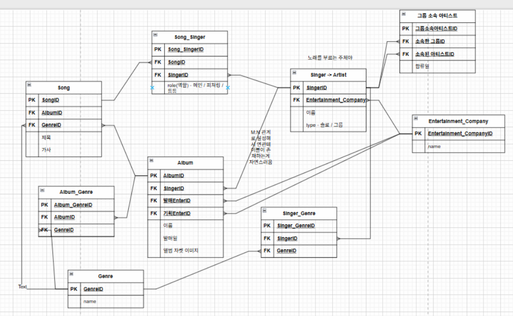

## 인덱스

- 데이터베이스 테이블의 검색 속도를 향상시키기 위한 자료구조이다.
- 특정 열(컬럼)에 대해 정렬된 상태를 유지한다. (B Tree, B+ tree)
- 검색 속도는 빨라지지만, 데이터 입력/수정/삭제시에 인덱스 페이지도 갱신해야 하기 때문에 성능이 저하될 수 있다.
- 인덱스 자체를 저장하기 위한 별도의 물리적 저장 공간이 필요하다.

- 인덱스 추가
    
    ```sql
    CREATE INDEX index_name 
    ON table_name (column_name);
    ```
    
- 인덱스 삭제
    
    ```sql
    DROP INDEX index_name;
    ```
    

### 고유 인덱스

- 이메일 주소, username 등 테이블의 특정 열에 중복된 값을 허용하지 않는 인덱스
- Unique 제약조건을 생성하면 자동으로 고유 인덱스가 생성된다.
    - Unique 제약조건은 중복값 체크가 필요한데, 이를 효율적으로 하기 위해서는 인덱스가 필요하기 때문
- NULL 값은 허용되며, 여러 행에 NULL 값이 들어갈 수 있다.

### 인덱스가 효율적인 경우

- WHERE 절에서 자주 사용되는 컬럼
- 외래 키로 사용되는 컬럼
- ORDER BY, GROUP BY 절에서 사용되는 컬럼
- 카디널리티(Cardinality)가 높은 컬럼

- 카디널리티
    - 특정 컬럼이 가지는 고유한 값의 수
    - 카디널리티 비율 계산
        - 1에 가까울수록 고유한 값이 많음 (높은 카디널리티)
            - 주민등록번호, 이메일, id 등
        - 0에 가까울수록 중복된 값이 많음 (낮은 카디널리티)
            - 성별, 결제여부, 등급 등
        
        ```sql
        SELECT COUNT(DISTINCT column_name) / CAST(COUNT(*) AS FLOAT) as cardinality_ratio
        FROM table_name;
        ```
        

### 인덱스가 비효율적인 경우

- 데이터가 적은 테이블
- 데이터 변경이 빈번한 테이블
- 카디널리티가 낮은 컬럼
- OR 조건이 많은 쿼리

## ERD 작성 순서

- [draw.io](https://app.diagrams.net/)
- https://www.erdcloud.com/

### 사전 준비 및 요구사항 분석

"무엇을 만들 것인가?"에 대한 비즈니스 로직 정리한다.

- **비즈니스 규칙 작성**
    
    "회원은 여러 개의 주문을 할 수 있지만, 비회원은 주문할 수 없다", "하나의 상품은 여러 카테고리에 속할 수 있다" 같은 규칙을 나열한다.
    
- **사용자 시나리오 작성**
    
    사용자가 회원가입을 하고, 상품을 검색하고, 결제하는 전체 과정을 글로 정리한다.
    

### 개체 도출 및 개념적 설계

요구사항에서 핵심이 되는 구성 요소를 찾아낸다.

- **핵심 명사 추출**
    
    "사용자", "주문", "상품" 등 주된 단어를 선택한다.
    
- **단순 연결**
    - "사용자가 상품을 주문한다" → `사용자` --- `주문` --- `상품` 식으로 관계의 존재 여부만 파악한다.

### 상세 설계 및 논리적 모델링

추출된 개체와 관계를 구체적인 도표로 형상화한다.

- **속성 정의**
이름, 연락처, 가격 등 각 개체가 가져야 할 상세 정보 항목을 나열한다.
- **관계 설정**
한 개체가 다른 개체와의 연결 관계를 일대일, 일대다, 다대다 관계 중 하나로 정의한다.

### 데이터 정규화

설계된 구조의 결함을 제거하고 효율성을 높인다.

- **중복 제거**
동일한 데이터가 여러 곳에 저장되지 않도록 테이블을 분리한다.
- **종속성 확인**
기본키와 나머지 데이터 사이의 연관 관계를 분석하여 데이터가 잘못 입력되거나 삭제되는 현상을 방지한다.

```markdown
## 나의 기획
- 노래 - 앨범
	- 하나의 노래는 하나의 앨범에만 실린다.
	- 하나의 앨범에는 여러 노래가 실린다.
- 노래 - 가수
	- 하나의 노래는 한명의 가수만 부른다.
        -> 하나의 노래를 여러 명의 가수가 부른다.
            연관테이블이 생기면서 가수가 노래를 부를 때에 대한 추가적인 정보를 저장할 수 있다.
            ex) role(메인 / 피쳐링 / 참여 등등)
	- 한명의 가수는 여러 노래를 부른다.
- 가수 - 앨범
	- 한명의 가수는 여러 개의 앨범을 가진다.
	- 한개의 앨범은 한개의 가수가 보유한다.

### 추가할 내용들
- 그룹을 추가해보자
	사실 그룹과 가수는 역할이 같다 (노래를 부르고 / 앨범을 갖고)
	따라서 song 과 album과 연관을 지을 때 같은 방식으로 지어야할 것 같습니다.
	table을 분리하자니 둘중 하나는 반드시 null인 경우가 존재합니다. 차라리 합칩시다.
	singer + group -> artist
	대신 자기자신과의 관계를 통해 그룹 - 소속인원의 관계를 연관테이블로 만들었습니다.

```

