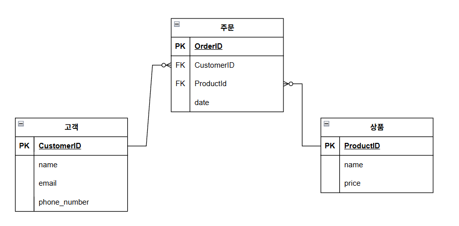

## 데이터베이스 설계

## Key

- Key란 데이터베이스에서 데이터를 식별하고 구분하는데 사용되는 특별한 필드나 필드들의 집합이다.
- 기본키(Primary Key)
    - 테이블의 각 레코드를 고유하게 식별하는 필수적인 키
    - NULL값을 가질 수 없고, 중복될 수 없음
    - 예: 학생 테이블의 학번
- 외래키(Foreign Key)
    - 다른 테이블의 기본키를 참조하는 키
    - 테이블 간의 관계를 정의하는데 사용
    - 예: 수강신청 테이블의 학번(학생 테이블 참조)
- 후보키(Candidate Key)
    - 기본키가 될 수 있는 자격이 있는 키
    - 유일성과 최소성을 만족
    - 예: 학생 테이블의 학번, 주민등록번호
- 자연키(Natural Key)
    - 실제 업무에서 사용되는 의미 있는 데이터를 키로 사용
    - 예: 주민등록번호, 상품코드
- 대리키/인조키(Surrogate Key/Artificial Key)
    - 인위적으로 생성한 식별자
    - 보통 일련번호 형태로 자동 생성됨
    - 예: auto_increment로 생성된 id
- 복합키 (Composite Key):
    - 하나의 필드만으로 기본키가 될 수 없어, 두 개 이상의 필드를 합쳐서 만든 키

---

## 데이터 무결성

- 데이터 무결성(data integrity)은 데이터의 정확성과 일관성을 유지하고 보증하는 것을 말한다.
- 개체 무결성(Entity Integrity)
    - 테이블의 각 행이 유일하게 식별될 수 있도록 보장하는 것
    - 주로 기본 키(Primary Key) 제약 조건을 통해 이루어진다.
- 참조 무결성(Referential Integrity)
    - 참조 무결성은 외래 키(Foreign Key)를 통한 테이블 간의 관계에서 유지되어야 하는 데이터의 일관성을 의미한다.
    - 외래 키는 다른 테이블의 기본 키를 참조하여 테이블 간의 관계를 맺는데, 참조 무결성은 이러한 참조 관계가 유효한 데이터를 가리키도록 보장한다.
    - 즉, 외래 키 값은 NULL이거나 참조하는 테이블의 기본 키 값 중 하나와 일치해야 한다.
- 도메인 무결성(Domain Integrity)
    - 도메인 무결성은 테이블의 필드가 정의된 도메인(유효한 값의 집합)에 속한 값만을 가져야 한다는 원칙이다.
    - 이는 데이터 타입, 데이터 형식, 범위 제한, 기본값 설정 등을 통해 구현된다.

---

## 정규화

- 정규화(Normalization)는 데이터를 구조화하여 중복을 최소화하고, 데이터 무결성을 유지하기 위한 과정이다.
- 목적
    1. 데이터 중복 최소화
    2. 데이터 무결성(Integrity) 유지
    3. 이상현상 방지
    4. 데이터의 일관성과 정확성 보장
    5. 효율적인 데이터 구조 설계
1. 제1정규형(1NF, First Normal Form)
    - 각 컬럼의 값이 원자값(분할 불가능한 값)을 가져야 한다.
    - 상품명에 2개의 값이 들어있음 (X)
        
        
        | **고객ID** | **고객이름** | **상품명** |
        | --- | --- | --- |
        | 1 | 권이혁 | 노트북 |
        | 2 | 배지원 | 핸드폰 |
        | 3 | 유창준 | 노트북, 태블릿 |
    - 1NF
        
        
        | **고객ID** | **고객이름** | **상품명** |
        | --- | --- | --- |
        | 1 | 권이혁 | 노트북 |
        | 2 | 배지원 | 핸드폰 |
        | 3 | 유창준 | 노트북 |
        | 3 | 유창준 | 태블릿 |
2. 제2정규형(2NF)
    - 1NF를 만족하고, 모든 비주요 속성이 후보키 전체에 완전히 함수적으로 의존해야 한다.
    - 간단히 말해, `어떠한 column`이 `row를 구분할 수 있는 column들`과 관계가 없으면 다른 테이블로 분리해야 한다.
    - row를 구분할 수 있는 column들 : (고객ID + 상품명)
        - 고객ID와 상품가격은 관계가 없다.(X)
        
        | **고객ID** | **고객이름** | **상품명** | **상품 가격** |
        | --- | --- | --- | --- |
        | 1 | 권이혁 | 노트북 | 100만 |
        | 2 | 배지원 | 핸드폰 | 120만 |
        | 3 | 유창준 | 노트북 | 100만 |
        | 3 | 유창준 | 태블릿 | 80만 |
    - 2NF
        
        
        | **고객ID** | **고객이름** | **상품명** |
        | --- | --- | --- |
        | 1 | 권이혁 | 노트북 |
        | 2 | 배지원 | 핸드폰 |
        | 3 | 유창준 | 노트북 |
        | 3 | 유창준 | 태블릿 |
        
        | **상품명** | **상품 가격** |
        | --- | --- |
        | 노트북 | 100만 |
        | 핸드폰 | 120만 |
        | 태블릿 | 80만 |
3. 제3정규형(3NF)
    - 2NF를 만족하고, 기본키가 아닌 모든 컬럼이 테이블의 기본키에 이행적 종속이 되지 않는다.
    - 간단히 말해, `어떠한 column`이 `row를 구분할 수 있는 column들` `외의 다른 column`과 관계있으면 다른 테이블로 분리해야 한다.
        - 정확하게는 틀린 표현 ⇒ `A → B이고 B → C일 때, A → C`가 성립하는 경우를 의미한다
    - row를 구분할 수 있는 column : 상품명
        - 제조사 대표(`어떠한 column`)는 제조사(`기본키 외의 다른 column`)와 관련이 있다.
        
        | **상품명** | **상품 가격** | **제조사** | **제조사 대표** |
        | --- | --- | --- | --- |
        | 노트북 | 100만 | 7star | dragon lee |
        | 핸드폰 | 120만 | Pine | team cook |
        | 태블릿 | 80만 | shyme | jun |
        | 무선이어폰 | 30만 | Pine | team cook |
    - 3NF
        
        
        | **상품명** | **상품 가격** | **제조사** |
        | --- | --- | --- |
        | 노트북 | 100만 | 7star |
        | 핸드폰 | 120만 | Pine |
        | 태블릿 | 80만 | shyme |
        | 무선이어폰 | 30만 | Pine |
        
        | **제조사** | **제조사 대표** |
        | --- | --- |
        | 7star | dragon lee |
        | Pine | team cook |
        | shyme | jun |
- 그 외에도
    - BCNF (Boyce-Codd Normal Form)
    - 제4정규형 (4NF)
    - 제5정규형 (5NF)
    
    등이 있으나, 3NF만 만족해도 충분하다.
    

### 반정규화

- 반정규화(Denormalization)란 성능 향상을 위해 의도적으로 정규화를 위배하는 것이다.
- 데이터의 중복을 허용하며, 조회 성능이 중요한 경우에 도입한다.
- 데이터 무결성과 성능 사이의 트레이드오프 고려한다.

---

## 데이터베이스 스키마

- 데이터베이스 스키마(database schema)는 데이터베이스에서 자료의 구조, 자료의 표현 방법, 자료 간의 관계를 정의한 것을 말한다.
- 스키마는 데이터베이스 설계의 청사진 역할을 하며, 데이터베이스 시스템에서 데이터를 어떻게 저장하고 접근할지에 대한 정보를 제공한다.

## ERD

- ERD(Entity-Relationship Diagram)는 데이터베이스의 구조를 시각적으로 표현하는 도구이다.
- 간단하게 말해서, 스키마를 시각화한 것이다.
- [draw.io](https://app.diagrams.net/)
- https://www.erdcloud.com/

### **ERD의 주요 구성 요소**

- **엔티티(Entity)**: 데이터베이스에 저장되는 주체이다. 예를 들어, '고객', '주문', '제품' 등이 엔티티가 될 수 있다.
- **속성(Attribute)**: 엔티티를 구성하는 세부 항목으로, 엔티티의 특성을 나타낸다. 예를 들어, '고객' 엔티티의 속성으로는 '고객 이름', '주소', '전화번호' 등이 있을 수 있다.
- **관계(Relationship)**: 두 엔티티 사이의 연관성을 나타낸다. 관계는 '일대일', '일대다', '다대다' 등으로 분류될 수 있으며, 선으로 표현되어 연결된 엔티티 사이를 나타낸다.
- **기본 키(Primary Key)**: 각 엔티티 내에서 각 인스턴스(또는 행)을 고유하게 식별하는 속성이다.
- **외래 키(Foreign Key)**: 다른 엔티티의 기본 키를 참조하여 두 엔티티 사이의 관계를 설정하는 속성이다.

## Domain

- 도메인은 각 필드에 들어갈 수 있는 값의 유형과 범위를 정의한 것이다
- 문자열 타입
    - CHAR: 고정 길이 문자열
        - 예: 성별(M/F), 고정된 코드값
        - 특징: 지정된 길이만큼 공간 차지
    - VARCHAR: 가변 길이 문자열
        - 예: 이름, 주소, 이메일
        - 특징: 실제 데이터 길이만큼만 공간 차지
    - TEXT: 긴 문자열
        - 예: 게시글 내용, 상품 설명, 약관
        - 특징: 대용량 텍스트 저장 가능
- 숫자 타입
    - INTEGER: 정수
        - 예: 나이, 수량, 순번
        - 특징: 소수점 없는 숫자
    - DECIMAL: 정확한 소수점 계산이 필요한 숫자
        - 예: 금액, 비율
        - 특징: 정확한 소수점 계산 가능
    - TINYINT, SMALLINT, BIGINT, FLOAT, DOUBLE
- 날짜/시간 타입
    - DATE: 날짜
        - 예: 생년월일, 등록일
    - TIMESTAMP: 날짜와 시간
        - 예: 로그기록, 등록/수정 일시
        - 특징: 시/분/초까지 기록
- 기타
    - BOOLEAN: 논리 - 참/거짓
        - 예: 사용여부, 삭제여부
        - 값: TRUE/FALSE
    - ENUM: 열거형 - 미리 정의된 값만 허용
        - 예: 주문상태(['결제대기','결제완료','배송중','완료'])
        - 예: 회원등급(['BRONZE','SILVER','GOLD'])
        - 특징: 제한된 값들 중에서만 선택 가능
- 제약 사항
    - DEFAULT: 값을 넣지 않았을 때 자동으로 들어갈 값
    - NOT NULL: 빈 값을 허용하지 않음

- ERD 예시

### 까마귀 발 표기법

- Zero or = 없거나.
- One만 있으면 반드시 있어야 함.

