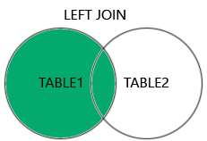
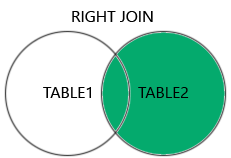
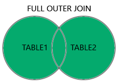

## JOIN

- JOIN은 두 개 이상의 테이블을 연결하여 데이터를 조회하는 SQL 구문이다.

```sql
SELECT 컬럼명
FROM 테이블1
JOIN유형 테이블2 ON 조인조건
```

## JOIN의 종류








출처 : [www.w3schools.com/](http://www.w3schools.com/)

### INNER JOIN

- 두 테이블에서 조인 조건이 일치하는 레코드만 반환
- `INNER` 키워드를 제외하여 `JOIN`만 명시하여도 `INNER JOIN`으 동작한다.

- 도시와 국가 정보 연결 `world`
    - 1:N 관계
    
    ```sql
    SELECT city.name as cityname, 
           country.name as countryname,
           country.continent
    FROM city
    INNER JOIN country ON city.countrycode = country.code;
    ```
    
    - INNER 생략 가능
        
        ```sql
        SELECT city.name as cityname, 
               country.name as countryname,
               country.continent
        FROM city
        JOIN country ON city.countrycode = country.code;
        ```
        

- 배우와 출연 영화 목록 `dvdrental`
    - M:N 관계
    
    ```sql
    SELECT actor.first_name, 
           actor.last_name, 
           film.title
    FROM actor
    INNER JOIN film_actor ON actor.actor_id = film_actor.actor_id
    INNER JOIN film ON film_actor.film_id = film.film_id
    ```
    

### LEFT JOIN

- 왼쪽 테이블의 모든 레코드와 오른쪽 테이블의 일치하는 레코드 반환

- 모든 국가와 수도 정보 `world`
    - 1:1 관계
    
    ```sql
    SELECT country.name as country_name, 
           city.name as capital_city
    FROM country
    LEFT JOIN city ON country.capital = city.id
    ```
    
    - join한 테이블에 데이터가 없는 경우, NULL이 포함될 수 있음
        
        ```sql
        SELECT country.name as country_name, 
               city.name as capital_city
        FROM country
        LEFT JOIN city ON country.capital = city.id
        WHERE city.name IS NULL;
        ```
        
    - inner join을 한 경우, city.name이 null인 경우는 조회되지 않음
        
        ```sql
        SELECT country.name, country.name as country_name, 
               city.name as capital_city
        FROM country
        INNER JOIN city ON country.capital = city.id
        WHERE country.name = 'Antarctica';
        ```
        

- 모든 영화의 재고 조회 `dvdrental`
    - 1:N 관계
    
    ```sql
    SELECT f.film_id, f.title, i.inventory_id
    FROM film f
    LEFT JOIN inventory i ON f.film_id = i.film_id;
    ```
    
    - join한 테이블에 데이터가 없는 경우, NULL이 포함될 수 있음
        
        ```sql
        SELECT f.film_id, f.title, i.inventory_id
        FROM film f
        LEFT JOIN inventory i ON f.film_id = i.film_id
        WHERE i.inventory_id IS NULL;
        ```
        

- 영화별 대여 현황 `dvdrental`
    - M:N 관계
    
    ```sql
    SELECT 
        f.title,
        r.rental_date
    FROM film f
    LEFT JOIN inventory i ON f.film_id = i.film_id
    LEFT JOIN rental r ON i.inventory_id = r.inventory_id;
    ```
    

### RIGHT JOIN

- 오른쪽 테이블의 모든 레코드와 왼쪽 테이블의 일치하는 레코드 반환
    - LEFT JOIN에서 순서를 바꾸면 되기 때문에 잘 사용하지 않는다.

### FULL JOIN

- 왼쪽 테이블의 모든 레코드와 오른쪽 테이블의 모든 레코드를 반환
    - 양쪽 모두 NULL이 포함될 수 있다
    - 모든 데이터를 다 가져오기 때문에 특수한 경우가 아니면 잘 사용하지 않는다.

### Self JOIN

- JOIN의 한 형태는 아니라 같은 테이블을 자기 자신과 조인하는 방식이며, INNER JOIN, LEFT JOIN 등 모두 사용 가능하다.