<aside>
💡 **Branch를 이용해 협업을 하는 두 가지 방법**에 대해 알아봅니다.
1. 원격 저장소 소유권이 있는 경우 (Shared repository model)
2. 원격 저장소 소유권이 없는 경우 (Fork & Pull model)

</aside>

## [1] 원격 저장소 소유권이 있는 경우 (Shared repository model)

### (1) 개념

- 원격 저장소가 자신의 소유이거나 collaborator로 등록되어 있는 경우에 가능합니다.
- master에 직접 개발하는 것이 아니라, `기능별로 브랜치`를 따로 만들어서 개발합니다.
- `Pull Request`를 같이 사용하여 팀원 간 변경 내용에 대한 소통을 진행합니다.

### (2) 작업 흐름

1. 소유권이 있는 원격 저장소를 로컬 저장소로 `clone` 받습니다.
    
    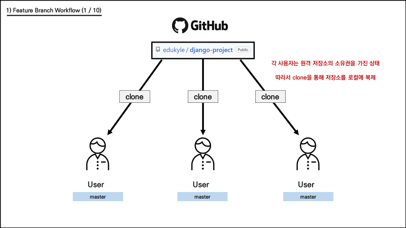
    
    ```bash
    $ git clone https://github.com/edukyle/django-project.git
    ```
    

1. 사용자는 자신이 작업할 기능에 대한 `브랜치를 생성`하고, 그 안에서 `기능을 구현`합니다.
    
    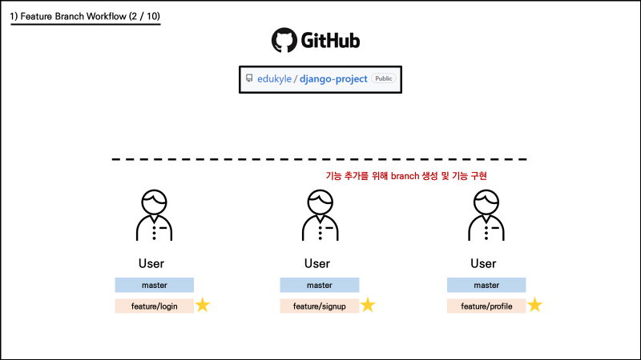
    
    ```bash
    $ git switch -c feature/login
    ```
    

1. 기능 구현이 완료되면, 원격 저장소에 해당 브랜치를 `push` 합니다.
    
    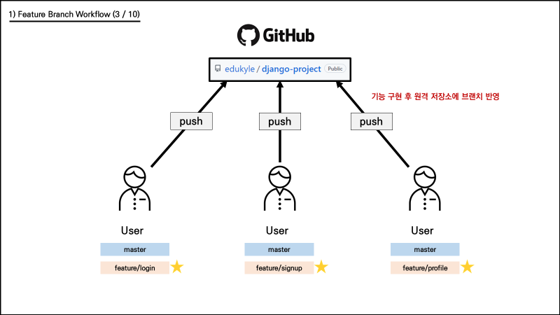
    
    ```bash
    $ git push origin feature/login
    ```
    

1. 원격 저장소에는 master와 각 기능의 브랜치가 반영되었습니다.
    
    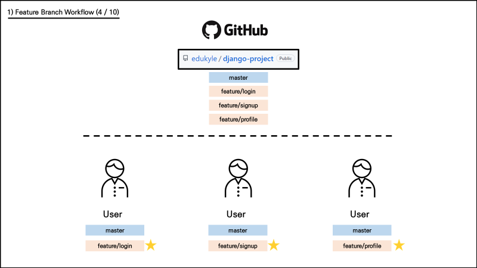
    

1. Pull Request를 통해 브랜치를 master에 반영해달라는 요청을 보냅니다.
(팀원들과 코드 리뷰를 통해 소통할 수 있습니다.)
    
    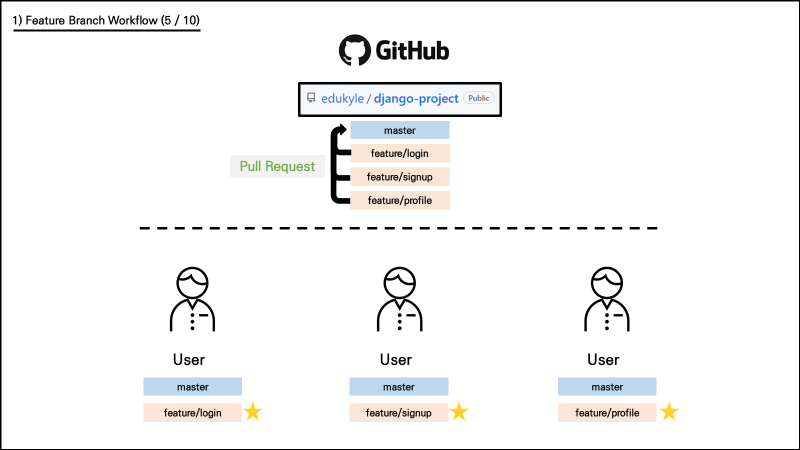
    
2. 병합이 완료되면 원격 저장소에서 병합이 완료된 브랜치는 불필요하므로 삭제합니다.
    
    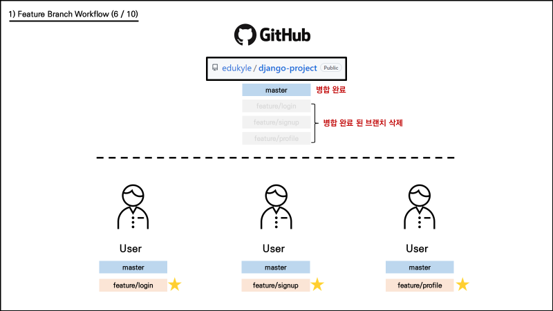
    

1. master에 브랜치가 병합되면, 각 사용자는 로컬의 master 브랜치로 이동합니다.
    
    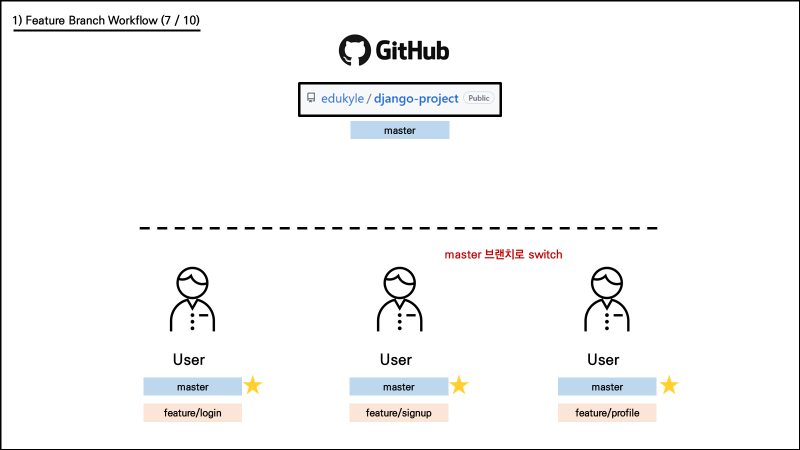
    
    ```bash
    $ git switch master
    ```
    

1. 병합으로 인해 변경된 원격 저장소의 master 내용을 로컬에 받아옵니다.
    
    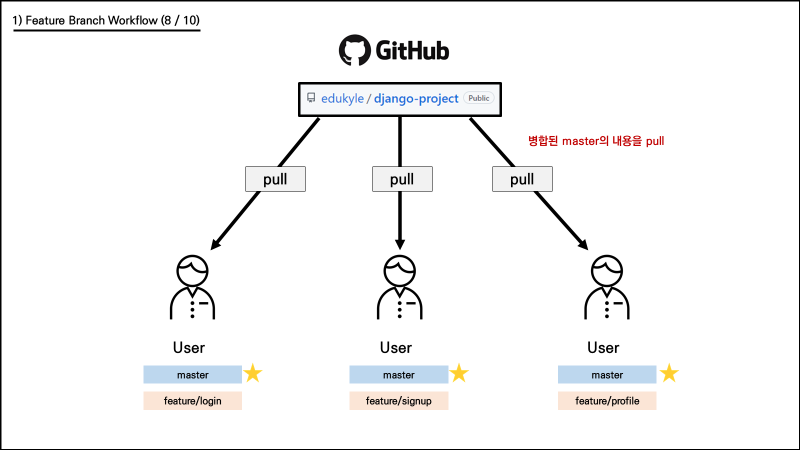
    
    ```bash
    $ git pull origin master
    ```
    

1. 병합이 완료된 master의 내용을 받았으므로, 기존 로컬 브랜치는 삭제합니다. (한 사이클 종료)
    
    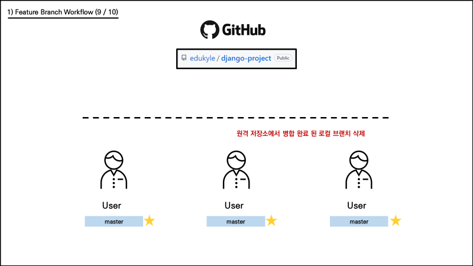
    
    ```bash
    $ git branch -d feature/login
    ```
    

1. 새로운 기능 추가를 위해 새로운 브랜치를 생성하며 위 과정을 반복합니다.
    
    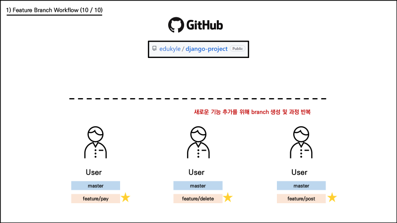
    
    ```bash
    $ git switch -c feature/pay
    ```
    

## [2] 원격 저장소 소유권이 없는 경우 (Fork & Pull model)

### (1) 개념

- 오픈 소스 프로젝트와 같이, 자신의 소유가 아닌 원격 저장소인 경우 사용합니다.
- 원본 원격 저장소를 그대로 내 원격 저장소에 `복제`합니다. (이 행위를 `fork`라고 합니다.)
- 기능 완성 후 `Push는 복제한 내 원격 저장소에 진행`합니다.
- 이후 `Pull Request`를 통해 원본 원격 저장소에 반영될 수 있도록 요청합니다.

### (2) 작업 흐름

1. 소유권이 없는 원격 저장소를 `fork`를 통해 내 원격 저장소로 `복제`합니다.
    
    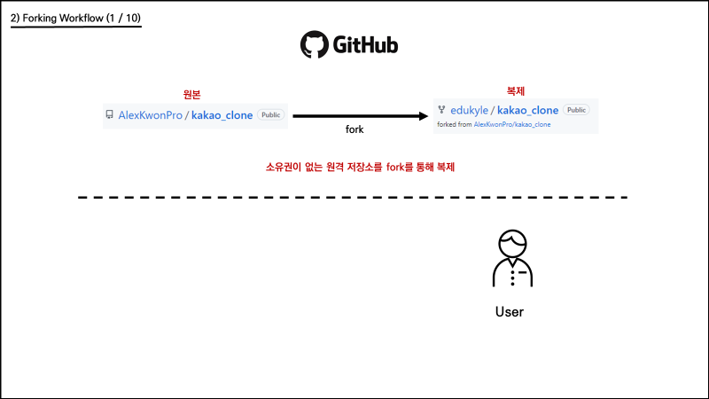
    
    아래와 같이 `Fork` 버튼을 누르면 자동으로 내 원격 저장소에 복제됩니다.
    
    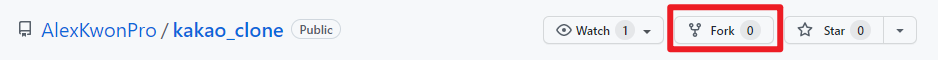
    

1. `fork` 후, 복제된 내 원격 저장소를 로컬 저장소에 `clone` 받습니다.
    
    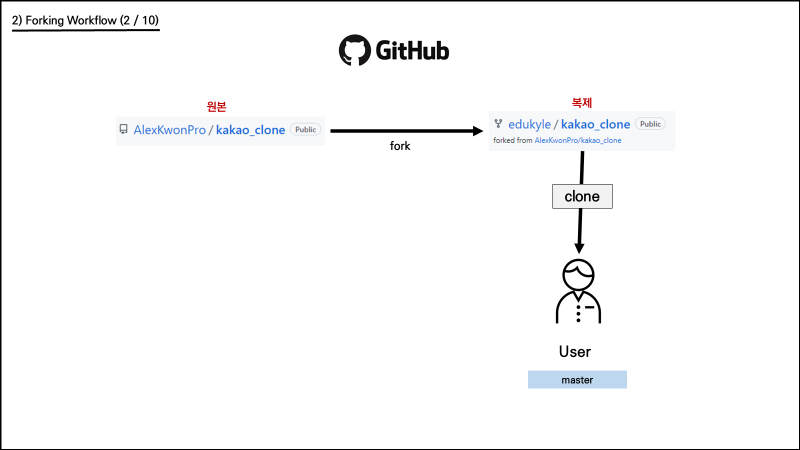
    
    ```bash
    $ git clone https://github.com/edukyle/kakao_clone.git
    ```
    

1. 이후에 로컬 저장소와 원본 원격 저장소를 동기화 하기 위해서 연결합니다.
    
    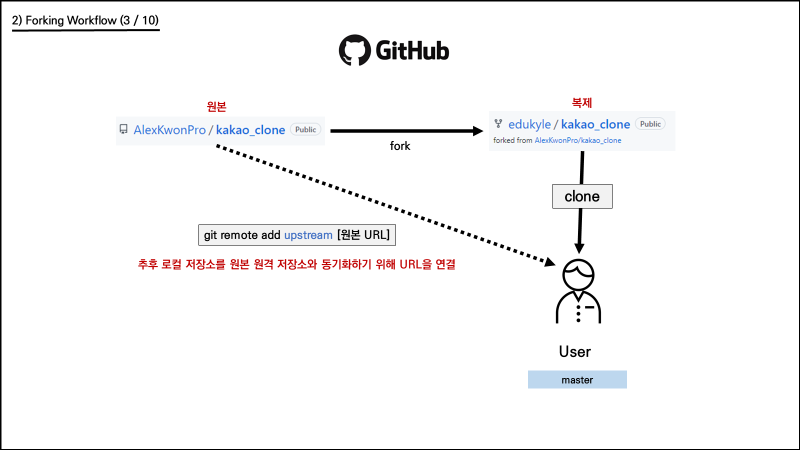
    
    ```bash
    # 원본 원격 저장소에 대한 이름은 upstream으로 붙이는 것이 일종의 관례
    
    $ git remote add upstream https://github.com/AlexKwonPro/kakao_clone.git
    ```
    

1. 사용자는 자신이 작업할 기능에 대한 `브랜치를 생성`하고, 그 안에서 `기능을 구현`합니다.
    
    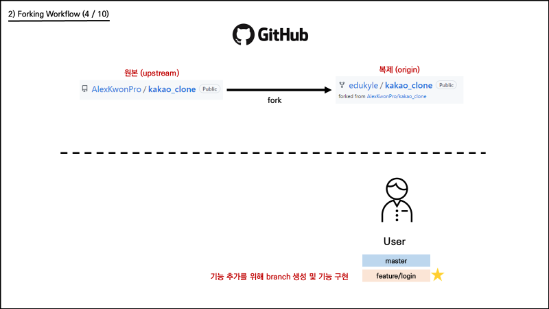
    
    ```bash
    $ git switch -c feature/login
    ```
    
2. 기능 구현이 완료되면, `복제 원격 저장소(origin)`에 해당 브랜치를 `push` 합니다.
    
    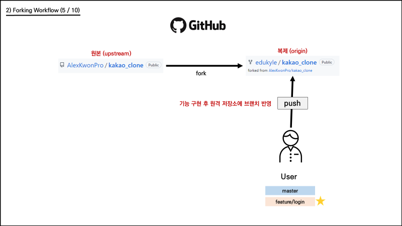
    
    ```bash
    $ git push origin feature/login
    ```
    
3. `복제 원격 저장소(origin)`에는 master와 브랜치가 반영되었습니다.
    
    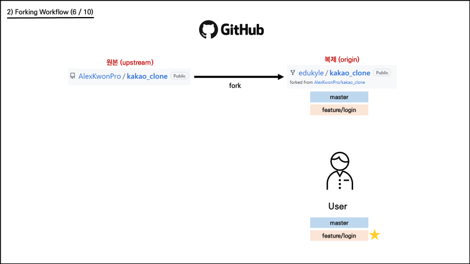
    

1. `Pull Request`를 통해 `복제 원격 저장소(origin)의 브랜치`를 `원본 원격 저장소(upstream)의 master`에 반영해달라는 요청을 보냅니다. 
(원본 원격 저장소의 관리자가 코드 리뷰를 진행하여 반영 여부를 결정합니다.)
    
    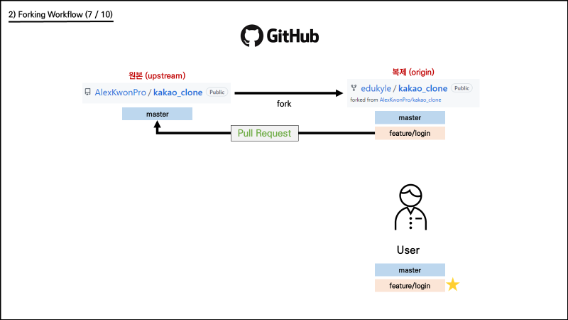
    

1. `원본 원격 저장소(upstream)`의 master에 브랜치가 병합되면 `복제 원격 저장소(origin)`의 브랜치는 삭제합니다. 그리고 사용자는 로컬에서 master 브랜치로 이동합니다.
    
    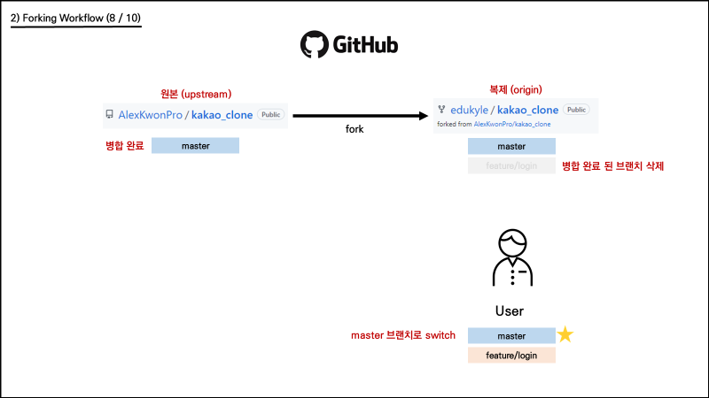
    
    ```bash
    $ git switch master
    ```
    

1. 병합으로 인해 변경된 `원본 원격 저장소(upstream)의 master` 내용을 로컬에 받아옵니다. 
그리고 기존 로컬 브랜치는 삭제합니다. (한 사이클 종료)
    
    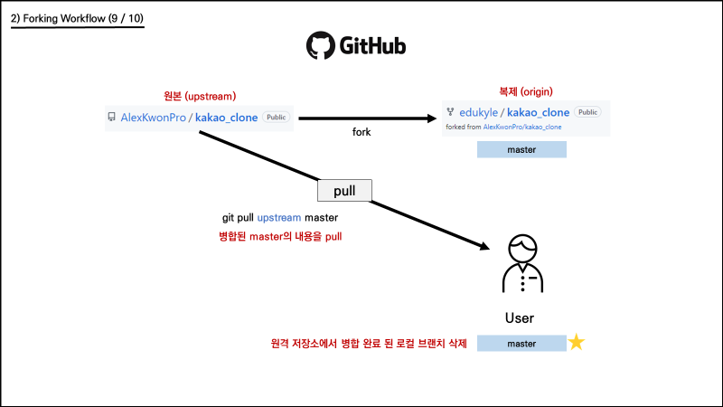
    
    ```bash
    $ git pull upstream master
    $ git branch -d feature/login
    ```
    

1. 새로운 기능 추가를 위해 새로운 브랜치를 생성하며 위 과정을 반복합니다.
    
    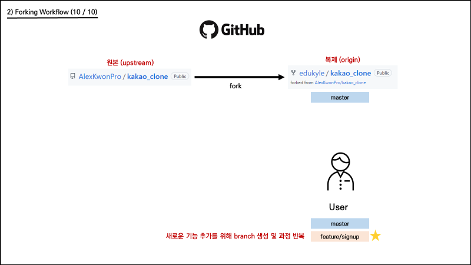
    
    ```bash
    $ git switch -c feature/pay
    ```