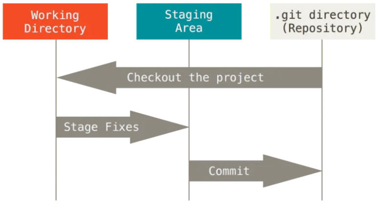
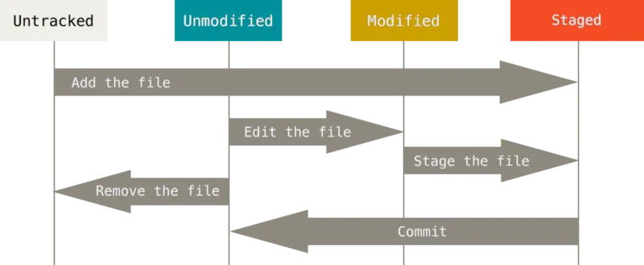

## git bash 사용할 때 쓸 키워드들
- 윈도우와 unix 명령어는 차이가 존재함. 그래서 git bash를 통해 윈도우에서 unix 계열의 명령어를 사용하려는 것.
- 루트 디렉토리 /
    - 윈도우에서 보통 C드라이브.
    - 모든 파일과 폴더를 담고 있는 최상위 폴더
- 절대 경로 / 상대 경로
    - 절대 경로는 /asdf/asd 이런 느낌. 루트 디렉토리부터 목적 지점까지 거치는 모든 경로를 작성함
    - 상대 경로는 ./~~ 이런 느낌. 현재 작업중인 디렉토리를 기준으로 계산된 상대적 위치 작성
    - ./ = 현재 작업하고 있는 폴더 의미
    - ../ = 현재 작업 중인 폴더 위의 부모 폴더를 의미
- touch
    - 파일 생성 명령어. touch b.txt 이런 느낌
    - 파일 앞에 . 붙이면 숨김 파일
- mkdir 폴더명
    - 폴더명을 ‘ ‘로 묶어서 띄어쓰기 포함 가능
- ls
    - 내 위치의 폴더와 파일을 보는 명령어.
    - -a 옵션 추가하면 all 옵션. 숨김 파일도 다 보여줌
    - -l long 옵션. 용량, 수정 날짜 등 파일 정보 다 보여줌.
    - -al 이렇게 같이 사용도 가능
- mv
    - move 폴더나 파일을 다른 위치로 이동, 이름을 변경하는 명령
    - 다른 폴더로 이동할 땐 해당 폴더가 반드시 있어야 함. 없으면 이름이 바뀜
- cd : 작업 디렉토리 변경. cd - 는 뒤로가기.
- rm
    - 폴더, 파일 지우는 명령어. 휴지통이 아니라 완전 삭제.
- **유용한 단축키**
    - `위, 아래 방향키` : 과거에 작성했던 명령어 조회
    - `tab` : 폴더/파일 이름 자동 완성
    - `ctrl + a` : 커서가 맨 앞으로 이동
    - `ctrl + e` : 커서가 맨 뒤로 이동
    - `ctrl + w` : 커서가 앞 단어를 삭제
    - `ctrl + l` : 터미널 화면을 깨끗하게 청소 (스크롤 올리면 과거 내역 조회 가능)
    - `ctrl + insert` : 복사
    - `shift + insert` : 붙여넣기
---
- Git이란?
    - 파일의 변경 사항을 추적하고 여러 명의 사용자들 간에 해당 파일들의 작업을 조율하기 위한 스냅샷 스트림 기반의 분산 버전 관리 시스템.
- 파일 기록에 필요한 것
    - 누가 - git 아이디 저장
    - 언제 - 자동으로 찍힘
    - 어디서 - 중요하지 않다. 집이던 회사던
    - 무엇을 - 중요. 변경사항 그 자체
    - 어떻게 - 직접 남김. 변경사항에 대한 간단한 주석 등..
    - 왜 - 직접 남김. 간단한 주석 등..
- git log = 깃 로그. 누가 커밋했으면 메시지랑 시간 등 보여줌. 커밋된 리스트를 볼 때 사용. 커밋의 내역을 보여줌.
- git diff = 커밋 후 변경 사항에 대해 알려줌



- `Working Directory (= Working Tree)` : 사용자의 일반적인 작업이 일어나는 곳
- `Staging Area (= Index)` : 커밋을 위한 파일 및 폴더가 추가되는 곳
- `Repository` : staging area에 있던 파일 및 폴더의 변경사항(커밋)을 저장하는 곳
- Git은 **Working Directory → Staging Area → Repository** 의 과정으로 버전 관리를 수행합니다.
- git add . 을 하면 Stage Fixes 과정이 일어남.
- git init
    - 현재 작업중인 디렉토리를 git으로 관리한다는 뜻.
    - 이미 git 저장소인 폴더 내에서 사용 금지. 중첩 금지. 최초 1회만 쓰자.
    - 터미널에 (master) 이런 표시 있으면 쓰지 말자.
    - 홈 디렉토리에서 쓰면 안댐. 경로가 ~ 인지 확인하자
- git status
    - Working Directory와 Staging Area에 있는 파일의 현재 상태를 알려주는 명령어
    - 지금 내 파일들의 git 관리 상태를 확인
    
    
    
    - 상태
        1. `Untracked` : Git이 관리하지 않는 파일 (한번도 Staging Area에 올라간 적 없는 파일)
        2. `Tracked` : Git이 관리하는 파일
            1. `Unmodified` : 최신 상태
            2. `Modified` : 수정되었지만 아직 Staging Area에는 반영하지 않은 상태
            3. `Staged` : Staging Area에 올라간 상태
- git add
    - Working Directory에 있는 파일을 Staging Area로 올리는 명령어
    - Git이 해당 파일을 추적(관리)할 수 있도록 만듭니다.
    - `Untracked, Modified → Staged` 로 상태를 변경합니다.
- git bash에서 code . 하면 해당 폴더에서 vscode 연다는 뜻
- git 과정
    1. git init
        1. git이 관리 - 변경 사항 트래킹. 이 폴더를 깃으로 관리하겠다.
    2. 변경사항 만듬
        1. 새로 생긴 파일 - untracked
            1. git이 아직 관리하고 있지 않음
        2. untracked를 add → commit
            1. 파일을 git이 관리함
            2. 그것을 수정 → M이 찍힘
    3. add
        1. staging area에 올라감
        2. 저장할 준비가 됨
        3. 파일 생성 변경 등 변경 후 add 하기.
    4. commit
        1. with message 저장
        2. 그 순간의 변경사항들이 저장됨
        3. git commit -m ‘메시지’
    5. remote
        1. github repository 생성
        2. git remote add origin {url} 최초 1회 실행
        3. git push -u origin main 최초 1회 실행
    6. 이후에는 변경사항 생김 → git add → git commit → git push 반복
- github에 repository 생성하고 remote로 연결해서 push 해줌.
- git으로 버전관리 하기.
    - commit을 쌓아서 버전관리.
    - 로컬에서만 하는게 아니라 온라인에서 다른 사람과 나의 git 공유 가능!
- git remote add origin 주소
    - 주소를 origin에 저장. origin이 변수 같은 느낌.
    - 이후 이거를 git push -u origin main 으로 올림.
    - origin에 main을 올리겠다. origin에는 내가 쓴 주소가 있음!
---
## git 추가 설명
- GIt
    - git init - 디렉토리를 git 관리 시작
    - 변경 사항 발생 → 저장
        - git add
        - git commit
    - 위 작업까지는 로컬에서만 발생하는 일! (내 컴퓨터 에서만)
- github
    - 레포지토리 - git을 올리는 공간
    - 로컬의 .git을 깃허브의 레포지토리에 올리자
        - 로컬 명령 → url로 올려
        - git remote add origin {url}
            - 원격 저장소
        - git push -u origin main
            - main = 브랜치 명.
            - 깃이 main을 origin에 올리겠다! 라는 뜻.
            - -u는 기본적으로 origin에다 main을 올리겠다는 것을 알려주는 것. 이후엔 origin main을 생략해도 main에 올리게 된다.
- git clone {주소} 레포지토리명
    - 레포지토리명 따로 지정 안하면 기존꺼 사용
    - 레포지토리명 겹치면 안댐
- .gitignore
    - api 키, 비밀번호 등 굳이 올릴 필요가 없거나 올려선 안되는 파일들을 push 되지 않도록 기록해두는 파일
    - 블랙리스트 느낌
    - .gitignore 파일명 똑같이 만들어서 제외할 파일 써두면 댐.
    - .env 파일은 환경 변수나 비밀번호 등 민감한 정보를 써두는 곳. 이런 파일을 제외해두는 편.
    - commit을 하면 파일을 관리하게 됨. 그래서 gitignore를 통해 제외하려면 commit 하기 전에 써둬야 한다. 그니까 그냥 add 전에 써두자.
    - .git 폴더와 동일한 위치에 생성해야 함.
    - https://www.toptal.com/developers/gitignore/
    - 위 사이트에서 쓰는 언어나 환경에 따라 필요한 gitignore 생성해줌
    - 최초의 커밋을 gitignore로 하면 좋음
- 같은 git에서 서로 동시에 push하는 경우
    - A와 B가 서로 다른 파일을 수정한 후 push 하는 경우 A는 push가 된다면, B는 push가 안됨.
    - 이미 A의 파일을 통해 최신화 된 git 데이터가 있기 때문. B는 git pull을 통해 최신 데이터를 받고 자신의 기존 데이터와 merge를 통해 병합해서 새로운 commit을 한 후에 push하면 된다.
        - B가 pull 할 때 vi 창이 뜨는데, 그냥 :wq 해주면 댐.
    - 이후 B가 push하면 그게 최신 데이터가 되고, A가 다시 pull 하면 둘 다 동일한 버전을 갖게 됨.
    - 이 상황은 서로 같은 버전에서 작업하고, 서로 다른 데이터를 작업한 경우임.
    - 서로 같은 데이터를 작업한 경우 충돌이 일어나면서 자동 merge가 안됨. 사용자가 직접 해당 파일을 수정한 후 add commit 해야 함. 이게 merge 하는 과정이랑 같음
    - 이후 push하면 끝.
- git default editor를 vi -> vscode로 변경하는 방법

```python
git config --global core.editor "code --wait"
```

- git stash
    - git pull이 안되는 경우 사용. 임시 저장. 이후 git pull 가능!