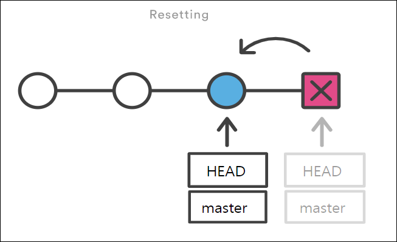
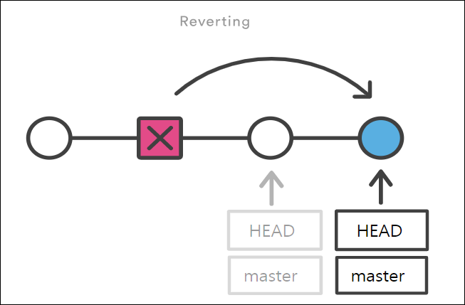

## [1] 파일 내용을 수정 전으로 되돌리기

> Working Directory에서 파일을 수정했다고 가정해봅시다.
만약 이 파일의 수정 사항을 취소하고, 원래 모습대로 돌리려면 어떻게 해야 할까요?
> 

### (1) git restore

- `git restore <파일 이름>`의 형식을 사용합니다.
- Git의 추적이 되고 있는, 즉 버전 관리가 되고 있는 파일만 되돌리기가 가능합니다.

1. 이미 버전 관리가 되고 있는 test.md 파일을 변경 후 저장(save)합니다.
    
    ```
    # test.md
    Hello
    World <- "World"라는 새로운 내용 추가
    -------------------------------------
    이후 저장
    ```
    
2. test.md는 modified 상태가 되었습니다.
    
    ```bash
    $ git status
    On branch master
    Changes not staged for commit:
      (use "git add <file>..." to update what will be committed)
      (use "git restore <file>..." to discard changes in working directory)
            modified:   test.md
    
    no changes added to commit (use "git add" and/or "git commit -a")
    ```
    
3. git restore를 통해 수정 전으로 되돌립니다.
    
    ```bash
    $ git restore test.md
    ```
    
    ```
    # test.md
    Hello
    -------------------------------------
    World가 삭제 되면서, 수정 전으로 되돌아감
    ```
    
- 참고사항
    
    ```bash
    # 구버전 Git(2.23.0 이전)에서는 아래와 같은 명령어 사용
    
    $ git checkout -- <파일 이름>
    ```
    

<aside>
❗ 한 번 git restore를 통해 수정을 취소하면, 해당 내용을 복원할 수 없으니 주의 바랍니다!

</aside>

## [2] 파일 상태를 Unstage로 되돌리기

> “Staging Area와 Working Directory 사이를 넘나드는 방법”

`git add`를 통해서 파일을 `Staging Area`에 올렸다고 가정해봅시다.
만약 이 파일을 다시 `Unstage` 상태로 내리려면 어떻게 해야 할까요? 
두 가지 상황으로 나누어 살펴보겠습니다.
> 

### (1) git rm --cached

1. 새 폴더에서 git 초기화 후 진행 `test.md` 파일을 생성하고 git add를 진행
    
    ```bash
    $ touch test.md
    ```
    
    ```bash
    $ git add test.md
    ```
    
    ```bash
    $ git status
    On branch master
    
    No commits yet
    
    Changes to be committed:
      (use "git rm --cached <file>..." to unstage)
            new file:   test.md
    ```
    
2. Staging Area에 올라간 test.md를 다시 내리기(unstage)
    
    ```bash
    $ git rm --cached test.md
    rm 'test.md'
    ```
    
    ```bash
    $ git status
    On branch master
    
    No commits yet
    
    Untracked files:
      (use "git add <file>..." to include in what will be committed)
            test.md
    
    nothing added to commit but untracked files present (use "git add" to track)
    ```
    

### (2) git restore --staged

- 두번째 상황 전 사전 준비
    
    ```bash
    $ git add .
    $ git commit -m "first commit"
    ```
    
1. `test.md`의 내용을 변경하고 git add를 진행
    
    ```bash
    test.md 파일 변경 후
    $ git add test.md
    ```
    
    ```bash
    $ git status
    On branch master
    Changes to be committed:
      (use "git restore --staged <file>..." to unstage)
            modified:   test.md
    ```
    
2. Staging Area에 올라간 test.md를 다시 내리기(unstage)
    
    ```bash
    $ git restore --staged test.md
    ```
    
    ```bash
    $ git status
    On branch master
    Changes not staged for commit:
      (use "git add <file>..." to update what will be committed)
      (use "git restore <file>..." to discard changes in working directory)
            modified:   test.md
    
    no changes added to commit (use "git add" and/or "git commit -a")
    ```
    
- 참고사항
    
    ```bash
    구버전 Git(2.23.0 이전)에서는 아래와 같은 명령어 사용
    
    $ git reset HEAD <파일 이름>
    ```
    

<aside>
💡 **(중요) Unstage로 되돌리는 명령어가 다른 이유가 무엇인가요?**

1. `git rm --cached <file>`
    - **root-commit이 없는 경우 사용 (로컬 저장소 자체에 커밋이 1개도 없는 경우)**
    - “to unstage and remove paths only from the staging area”
2. `git restore --staged <file>`
    - **로컬 저장소 자체에 커밋이 1개 이상 있는 경우 사용**
    - “the contents are restored from HEAD”
</aside>

## [3] 바로 직전 커밋 수정하기

> 만약 `A`라는 기능을 완성하고 `"A 기능 완성"`이라는 커밋을 남겼다고 가정해봅시다.
그런데 아차! A 기능에 필요한 파일 중 1개를 빼놓고 커밋 했다는 걸 깨달아 버렸습니다.
직전 커밋을 취소하고, 모든 파일을 포함해서 다시 커밋 하려면 어떻게 해야 할까요?
> 

### (1) git commit --amend

- 2가지 역할
    1. Staging Area에 새로 올라온 내용이 없다면, 단순히 `직전 커밋의 메시지만 수정`합니다. 
    (즉, 커밋하자마자 바로 이 명령어을 실행하는 경우)
    2. Staging Area에 새로 올라온 내용이 있다면, 직전 커밋 내역에 같이 묶어서 재 커밋 됩니다.

**1-1. 커밋 메시지만 수정하는 경우**

1. A 기능을 완성하고 커밋합니다.
    
    ```bash
    $ git commit -m 'B feature completed'
    ```
    
2. 현재 커밋 해시 값 확인해두기
    
    ```bash
    $ git log
    ```
    
3. 커밋 메시지 수정을 위해 다음과 같이 입력합니다.
    
    ```bash
    $ git commit --amend
    
    hint: Waiting for your editor to close the file..[master c01f908] Add no.txt
    ...
    ```
    
4. Vim 편집기가 열리면서 직전 커밋 메시지를 수정할 수 있습니다.
    
    ```bash
    B feature completed
    
    # Please enter the commit message for your changes. Lines starting
    # with '#' will be ignored, and an empty message aborts the commit.
    #
    # Date:      Wed Jan 12 01:25:10 2022 +0900
    #
    # On branch master
    #
    # Initial commit
    #
    # Changes to be committed:
    #       new file:   test.txt
    ```
    
5. 커밋 메세지를 수정하고 저장하면 새로운 메세지로 변경되며 커밋 **해시 값 또한 변경됨**
    
    ```bash
    $ git log
    ```
    

**1-2. 커밋 재작성**

1. 실수로 bar.txt를 빼고 커밋 해버린 상황까지 만들어 봅시다.
    
    ```bash
    $ touch foo.txt bar.txt
    $ git add foo.txt
    ```
    
    ```bash
    $ git status
    On branch master
    Changes to be committed:
      (use "git restore --staged <file>..." to unstage)
            new file:   foo.txt
    
    Untracked files:
      (use "git add <file>..." to include in what will be committed)
            bar.txt
    ```
    
    ```bash
    $ git commit -m "foo & bar"
    
    [master 4221af6] foo & bar
     1 file changed, 0 insertions(+), 0 deletions(-)
     create mode 100644 foo.txt
    ```
    
    ```bash
    $ git status
    
    On branch master
    Untracked files:
      (use "git add <file>..." to include in what will be committed)
            bar.txt
    ```
    
2. 누락된 파일을 staging area로 이동 시킵니다.
    
    ```bash
    $ git add bar.txt
    
    $ git status
    On branch master
    Changes to be committed:
      (use "git restore --staged <file>..." to unstage)
            new file:   bar.txt
    ```
    
3. `git commit --amend` 를 입력합니다
    
    ```bash
    $ git commit --amend
    ```
    
4. Vim 편집기가 열립니다. (마찬가지로 커밋 메시지도 수정가능)
    
    ```bash
    foo & bar
    
    # Please enter the commit message for your changes. Lines starting
    # with '#' will be ignored, and an empty message aborts the commit.
    #
    # Date:      Mon Jun 7 22:32:58 2021 +0900
    #
    # On branch master
    # Changes to be committed:
    #       new file:   bar.txt
    #       new file:   foo.txt
    ```
    
5. Vim 편집기를 저장 후 종료하면 직전 커밋이 덮어 씌워집니다. (커밋이 새로 추가된 것이 아님)
마찬가지로 커밋 **해시 값 또한 변경됨** 
    
    ```bash
    $ git commit --amend
    
    [master 7f6c24c] foo & bar
     Date: Mon Jun 7 22:32:58 2021 +0900
     2 files changed, 0 insertions(+), 0 deletions(-)
     create mode 100644 bar.txt
     create mode 100644 foo.txt
    ```
    
6. `git log -p` 를 사용하여 직전 커밋의 변경 내용을 살펴봅니다.

---

## [4] git reset

> 가끔 앱을 사용하다가 업데이트를 했는데, 오히려 예전 버전이 더 좋다고 느낄 때가 있습니다.
이처럼 만약 여러분들이 예전 버전으로 돌아가고 싶을 땐 어떻게 해야할까요?
> 

- `git reset [옵션] <커밋 ID>`의 형태로 사용합니다.
- **시계를 마치 과거로 돌리는 듯한 행위**로써, 특정 커밋 상태로 되돌아갑니다.
- 특정 커밋으로 되돌아 갔을 때, 해당 커밋 이후로 쌓아 놨던 커밋들은 전부 사라집니다.

- `옵션`은 아래와 같이 세 종류가 있으며, 생략 시 `--mixed`가 기본 값입니다.
    1. `--soft` 
        - **돌아가려는 커밋으로 되돌아가고**,
        - 이후의 commit된 파일들을 `staging area`로 돌려놓음 (commit 하기 전 상태)
        - 즉, 다시 커밋할 수 있는 상태가 됨
    2. `--mixed`
        - **돌아가려는 커밋으로 되돌아가고**,
        - 이후의 commit된 파일들을 `working directory`로 돌려놓음 (add 하기 전 상태)
        - 즉, unstage 된 상태로 남아있음
        - 기본 값
    3. `--hard`
        - **돌아가려는 커밋으로 되돌아가고**,
        - 이후의 commit된 파일들(`tracked 파일들`)은 모두 working directory에서 삭제
        - 단, Untracked 파일은 Untracked로 남음
        - 혹시나 이미 삭제한 커밋으로 다시 돌아가고 싶다면? → `git reflog`를 사용합니다.
            
            ```bash
            $ git reflog
            1a410ef HEAD@{0}: reset: moving to 1a410ef
            ab1afef HEAD@{1}: commit: modified repo.rb a bit
            484a592 HEAD@{2}: commit: added repo.rb
            
            git reflog 명령어는 HEAD가 이전에 가리켰던 모든 커밋을 보여줍니다.
            따라서 --hard 옵션을 통해 지워진 커밋도, reflog로 조회하여 돌아갈 수 있습니다.
            ```
            
        - 예시
            
            ```bash
            # --hard 예시
            
            $ git log --oneline
            d56a232 (HEAD -> master) hello
            7f6c24c foo & bar
            006dc87 rename commit message
            3551584 asdasd
            71ccbf1 first
            
            $ git reset --hard 3551584
            HEAD is now at 3551584 asdasd
            
            # 3551584 커밋까지만 살아있고, 나머지 커밋은 모두 사라짐
            $ git log --oneline
            3551584 (HEAD -> master) asdasd
            71ccbf1 first
            
            $ git status
            On branch master
            nothing to commit, working tree clean
            ```
            

- 그림으로 이해하는 `git reset`
    
    
    
    이전 커밋으로 돌아가고, 돌아간 커밋 이후의 내역은 사라집니다.
    

## [5] git revert

> git reset은 쉽게 과거로 돌아갈 수 있다는 장점이 있지만, 커밋 내역이 사라진다는 단점이 있습니다. 따라서 다른 사람과 협업할 때 커밋 내역의 차이로 인해 충돌이 발생할 수 있습니다.
> 

- `git revert <커밋 아이디>` 의 형태로 사용합니다.
- **특정 사건을 없었던 일로 만드는 행위**로써, `이전 커밋을 취소한다는 새로운 커밋`을 만듭니다.
- git reset은 커밋 내역을 삭제하는 반면, git revert는 `새로 커밋을 쌓는다`는 차이가 있습니다.
- 사용
    
    ```bash
    $ git log --oneline
    7f6c24c (HEAD -> master) foo & bar
    006dc87 rename commit message
    3551584 asdasd
    71ccbf1 first
    
    # revert commit 편집기 실행
    $ git revert 71ccbf1
    Removing foo.txt
    Removing bar.txt
    [master 3b55051] Revert "first"
     2 files changed, 0 insertions(+), 0 deletions(-)
     delete mode 100644 bar.txt
     delete mode 100644 foo.txt
    
    $ git log --oneline
    3b55051 (HEAD -> master) Revert "foo & bar" # 새로 쌓인 커밋
    7f6c24c foo & bar # 히스토리는 남아있음
    006dc87 rename commit message
    3551584 asdasd
    71ccbf1 first
    ```
    
- 기타
    
    ```bash
    # 공백을 통해 여러 커밋을 한꺼번에 되돌리기 가능
    $ git revert 7f6c24c 006dc87 3551584
    
    # 범위 지정을 통해 여러 커밋을 한꺼번에 되돌리기 가능
    $ git revert 3551584..7f6c24c
    
    # 커밋 메시지 작성을 위한 편집기를 열지 않음 (자동으로 커밋 완료)
    $ git revert --no-edit 7f6c24c
    
    # 자동으로 커밋하지 않고, Staging Area에만 올림 (이후, git commit으로 수동 커밋)
    # 이 옵션은 여러 커밋을 revert 할 때 하나의 커밋으로 묶는게 가능
    $ git revert --no-commit 7f6c24c
    ```
    

<aside>
❗ **git reset과 비슷하다는 이유로 다음 사항이 혼동될 수 있습니다.**

`git reset --hard 5sd2f42`라고 작성하면 5sd2f42라는 커밋`으로` 돌아간다는 뜻입니다.
`git revert 5sd2f42`라고 작성하면 5sd2f42라는 커밋`을` 되돌린다는 뜻입니다.

</aside>

- 그림으로 이해하는 `git revert`
    
    
    
    이전 커밋을 취소했다는 새로운 커밋을 생성합니다. (이전 커밋은 그대로 살아있습니다.)