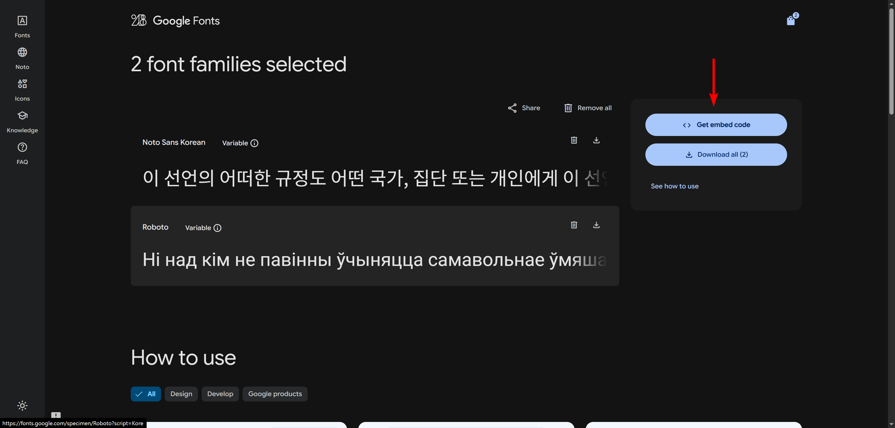
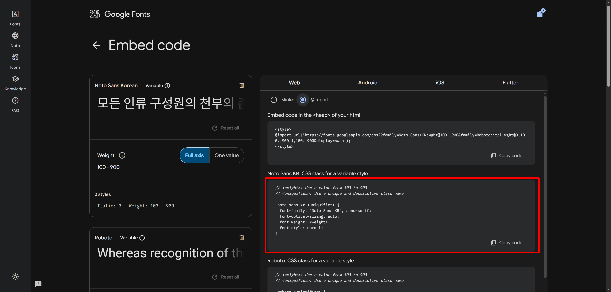

## Google Fonts

- 구글이 제공하는 무료 웹 폰트 서비스

### 사용법

1. [Google Fonts](https://fonts.google.com/) 접속
2. 원하는 폰트 탐색, 선택 (예: [Noto Sans Korean](https://fonts.google.com/noto/specimen/Noto+Sans+KR?script=Kore))
3. `Get font` → `Get embed code` 클릭
    
    
    
4. 폰트 추가 방식 선택
    - 방법 1: `<link>` 태그 사용
        1. HTML 파일에 `<link>` 태그 직접 추가
            - CSS 파일과 폰트 파일의 병렬 다운로드로 `@import`보다 렌더링 성능 우수
        2. `<link>` 탭 선택 후 제공된 태그들을 복사하여 HTML `<head>` 태그 내부에 붙여넣기
        
        ```html
        <head>
          <link rel="preconnect" href="<https://fonts.googleapis.com>" />
        
          <link rel="preconnect" href="<https://fonts.gstatic.com>" crossorigin />
          <link
            href="<https://fonts.googleapis.com/css2?family=Noto+Sans+KR:wght@100..900&family=Roboto:ital,wght@0,100..900;1,100..900&display=swap>"
            rel="stylesheet"
          />
        </head>
        ```
        
    - 방법 2: `@import` 사용
        1. CSS 파일 상단에 `@import` 구문 추가
        2. `Web` 탭의 `@import` 항목 선택 후 `<style>` 태그를 제외한 `@import` 코드를 복사하여 `css` 파일 최상단에 붙여넣기
        
        ```css
        @import url("<https://fonts.googleapis.com/css2?family=Noto+Sans+KR:wght@100..900&display=swap>");
        
        /* 다른 CSS 규칙들... */
        
        ```
        
5. CSS에서 `font-family` 적용
- 사이트 예시 코드를 참고하여 CSS 규칙 작성
    
    
    
    ```css
    p {
      font-family: "Noto Sans KR", sans-serif;
    }
    
    ```
    

## FontAwesome

- 각종 아이콘이 있는 사이트. 그림이 아니라 글자 취급.

[Font Awesome](https://fontawesome.com/)

## Tailwind CSS

- 유틸리티 클래스로 스타일을 적용하는 CSS 라이브러리
- 빠르고 효율적인 스타일링 가능
- 반응형 웹 디자인 지원
- [Tailwind CSS 공식 사이트](https://tailwindcss.com/)

### Tailwind CSS 설치

- `<body>` 태그 내부에 `<script>` 태그로 CDN 링크 추가
- [참고 문서](https://tailwindcss.com/docs/installation/play-cdn)
- 자주 쓰이니까 꼭 알아둬야 한다!

```html
<!DOCTYPE html>
<html>
  <head>
    <meta charset="UTF-8" />
    <meta name="viewport" content="width=device-width, initial-scale=1.0" />
    <!-- CDN 링크 script 태그 -->
    <script src="https://cdn.jsdelivr.net/npm/@tailwindcss/browser@4"></script>
  </head>
</html>

```

## 유틸리티 클래스(Utility Classes)

- 기능별로 하나의 스타일 속성만 가진 클래스

### 예시

**`.w-40`: `width: 10rem;` 속성 정의**

```css
/* 순수 css 표현 */
.w-40 {
  width: 10rem;
}

```

**`.text-sm`: `font-size: 0.875rem;` 속성 정의**

```css
/* 순수 css 표현 */
.text-sm {
  font-size: 0.875rem;
}

```

**`.m-4`: `margin: 1rem;` 속성 정의**

```css
/* 순수 css 표현 */
.m-4 {
  margin: 1rem;
}

```

**`md:w-80`: `width: 20rem`; 속성 정의 (768px 이상에서 적용)**

```python
/* 순수 css 표현 */
@media (min-width: 768px) {
  .md\:w-80 {
    width: 20rem;
  }
}
```

### 순수 CSS와 Tailwind CSS 비교

**테두리 `border`**

```html
<!-- 순수 css 활용 -->
<div class="box"></div>
<br />

<!-- tailwindcss 활용  -->
<div class="border-4 border-black border-dashed w-40 h-40"></div>

```

```css
.box {
  border-width: 4px;
  border-color: black;
  border-style: dashed;
  width: 10rem;
  height: 10rem;
}

```

**플렉스 `flex` 속성**

```html
<!-- 순수 css 활용 -->
<div class="flex-container">
  <div class="flex-item"></div>
  <div class="flex-item"></div>
  <div class="flex-item"></div>
</div>
<br />

<!-- tailwindcss 활용  -->
<div class="flex justify-center gap-8">
  <div class="border-4 border-black border-dashed w-40 h-40"></div>
  <div class="border-4 border-black border-dashed w-40 h-40"></div>
  <div class="border-4 border-black border-dashed w-40 h-40"></div>
</div>

```

```css
.flex-container {
  display: flex;
  justify-content: center;
  gap: 2rem;
}

.flex-item {
  border-width: 4px;
  border-color: black;
  border-style: dashed;
  width: 10rem;
  height: 10rem;
}

```

### 문제점

- 많은 클래스 사용으로 코드 가독성 저하

**tailwindcss 활용 시**

```html
<div class="w-40 h-40 border-4 border-black border-dashed"></div>

```

**순수 css 활용 시**

```html
<div class="box"></div>

```

```css
.box {
  width: 10rem;
  height: 10rem;
  border-width: 4px;
  border-color: black;
  border-style: dashed;
}

```

## 생성형 AI UI 도구

- 사용자가 자연어 또는 스케치 이미지로 원하는 UI를 설명하면, AI가 이를 해석하여 실제 작동하는 UI 디자인과 코드를 만들어주는 서비스
- 디자인 툴과 개발의 경계를 허물어 아이디어를 빠른 속도로 시각화하고 프로토타입 제작 가능

### 기존 개발 방식과 차이점

- 전통적인 방식: 기획 → 와이어프레임/디자인(Figma 등) → 개발자 코딩(HTML, CSS, JS)
- 생성형 AI 방식: 아이디어/프롬프트 → AI로 디자인 및 코드 생성 → 개발자 코딩(HTML, CSS, JS)

### 주의사항

1. 웹 페이지 구현의 시작부터 끝을 AI가 모두 할 수도 없고, 모두 맡겨서도 안된다.
2. AI가 생성한 코드를 보고, 이해하고, 이를 기반으로 수정하는 과정이 꼭 필요하다.

---

## Google Stitch

[**stitch.withgoogle.com**](https://stitch.withgoogle.com/)

- Google에서 개발한 텍스트, 이미지, 스케치 기반 UI 생성형 AI 도구
- 디자인 시안을 Figma로 내보낼 수 있어 디자이너와의 협업에 유용

### 주요 특징

- **멀티모달 입력**: 텍스트, 손그림, 와이어프레임, 스크린샷 등 다양한 형태로 아이디어 입력 가능
- **Figma 연동**: 생성된 디자인을 Figma 파일로 내보내 디테일한 수정 가능
- **HTML/CSS 코드 생성**: 생성된 디자인의 HTML/CSS 코드 제공

### Stitch Prompt Guide

[**Stitch Prompt Guide**](https://discuss.ai.google.dev/t/stitch-prompt-guide/83844)

- 명확한 목표 설정 : 서비스의 목적과 핵심 기능을 먼저 정의
- 형용사로 분위기 설정 : 활기찬(vibrant), 고무적인(encouraging), 미니멀리스트(minimalist) 와 같은 형용사로 서비스의 분위기 설정
- UI/UX 키워드 사용: Navigation bar, CTA, Hero section과 같은 구체적인 키워드 사용
- 한 번에 하나 씩(One Major Change at a Time)

---

## Vercel v0

[**v0.dev**](https://v0.dev/)

- Vercel에서 개발한 텍스트 기반 UI 생성형 AI 도구
- **React, Tailwind CSS** 기반의 웹 컴포넌트 코드 생성

### 주요 특징

- **React + Tailwind CSS 기반**: 현업에서 널리 쓰이는 기술 스택으로 코드를 생성하여 프로젝트에 바로 적용 가능
- **컴포넌트 기반 생성**: 페이지 전체가 아닌 개별 컴포넌트 생성에 특화

---

## Readdy AI

[**readdy.ai**](https://readdy.ai/)

- 텍스트, 이미지 기반 UI 생성형 AI 도구

### 주요 특징

- **반응형 웹 디자인**: 모바일과 데스크탑 두 화면에 대한 디자인 생성
- **코드 및 Figma 생성**: 생성된 디자인의 HTML/CSS 코드 및 Figma 파일 제공 (유료 기능)