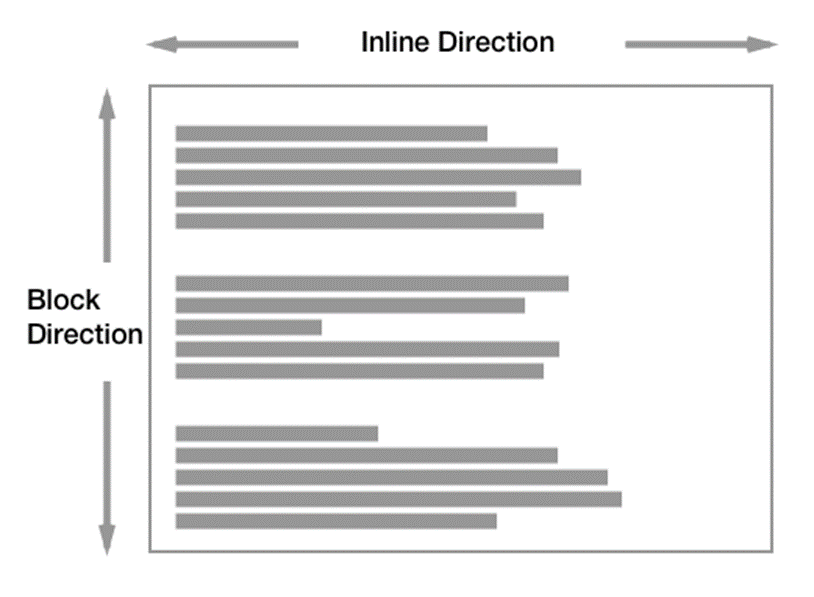

# CSS 디스플레이 속성

## 디스플레이(Display)

- 요소가 웹 페이지에서 어떻게 배치되고, 공간을 차지할지를 결정하는 속성
- 각 요소는 디스플레이 속성에 따라 인라인, 블록 또는 레이아웃 방식을 따르게 된다

## 디스플레이 속성 종류

### inline

- 수평으로 배치되며, 요소는 자식 요소의 크기만큼 공간을 차지한다
- 줄을 바꾸지 않고 다른 인라인 요소와 한 줄에 나란히 위치한다
- 너비와 높이를 지정할 수 없다
- 예시 태그: `span`, `a`, `img`, `input`, `label`, `button`

### block

- 수직으로 배치되며, 요소는 한 줄 전체를 차지한다
- 블록 요소는 자동으로 줄이 바뀌며 너비와 높이를 지정할 수 있다
- 예시 태그: `div`, `p`, `h1`, `h2`, `h3`, `h4`, `h5`, `h6`, `ul`, `ol`, `li`, `table`, `form`

### inline-block

- inline 요소처럼 한 줄에 나란히 수평으로 배치되지만 block 요소처럼 너비와 높이를 지정할 수 있다
- 두 속성의 장점을 결합한 속성
- 예시 태그: `input`, `textarea`, `select`, `button`

### none

- 요소를 숨긴다
- 해당 요소는 웹 페이지에서 보이지 않으며 공간도 차지하지 않는다
- 예시 태그: `script`, `style`, `link`, `meta`



### 예시 코드

```html
<div class="inline">inline 속성 div</div>
<div class="inline">inline 속성 div</div>

<div class="block">block 속성 div</div>
<div class="block">block 속성 div</div>

<div class="inline-block">inline-block 속성 div</div>
<div class="inline-block">inline-block 속성 div</div>

```

```css
/* div 태그 공통 스타일 속성 */
div {
  width: 200px;
  height: 200px;
}

.inline {
  display: inline;
  border: red 1px solid;
}

.block {
  display: block;
  border: blue 1px solid;
}

.inline-block {
  display: inline-block;
  border: green 1px solid;
}

```