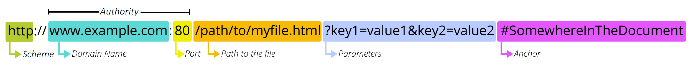

## HTTP 프로토콜

- HTTP(HyperText Transfer Protocol)는 웹에서 데이터를 주고받기 위한 통신 규약이다. 클라이언트와 서버 사이에서 메시지를 어떻게 주고받을지 정해놓은 약속이다.
- 하이퍼텍스트 = url을 통해 텍스트를 클릭하면 이동시키는 기술
- 트랜스퍼 = 이동 시키는 거
- 프로토콜 = 규약

### 클라이언트와 서버 구조

- 클라에서 요청 → 서버에서 받고 결과 보내주기 → 클라에서 결과 받기
- 클라이언트 : 서비스를 요청하는 주체. 웹 브라우저나 모바일 앱이 이에 해당.
- 서버 : 요청에 대해 응답을 제공하는 주체

---

## HTTP의 주요 특징

- 비연결성
    - 클라이언트가 요청을 보내고 서버가 응답을 마치면 즉시 연결을 끊는 방식.
    - 이를 통해 서버의 자원을 효율적으로 관리할 수 있지만, 매번 새로운 연결을 맺어야 하는 비용이 발생
- 무상태성
    - 서버가 클라이언트의 이전 상태를 기억하지 않는 특징.
    - 각 요청은 독립적이며 서버는 요청에 필요한 모든 정보를 매번 전달받아야 한다. 이 특징 덕분에 서버 확장이 용이하다.

---

## HTTP 메시지 구조

### 요청 메시지

- 시작 라인: 메소드, 타겟 경로, HTTP 버전이 포함된다.
- 헤더: 요청에 대한 부가 정보가 들어간다.
    - 요청한 데이터에 대한 정보 등
- 바디: 서버로 보낼 실제 데이터가 담기는 부분이다.

```jsx
POST /api/v1/users HTTP/1.1
Host: api.example.com
Content-Type: application/json
Authorization: Bearer YOUR_ACCESS_TOKEN

{
  "username": "developer_kim",
  "email": "kim@example.com",
  "role": "admin"
}
```

### 응답 메시지

- 시작 라인: HTTP 버전, 상태 코드, 상태 문구가 포함된다.
- 헤더: 응답에 대한 부가 정보가 들어간다.
- 바디: 서버가 클라이언트에 전달하는 실제 데이터가 담긴다.

```jsx
HTTP/1.1 201 Created
Content-Type: application/json

{
  "status": "success",
  "data": {
    "id": 101,
    "username": "developer_kim",
    "created_at": "2000-01-01T00:00:00Z"
  }
}
```

---

## HTTP 메소드

클라이언트가 서버에 요청의 목적을 알리는 방법이다.

| 메소드 | 설명 |
| --- | --- |
| GET | 리소스 조회를 의미한다. |
| POST | 요청 데이터 처리이며 주로 신규 리소스 등록에 사용한다. |
| PUT | 리소스를 완전히 대체하거나 생성한다. |
| PATCH | 리소스의 일부만 수정한다. |
| DELETE | 리소스 삭제를 의미한다. |

---

## HTTP 상태 코드

서버가 클라이언트의 요청이 성공했는지 또는 실패했는지 알려주는 3자리 숫자이다.
더 많이 있지만 생략. (100번대 도 있다!)

### 2xx - 성공

- 200: 요청이 정상적으로 처리된 상태이다.
- 201: 요청이 성공하여 새로운 리소스가 생성된 상태이다.

### 3xx - 리다이렉션

- 301: 리소스의 위치가 영구적으로 이동된 상태이다.
- 302: 리소스의 위치가 일시적으로 이동된 상태이다.

### 4xx - 클라이언트 오류

- 400: 잘못된 요청 문법 등으로 서버가 처리할 수 없는 상태이다.
- 401: 인증되지 않은 사용자임을 나타낸다.
- 403: 권한이 없어 접근이 거부된 상태이다.
- 404: 요청한 리소스를 찾을 수 없는 상태이다.

### 5xx - 서버 오류

- 500: 서버 내부의 문제로 오류가 발생한 상태이다.
- 503: 서버 과부하 등으로 일시적으로 서비스를 이용할 수 없는 상태이다.

---

## HTTP와 HTTPS

HTTPS는 HTTP에 보안 계층을 추가한 프로토콜이다.

- 암호화: 데이터를 암호화하여 전송하므로 중간에 데이터를 가로채더라도 내용을 알 수 없다.
- 데이터 무결성: 전송 중에 데이터가 변조되지 않았음을 보장한다.
- 인증: 연결하려는 서버가 믿을 수 있는 서버인지 확인한다.

---

## RESTful API

### 인터페이스

인터페이스는 서로 다른 두 개의 시스템이나 장치가 정보를 주고받을 때 발생하는 접점 또는 경계면을 의미한다.

- GUI
사용자가 아이콘이나 버튼 같은 그래픽 요소를 통해 컴퓨터와 상호작용하는 환경이다.
- CLI
사용자가 텍스트 기반의 명령어를 직접 입력하여 컴퓨터와 상호작용하는 환경이다.

### API

- API(Application Programming Interface)는 소프트웨어 애플리케이션이 서로 데이터를 주고받으며 기능을 수행할 수 있도록 정의한 규격이다. 한 프로그램의 기능을 다른 프로그램에서도 활용할 수 있게 해주는 징검다리 역할을 수행한다.
- 클라이언트와 서버는 http를 이용해서 요청과 응답을 주고 받는다.

---

## RESTful API 아키텍처

- RESTful API는 웹의 기존 기반 시설을 최대한 활용하여 리소스를 효율적으로 관리하기 위한 설계 지침이다.
- 이는 두 컴퓨터 시스템이 인터넷을 통해 정보를 안전하고 표준화된 방식으로 교환하게 한다.

### REST API 설계의 주요 특징

- 클라이언트와 서버의 분리
사용자 인터페이스를 담당하는 클라이언트와 데이터 처리를 담당하는 서버의 역할을 명확히 나누어 독립적으로 발전할 수 있게 한다.
- 무상태성
서버는 클라이언트의 이전 요청 상태를 저장하지 않는다. 모든 요청은 독립적이며 처리에 필요한 모든 정보를 스스로 포함해야 한다.
- 캐시 처리 가능
웹의 기존 인프라를 활용하여 응답 데이터를 임시로 저장할 수 있다. 이를 통해 네트워크 효율을 높이고 서버의 부하를 줄인다.
- 계층화 시스템
클라이언트는 서버에 직접 연결되는지 혹은 중간 서버를 거치는지 알 수 없다. 보안이나 로드 밸런싱을 위한 계층 구성을 자유롭게 할 수 있다.
- 인터페이스의 일관성
자원을 정의하고 조작하는 방식이 규격화되어 있어 플랫폼에 상관없이 동일한 방식으로 데이터에 접근할 수 있다.

요청을 하던, 응답을 하던 규칙이 필요하고, 이 규칙을 잘 지키면 RESTful 하다고 할 수 있다!

---

## 요청의 구조와 구성 요소

웹 API에서 요청(Request)은 서버에 특정 자원을 요구하거나 동작을 지시하는 행위이다.

### URI(Uniform Resource Identifier)

인터넷상의 자원을 고유하게 식별(Identifier)하기 위한 체계이다.

- URL(Uniform Resource Locator)
자원이 어디에 위치하는지 나타내는 물리적인 주소이다.
- URN(Uniform Resource Name)
위치와 상관없이 자원에 부여된 고유한 이름이다.

### URL의 세부 구성



- Scheme(스킴), 스키마
    
    데이터 전송에 사용하는 통신 규약이다. 보통 보안이 강화된 HTTPS를 사용한다. (HTTP, HTTPS 등..)
    
- Domain name
    
    자원이 보관된 웹 서버의 주소 또는 아이피 주소이다.
    (naver, google 등 보통은 큰 회사 느낌)
    
- Port
    
    서버의 특정 서비스에 접근하기 위한 통로 번호이다. http - 80 / https - 443으로 약속이 되어있으며, 웹 서비스는 대개 생략 가능하다.
    
- path to the file
    
    서버 내부에서 실제 자원이 위치한 상세 경로를 나타낸다.
    
- Parameters (query parameter)
    
    서버에 전달하는 추가적인 조건 정보이다. 물음표 뒤에 `&`로 구분되는 키와 값의 형태로 구성한다.
    
- Anchor
    
    문서 내부의 특정 위치를 가리키는 책갈피와 같은 역할을 한다.
    

### HTTP method

서버에 데이터 처리를 요청할 때 사용하는 주요 방식들이다.

- GET
    
    서버로부터 데이터를 가져올 때 사용한다.
    
- POST
    
    새로운 데이터를 생성하여 서버에 보낼 때 사용한다.
    
- PUT
    
    기존 데이터를 새로운 내용으로 완전히 교체할 때 사용한다.
    
- DELETE
    
    특정 데이터를 삭제할 때 사용한다.
    

---

## 응답과 데이터 처리

### 데이터 포맷

최근 웹 응답은 대부분 JSON(JavaScript Object Notation) 형식을 사용한다.
JSON은 이름-값 쌍(객체)과 순서화된 값들의 목록(배열)이라는 두 가지 기본 구조를 기반으로 하는 텍스트 기반의 데이터 교환 표준 포맷이다.

- 클라이언트는 서버에 요청할 때 요청에 URL과 메서드, 데이터를 담아서 보냄.
- 데이터를 보낼 때 서버에서 알아들을 수 있도록 보내야 한다.
- JSON은 규격화 되어 있음. 그래서 python, java, js 등 다양한 언어에서도 확인이 가능. 추상 클래스 같은 느낌.
- JSON 자체는 그냥 text. 포맷이다. 약속 정도로 생각하자.

컴퓨터는 xml 태그를 더 잘 이해한다고 함. 프롬프팅할 xml을 쓰고 데이터 전달할땐 json을 써보자.

### 상태 코드의 분류

서버는 처리 결과를 숫자로 된 상태 코드로 반환한다.

- 200번대: 요청이 성공적으로 처리되었음을 뜻한다.
- 300번대: 요청을 완료하기 위해 추가적인 주소 이동이 필요함을 뜻한다.
- 400번대: 클라이언트의 요청에 잘못된 부분이 있음을 뜻한다. 주소가 틀리거나 권한이 없는 경우이다.
- 500번대: 서버 내부의 문제로 요청을 처리하지 못했음을 뜻한다. 개발자의 코드 오류가 주된 원인이다.

## API 엔드포인트

API : 프로그램 사이에 소통하기 위한 방식! 정도로 생각하자

엔드포인트는 API가 리소스에 접근하기 위해 외부로 노출한 특정 주소이다.

API 엔드포인트는 리소스에 접근하는 진입점이며, 이를 설계할 때는 리소스 중심의 구조를 갖추는 것이 핵심이다. 좋은 엔드포인트 설계는 문서 없이도 주소만 보고 그 역할을 짐작할 수 있게 한다.

---

### 리소스를 나타내는 명사 중심의 설계

엔드포인트의 주소에는 동작을 나타내는 동사 대신 관리하고자 하는 대상인 명사를 사용한다. 어떤 행위를 할 것인지는 주소가 아니라 HTTP 메서드가 결정한다.

- 잘못된 예시
가져오기 주소: /get_users
생성하기 주소: /create_user
- 올바른 예시
사용자 목록 관련 주소: /users
    - /users 에다 get 사용하면 정보 가져오기! post는 정보 입력! 이런 느낌.
- 아주 중요!

---

### 복수 명사 사용의 일관성

대부분의 리소스는 여러 개의 모음을 다루거나 그중 하나를 선택하는 경우가 많다. 따라서 리소스 이름은 단수형보다 복수형인 복수 명사를 사용하는 것이 관례이다.

- 예시: /users, /posts, /products

이렇게 설계하면 전체 목록을 다루는 요청과 특정 항목을 다루는 요청을 일관되게 표현할 수 있다.

---

### 계층 관계를 나타내는 경로 구조

자원 간에 포함 관계가 있거나 종속적인 관계가 있을 때는 슬래시를 사용하여 계층 구조를 나타낸다.

- 예시: /users/1/orders
이 주소는 아이디가 1인 사용자의 주문 목록이라는 의미를 직관적으로 전달한다.

---

### HTTP 메서드와 CRUD 기능의 매핑

주소는 명사로 고정하고, 해당 리소스에 대해 무엇을 할지는 메서드로 구분한다.

이렇게 구현하는 것이 RESTful API 방식.

- 예시
    - GET /users
    사용자 전체 목록을 조회한다.
    - GET /users/1
    아이디가 1인 특정 사용자 정보를 조회한다.
    - POST /users
    새로운 사용자를 생성한다.
    - PUT /users/1
    아이디가 1인 사용자 정보를 전체적으로 수정한다.
    - PATCH /users/1
    아이디가 1인 사용자 정보 중 일부만 수정한다.
    - DELETE /users/1
    아이디가 1인 사용자를 삭제한다.

---

### 경로 변수와 쿼리 매개변수의 구분

데이터를 식별하거나 필터링할 때 어떤 방식을 사용할지 명확히 정해야 한다.

- 경로 변수(path variable)
    
    특정 자원을 유일하게 식별할 때 사용한다. 주소의 경로 일부로 포함된다.
    
    - 예시: /users/123
- 쿼리 매개변수(query parameter)
    
    정렬, 필터링, 검색 등 보조적인 조건을 추가할 때 사용한다. 물음표 뒤에 위치한다.
    
    - 예시: /users?role=admin&sort=created_at
    이 주소는 관리자 권한을 가진 사용자를 가입일 순으로 정렬하여 보여달라는 의미이다.

---

### API 버전 관리

시스템이 업데이트되면서 엔드포인트의 구조가 바뀔 수 있다. 기존에 서비스를 이용하던 사용자의 불편을 최소화하기 위해 주소에 버전을 명시한다.

- 예시: /v1/users, /v2/users

버전을 포함하면 새로운 기능을 도입하면서도 이전 버전의 안정성을 유지할 수 있다.

---

### 하이픈을 사용한 가독성 향상

주소에 여러 단어가 포함될 경우 가독성을 위해 하이픈을 사용한다. 밑줄이나 대문자 혼용은 권장하지 않는다.

- 좋은 예시: /user-profiles
- 나쁜 예시: /user_profiles, /userProfiles

```
https://en.wikipedia.org/wiki/REST#Architectural_properties
```

- 의미
    
    `en`버전 `wiki`에서 `REST`에 대한 정보를 줘. `Architectural_properties`에 대한 설명을 바로 볼 수 있게 해줘
    
- #는 앵커. 페이지의 특정 위치로 이동할 수 있음.

## 각종 공공데이터 OPEN API 목록

[열린데이터광장 메인](https://data.seoul.go.kr/)

[문화공공데이터광장-메인화면](https://www.culture.go.kr/data/main/main.do#main)

[공공데이터 포털](https://www.data.go.kr/index.do)

[Getting Started](https://developer.themoviedb.org/reference/intro/getting-started)

https://github.com/dl0312/open-apis-korea

https://github.com/yybmion/public-apis-4Kr

https://github.com/public-apis/public-apis

## python JSONPlaceholder 사용해서 API 써보기

- 단일 조회.
- JSONPlaceholder는 연습용 사이트. url 저장해서 requests 를 통해 get, post 등 원하는 작업 수행.

```python
import requests
from pprint import pprint

# 단일 리소스 조회
url = "https://jsonplaceholder.typicode.com/posts/10"
response = requests.get(url)
# print("단일 조회 결과:", response.json())
print(response)
# pprint(response.json())
# print(response.json(), type(response.json())) # 딕셔너리 타입
data = response.json()
print(data['body'])
```

- .json()을 사용해서 받아온 결과를 딕셔너리로 변환해서 사용.

## tmdb 사용해보기

- https://developer.themoviedb.org/reference/getting-started
- tmdb 사이트 가서 로그인하고 api 키 발급 받기.
- 홈페이지의 Try it 을 참고해서 데이터들 가져와보기
- 홈페이지의 가이드를 참고해서 원하는 데이터만 가져올 수 있음!

```python
import requests
from pprint import pprint

URL = "https://api.themoviedb.org/3/movie/now_playing"
API_KEY = ""

params = {
    'language' : 'ko-kr',
}

headers = {
    "Authorization" : f"Bearer {API_KEY}"
}

try:
    response = requests.get(URL, headers=headers, params=params)

    response.raise_for_status()
    # if not response.status_code == 200:
    #     raise Exception
    
    data = response.json()

    data = data["results"][0]["title"]

    pprint(data)
    
except Exception as e:
    print(e)
```

- 기본적으로는 위에 코드처럼 되어 있음. API_KEY 부분은 혹시 몰라서 지워둠. 로그인하면 발급받는 키를 저기에 쓰는 것
- requests.get()을 통해 데이터를 저장하고, .json()을 통해서 사용 가능하게 만들고 사용하기.
- raise_for_status()의 경우 에러가 났을 때를 대비한 용도. 아래의 주석쳐둔 코드와 비슷한 효과라고 보면 됨.
- 홈페이지에서 가이드 보면서 데이터를 뽑아보자.
- 데이터 가져오는 코드가 여러 번 사용될 수 있으니 함수로 바꿔서 사용하면 좋음! URL은 뒷 부분만 상황에 맞게 가져다 붙이는 느낌으로 구현.