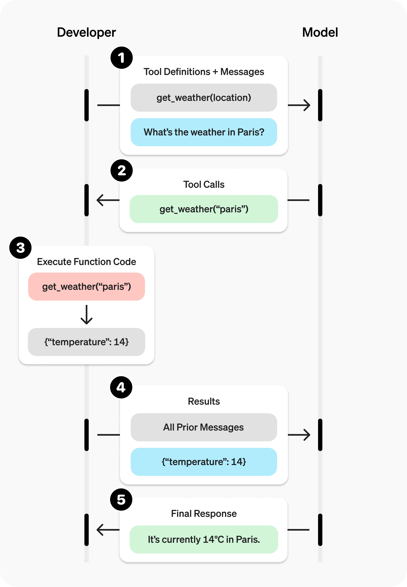

## function calling

- https://platform.openai.com/docs/guides/function-calling#function-tool-example
- function calling은 AI 모델이 실시간 데이터 조회나 외부 서비스 조작을 위해 필요한 도구를 스스로 선택하고 실행 인자를 만들어주는 기술.
- 모델이 함수를 직접 실행하는 대신 실행에 필요한 데이터를 구조화된 JSON 형태로 짜주면, 개발자의 코드가 이를 처리해 최신 정보를 답변에 반영할 수 있다.
- 클라이언트가 LLM에게 질문을 보냄.
    - 질문은 특정 모델을 통과시킴.
    - 계산을 통해 한글자씩 클라이언트에 전달.
    - 이 수준에선 텍스트 생성만 가능. 학습은 이전에 있는 데이터로만 되었기에 실시간 정보는 접근이 불가능함.
- 오늘 뉴스에 대한 질문
    - 모델은 스스로 처리하지 못한다고 판단.
    - 웹 서치가 허가되어 있다면? 웹 서치를 통해 답변.
        - developer에게 질문과 사용 가능한 기능들을 받고, 질문을 답변할 수 없으면 사용 가능한 기능들 중에 웹 서치가 허용되어 있는 경우에 웹 서치를 하게 되는 것.
- 클라이언트 - 개발자 - 모델의 흐름
    1. 클라이언트의 질문을 개발자가 실행 가능한 도구들과 함께 모델에게 전달.
    LLM에 주는 것은 코드가 아니라 코드의 실행 방법. 함수 자체는 개발자가 다 구현해 놓아야 한다.
    2. 스스로 확인이 불가능한 질문이라 사용 가능한 함수를 실행하라고 개발자에게 전달.
    함수의 정의와 기능을 바탕으로 이 함수를 실행시켜야 한다고 판단되면 전달.
    3. 개발자는 함수를 실행
    4. 결과값을 모델에게 전달
    사용자는 그냥 온도 : 14 이런 답변이 아니라 파리의 온도는 ~~ 에요. 라는 식의 답변을 원하기에, 모델에게 결과를 전달하는 것.
    5. 모델은 결과를 통해 답변을 전달. 



- 코드로 살펴보기
    1. 함수를 정의.
    2. 내가 실행한 코드에 있는 도구(함수)에 대한 정보. 해당 정보를 사용할 AI 모델에게 전달할 수 있도록 작성해서 저장.
    3. 고객이 요청 → 개발자가 LLM에 요청. 사용 가능한 도구들도 같이 보냄. 위에서 작성해둔 내용도 담아서 보냄.
    4. LLM이 response를 함. 그 response가 Function call인 경우 안에 함수에 어떤 매개변수를 담아서 실행시키라고 하는지 다 담겨있는 데이터를 개발자에게 전송.
    5. 개발자는 AI가 요청한 함수를 실행시키고 결과값을 AI에게 전송.

```python

# 1. Define a list of callable tools for the model
tools = [
    {
        "type": "function",
        "name": "get_horoscope",
        "description": "Get today's horoscope for an astrological sign.",
        "parameters": {
            "type": "object",
            "properties": {
                "sign": {
                    "type": "string",
                    "description": "An astrological sign like Taurus or Aquarius",
                },
            },
            "required": ["sign"], # 필수. sign 값이 반드시 있어야 한다는 뜻.
        },
    },
]

def get_horoscope(sign):
    # api 요청이 들어갈 예정.
    return f"{sign}: Next Tuesday you will befriend a baby otter."

# Create a running input list we will add to over time
input_list = [
    {"role": "user", "content": "What is my horoscope? I am an Aquarius."}
]

# 2. Prompt the model with tools defined
response = client.responses.create(
    model=model,
    tools=tools,
    input=input_list,
)

# Save function call outputs for subsequent requests
input_list += response.output

for item in response.output:
    if item.type == "function_call":
        if item.name == "get_horoscope":
            # 3. Execute the function logic for get_horoscope
            horoscope = get_horoscope(json.loads(item.arguments))
            
            # 4. Provide function call results to the model
            input_list.append({
                "type": "function_call_output",
                "call_id": item.call_id,
                "output": json.dumps({
                  "horoscope": horoscope
                })
            })

print("Final input:")
print(input_list)

response = client.responses.create(
    model=model,
    instructions="Respond only with a horoscope generated by a tool.",
    tools=tools,
    input=input_list,
)

# 5. The model should be able to give a response!
print("Final output:")
print(response.model_dump_json(indent=2))
print("\n" + response.output_text)
```

- ai한테 일을 시키고 싶다
    - 질문 → 답변을 받음
    - 생성형 ai → text / 이미지 생성 같은 뭔가를 만드는 일을 한다.
    - 정해져있는 규칙적인 일은 하지 못한다. (정적인 일들)
- 다른 예시! (영화)
- AI 모델이 사용할 수 있는 영화 목록 불러오는 함수 정의

```python
def get_now_playing_movies(region : str = 'KR'):
    """TMDB API를 호출하여 현재 상영 중인 영화 목록을 가져옵니다."""

    print(f'{region}의 영화를 가져옵니다.')

    url = "https://api.themoviedb.org/3/movie/now_playing"
    
    params = {
        'language' : 'ko-kr',
        'region' : region
    }
    
    headers = {
        'Authorization' : f'Bearer {TMDB_API_KEY}'
    }
    
    try:
        response = requests.get(url, params=params, headers=headers)
        response.raise_for_status()    
        return response.json()['results']
    except Exception as e:
        print(e)

pprint(get_now_playing_movies())
```

- 함수 스키마 정의. LLM이 함수를 이해할 수 있도록 스키마를 정의해서 보내줘야 함.
    - 특정 나라의 영화만 가져오기 위해 region 변수를 추가하고, 이를 설명함.
    - ISO-3166-1 이란? 국제 표준화 기구에서 발행한 표준 국가 코드. 한국은 KR, KOR.
        - TMDB에선 해당 코드를 받겠다고 정의해둠.

```python
tools = [
    {
        "type": "function",
        "name": "get_now_playing_movies",
        "description": "현재 극장에서 상영 중인 영화 목록을 TMDB에서 가져옵니다.",
        "parameters": {
            "type": "object",
            "properties": {
                "region": {
                    "type": "string",
                    "description": "region, ISO-3166-1 code",
                },

            }
        }
    }
]
```

- 이제 AI 실행.

```python

def run_conversation(user_prompt):
    
    input_list = [{"role": "user", "content": user_prompt}]

    # 1. LLM에게 1차 요청을 한다.
    response = client.responses.create(
        model=model,
        input=input_list,
        tools=tools,
    )
    input_list += response.output
    
    # 2. LLM의 응답에서 "함수 실행"에 대한 응답이 있다면 이를 실행한다.
    for item in response.output:
        if item.type == "function_call":
            if item.name == 'get_now_playing_movies':
                # ** = 키워드args
                result = get_now_playing_movies(**json.loads(item.arguments))
                
                # 3. 함수 실행 결과를 input에 담는다.
                input_list.append({
                    "type": "function_call_output",
                    "call_id": item.call_id,
                    "output": json.dumps({
                    "result": result
                    })
                })
    # 4. 다시 한번 LLM에게 요청한다.
    response = client.responses.create(
        model=model,
        instructions="Respond only with a movies generated by a tool.",
        tools=tools,
        input=input_list,
    )

    return response.output_text
    

# 실행 예시
print(run_conversation("요즘 미국에서 볼만한 영화가 뭐가 있어?"))
```

### 네이버 뉴스 검색 api 사용해서 뉴스 요약해주는 ai 만들어 보기.

- 먼저 ai가 네이버 뉴스를 검색해서 정보를 가져올 수 있도록, 네이버 검색 api를 사용해 네이버 뉴스 검색 정보를 가져오는 함수를 생성.
- 이후 function calling 사용! ai가 해당 함수를 활용할 수 있도록 tools 리스트에 함수 실행에 필요한 데이터를 json 구조로 저장.
    - tools의 name은 내가 실행 시키려는 함수의 이름.
    - properties에 있는 search_text는 함수의 매개변수.
    - required는 함수 매개변수가 반드시 필요할 때 사용.

```python
# naver_news_search.py
import os
from dotenv import load_dotenv
import requests

def naver_news_search(search_text):

    load_dotenv()
    naver_client_id = os.getenv("NAVER_CLIENT_ID")
    naver_client_secret = os.getenv("NAVER_CLIENT_SECRET")

    url = f"https://openapi.naver.com/v1/search/news.json?query={search_text}"

    header = {
        "X-Naver-Client-Id" : naver_client_id,
        "X-Naver-Client-Secret" : naver_client_secret
    }

    response = requests.get(url, headers=header)
    response = response.json()
    return response

tools = [
    {
        "type": "function",
        "name": "naver_news_search",
        "description": "Search Naver News content.",
        "parameters": {
            "type": "object",
            "properties": {
                "search_text": {
                    "type": "string",
                    "description": "Enter what you want to search for in Naver News.",
                },
            },
            "required": ["search_text"],
        },
    },
]
```

- ai와 관련된 부분을 다 모아놓은 py파일. 여기서 ai 모델 가져오는 부분, 실행시키는 함수까지 구현
    - 위에서 만든 네이버 뉴스 가져오는 함수를 사용할 수 있도록 import

```python
import os
from dotenv import load_dotenv
from openai import OpenAI
import naver_news_search
import json

load_dotenv()

OPENAI_API_KEY = os.getenv('OPENAI_API_KEY')
URL = "https://api.openai.com/v1/chat/completions"
model = 'gpt-4o-mini'
client = OpenAI(api_key=OPENAI_API_KEY)

def run_conversation(user_prompt):
    
    input_list = [
        {"role": "developer", "content": "너는 진실을 전달하는 기자야."},
        {"role": "user", "content": user_prompt}
    ]    

    tools = naver_news_search.tools

    # 1. LLM에게 1차 요청을 한다.
    response = client.responses.create(
        model=model,
        input=input_list,
        tools=tools,        
    )    
    input_list += response.output
    
    # 2. LLM의 응답에서 "함수 실행"에 대한 응답이 있다면 이를 실행한다.
    for item in response.output:        
        if item.type == "function_call":
            if item.name == 'naver_news_search':                
                result = naver_news_search.naver_news_search(**json.loads(item.arguments))
                
                # 3. 함수 실행 결과를 input에 담는다.
                input_list.append({
                    "type": "function_call_output",
                    "call_id": item.call_id,
                    "output": json.dumps({
                    "result": result
                    })
                })
    # 4. 다시 한번 LLM에게 요청한다.
    response = client.responses.create(
        model=model,
        instructions="주어진 정보를 바탕으로 요약해줘.",
        tools=tools,
        input=input_list + [{'role' : 'user', 'content' : 'naver_news_search에서 주어진 정보를 바탕으로 나에게 요약해줘. 주어진 정보만을 사용해서 응답해. 주어진 정보만을 사용해서 응답해.'}],
        temperature=0,
        stream=True
    )

    for chunk in response:
    # 스트리밍 시 delta 이벤트를 통해 텍스트 조각을 수신함
    
        if hasattr(chunk, 'delta') and chunk.delta:
            print(chunk.delta, end="", flush=True)

    
```

- ai 실행 파일. q를 누르면 종료, 누르기 전에는 계속 질문할 수 있도록 구현.

```python
import naver_news_llm

# 실행 예시
print("안녕하세요. 챗봇입니다. 하고싶은 말을 입력해주세요. 뉴스 검색도 가능해요.")

while True:
    user_prompt = input("me : ")
    if user_prompt == "q":
        print("챗봇을 종료합니다.")
        break
    response_id = naver_news_llm.run_conversation(user_prompt)
    print()

```