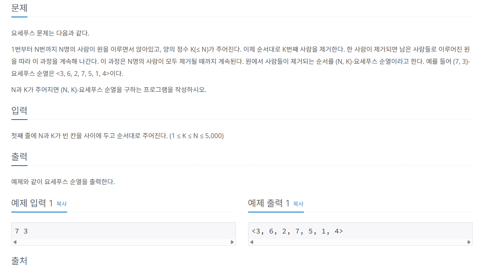

- 리스트. ArrayList
    - 여러 개의 데이터를 순서 있게 저장.
    - 각 데이터끼리 물리적으로 옆에 있음. 0 - 1 - 2…
    - index를 통한 접근이 가능해서 데이터 탐색에 유리함.
    - 새로운 데이터 삽입할 때 n번 연산이 필요. (1000개의 데이터가 있는 리스트의 맨 앞에 새로운 데이터를 삽입하는 경우)
    - 접근 O(1), 삽입 삭제 O(n)
- 연결 리스트. LinkedList
    - 노드를 통해 각 데이터 연결.
    - 삽입, 삭제가 ArrayList보다 유리. 시작 노드가 가리키는 데이터가 첫 데이터가 되기 때문.
    - 접근 O(n), 삽입 삭제 O(1)
- Stack, Queue 라는 자료구조가 있는데, 우린 이 중에서 deque를 써볼 것이다.
    - Stack는 후입 선출. 나중에 들어온 데이터가 먼저 나가게 된다. ( 접시 쌓아두고 설거지 하는 이미지 )
    - Queue는 선입 선출. 먼저 들어온 데이터는 먼저 나가게 된다. ( 은행 대기 줄, 롤 큐 잡히는 이미지 )
- deque
    - 사용 전에 `from collections import deque` 필요
    - queue 자료구조를 편하게 쓰기 위해 만들어 둔 자료구조.
    - append(), pop() 으로 삽입 삭제. 오른쪽 방향으로 삽입되고, 추출되는 방식. 뒤에 left 붙이면 왼쪽 방향으로 가능.
    - java와 다르게 python에서는 deque를 사용하는 방식에 따라 stack 처럼, queue 처럼 사용할 수 있다.
    
    ```python
    from collections import deque
    
    print(deque(range(5)))
    
    q = deque(range(5))
    
    # 데이터 삽입
    q.append('a')
    print(q)
    
    q.appendleft('b')
    print(q)
    
    # 데이터 추출
    popped_el = q.pop()
    print(q)
    print(popped_el)
    
    popped_el = q.popleft()
    print(q)
    print(popped_el)
    ```
    
- 알고리즘 문제 풀 때 입력 값 받는 방식 (백준 등)
    - 문자열에 .split() 함수를 사용하면 문자열을 나눠서 리스트 형태로 반환 받을 수 있음.
    - 아래 예시는 n, w, L 변수에 각각 4, 2, 10의 숫자를, 7, 4, 5, 6 이라는 list 형태의 데이터가 입력으로 주어지는 문제라고 가정.
    - 이를 받기 위해 split() 함수와 map() 함수를 사용.
    - map() 함수는 여러 개의 데이터를 받아서 각 데이터에 특정 함수를 적용 시켜준다.
    - 아래 예시에서는 input_value에 있는 데이터들에 int() 함수를 적용 시킨 것.
    - 그래서 한 줄로 하게 되면 map()에서 바로 input().split() 을 사용해서 입력 값을 받고 변환하는 것.
    - 아래의 sys.stdin.readline은 기존 input에 덮어씌워서 사용. 자바에서 scanf 안 쓰는 것과 같음.
    
    ```python
    # 4 2 10        # n / w / L
    # 7 4 5 6       # list
    
    input_value = "4 2 10"
    input_value = input_value.split()
    print(input_value)
    
    input_value = map(int, input_value)
    # map(fun, list) -> list의 각각의 원소에 func을 통과시켜 결과를 반환한다.
    #[x, y, z] => [f(x), f(y), f(z)]
    n, w, L = input_value
    print(n, w, L)
    
    n, w, L = map(int, input().split())
    lst = list(map(int, input().split()))
    print(lst)
    
    # 입력시간을 줄일때 사용
    # 로직의 맨 위에 작성
    # input을 덮어씌움. 입력 받는 데이터가 많으면 input으로 할 때 시간초과가 나옴
    # java에서 scan 안쓰는 것 처럼..
    import sys
    input = sys.stdin.readline
    
    # 출력
    print(1, 2, 3, 4, sep="/") # 원소들 사이에 값 끼워 넣기.
    print(*[1, 2, 3, 4]) # 리스트를 분해해서 하나씩 출력
    ```
    
    - 백준 문제 입력 예시
    
    
    
    - 위 사진처럼 입력에 7 3 이라고 적혀 있다면, 문제를 읽어봤을 때 N, K라는 변수에 각각 7과 3이 입력으로 들어온다. 라고 생각하면 된다!
    - 위의 코드를 참고해서 map(), split() 등 잘 사용해서 입력 값을 받을 수 있도록 작성해야 한다.
    - 프로그래머스 에서는 친절하게 함수를 작성해두고 변수까지 적어 놓지만, 백준에서는 그런게 없음. 사진엔 안보이지만, 문제 위에 제출 이라고 적혀 있는 칸이 있는데, 이 칸을 눌러서 vsCode에서 작성한 코드를 복붙하고 제출해야 하는 방식.
- 출력 관련
    - java의 Stringbuilder처럼 python에서 사용하는 출력 방식.
    - 일반 리스트에 출력할 데이터를 다 모아놓고 .join() 함수를 통해 한번에 출력한다고 함. 근데 join은 문자열 함수라서 데이터를 문자열로 바꾸는 과정이 필요.
    - map 함수를 통해 문자열이 아닌 데이터도 바꿔서 출력이 가능.
    - stdout.write를 사용하면 print보다 훨씬 성능이 좋음.
    
    ```python
    import sys
    
    result = []
    result.append("a")
    result.append("b")
    
    print("".join(result)) # "" 안에 print의 sep 기능처럼 문자 사이에 쓸 문자 추가.
    
    sys.stdout.write(" ".join(map(str, result))) # a b 이런식으로 출력 됨.
    ```
    
- 백준 알고리즘 문제
    - 백준 2161번 카드1
        - 주소 : https://www.acmicpc.net/problem/2161
        - 로직
            1. 1 ~ n까지 숫자를 담고 있는 deque를 생성.
            2. popleft()를 통해 deque 맨 왼쪽에 있는 데이터를 뽑아서 result 리스트에 저장.
            3. 이후 값이 없는지 체크하고 없으면 result 반환.
            4. 값이 남아 있으면, 맨 위(왼쪽) 값을 아래(오른쪽) 으로 이동. 이 과정에서 popleft()와 append()를 사용함.
            5. 반복. 
        - 최종 코드
        
        ```python
        from collections import deque
        import sys
        
        def card_game(card_count):
            card_queue = deque(range(1, card_count + 1))
            result = []
            
            while True:
                # 맨 위 카드 버리기
                throw_card = card_queue.popleft()
                result.append(throw_card)
        
                # 값이 없으면 종료
                if not card_queue:
                    return result
        
                # 다음 맨 위 카드 아래로
                throw_card = card_queue.popleft()
                card_queue.append(throw_card)
        
        N = int(input())
        result = card_game(N)
        
        sys.stdout.write(" ".join(map(str, result)))
        ```
        
    - 백준 1158번 요세푸스 문제
        - 주소 : https://www.acmicpc.net/problem/1158
        - 로직
            1. deque를 사용해서 문제가 요구하는 대로 구현
            2. 반복문을 통해 k - 1번 왼쪽의 값을 빼서 오른쪽에 다시 넣기
            3. 이후 1번 왼쪽에서 값을 빼서 result에 저장.
        - 최종 코드
        
        ```python
        from collections import deque
        import sys
        
        def josephus(length, remove_number):
            
            cycleQueue = deque(range(1, length + 1))
            result = []
        
            while cycleQueue:
                for _ in range(remove_number - 1):
                    temp = cycleQueue.popleft()
                    cycleQueue.append(temp)
                
                result.append(cycleQueue.popleft())
            
            return result
        
        N, K = map(int, input().split())
        
        result = josephus(N, K)
        
        text = ", ".join(map(str, result))
        print(f"<{text}>")
        ```
        
    - 백준 9012번 괄호
        - 주소 : https://www.acmicpc.net/problem/9012
        - 로직
            1. () 문자가 잔뜩 있는 문자열에서 모든 ()가 정상적으로 열고 닫히는지 확인하는 문제.
            2. 2중 반복문을 사용해서 1개의 문자열을 하나씩 확인.
            3. 문자열 하나를 반복할 때마다 괄호의 상태 확인을 위한 변수 생성. 이후 반복문을 통 해 한 개의 문자에서 “(” 또는 “)”를 파악하고, 괄호를 여는 문자 “(”가 온 경우 변수에 +1, 괄호를 닫는 문자인 “)”가 오는 경우 변수에 -1
            4. 모든 괄호가 열고 닫히기 위해선 일단 괄호가 열려있어야 한다. 즉, “(”의 숫자가 “)”의 숫자보다 작아지면 안된다는 뜻.
            5. 그래서 괄호의 상태 확인을 위한 변수의 값이 0 미만으로 내려가는 경우 정상적인 괄호가 열릴 수 없다고 판단하고 반복 종료.
            6. 하나의 문자열에서 모든 반복을 끝내면, 마지막에 변수를 확인해서 값이 0인 경우 YES를 result 리스트에 추가.
            7. 값이 0이라는 뜻은 모든 괄호가 열고 닫기를 무사히 했다는 뜻.
            8. 값이 0이 아니라면? 모든 괄호가 정상적으로 닫히지 않았다는 뜻. 
        - 최종 코드
        
        ```python
        from collections import deque
        import sys
        
        def parentheses(input_count, input_values):
            
            result = []
        
            for values in input_values:
                parentheses_count = 0
        
                for value in values:            
                    if value == "(":
                        parentheses_count += 1
                    elif value == ")":
                        parentheses_count -= 1
                    
                    if parentheses_count < 0:                
                        break
        
                if parentheses_count == 0:
                    result.append("YES")
                else:
                    result.append("NO")
        
            return result
        
        input_count = int(input())
        input_values = []
        
        for _ in range(input_count):
            input_values.append(input())
        
        result = parentheses(input_count, input_values)
        
        sys.stdout.write("\n".join(result))
        ```
        
    - 백준 13335번 트럭
        - 주소 : https://www.acmicpc.net/problem/13335
        - 로직
            1. 1초가 지나면, 맨 앞에 있는 트럭이 다리에 올라간다. 이 과정에서 트럭의 무게를 다리가 견딜 수 없으면 올라가지 않는다.
            2. 기존에 다리 위에 있는 트럭들은 한 칸 앞으로 전진한다.
            3. 다리 길이보다 많이 전진했다면(다리를 다 건넜다면) 다리의 허용 무게가 다리를 건넌 트럭의 무게만큼 증가한다.
            4. 만약, 다리를 다 건넌 트럭이 생긴다면 1번의 과정을 다시 체크해야함. 그래서 구현할 때는 실행 순서를 2 - 3 - 1 순서로 했음.
            5. 2 - 3 - 1 순서를 하게 된다면 맨 처음 실행할 때에는 2번을 진행하기 어렵기 때문에, 반복문에 들어가기 전에 최초의 트럭 1개는 반복문 실행 전에 올라가도록 구현.
            6. 그래서 반복문 시작 시점에 다리에는 트럭 1개가 올라와 있고, 1초가 이미 지나있는 상태로 시작된다.
        - 최종 코드
        
        ```python
        from collections import deque
        import sys
        
        def truck_driving(truck_count, bridge_length, bridge_weight, trucks_weight):
            
            result = 0
            
            current_bridge_weight = bridge_weight
            current_truck_number = 0
        
            # 다리 위에 있는 트럭들
            truck_deque = deque()
        
            # 가장 앞에 있는 트럭은 반복문 시작 전에 다리 위로 이동.
            truck_deque.append({
                "weight" : trucks_weight[current_truck_number],
                "location" : 1
                })
            current_bridge_weight -= trucks_weight[current_truck_number]
            current_truck_number += 1
            result += 1
        
            while truck_deque:
        
                # 다리에 있는 트럭들 한 칸씩 전진
                size = len(truck_deque)
                for _ in range(size):
                    truck = truck_deque.popleft()
                    truck_location = truck["location"] + 1
                    truck["location"] = truck_location
                    # 다리를 건넌 트럭은 deque에 넣지 않고 다리 허용 무게 추가
                    if truck_location > bridge_length:
                        current_bridge_weight += truck["weight"]
                    else:
                        truck_deque.append(truck)
        
                # 모든 트럭이 다리 위로 이동할 때까지 실행
                if current_truck_number < truck_count:
                    truck_weight = trucks_weight[current_truck_number]
                    # 현재 앞에 있는 트럭의 무게를 다리가 감당 가능하면 전진
                    if current_bridge_weight >= truck_weight:
                        truck_deque.append({
                            "weight" : truck_weight,
                            "location" : 1
                        })
                        current_bridge_weight -= truck_weight
                        current_truck_number += 1
        
                result += 1
        
            return result
        
        truck_count, bridge_length, bridge_weight = map(int, input().split())
        trucks_weight = list(map(int, input().split()))
        
        result = truck_driving(truck_count, bridge_length, bridge_weight, trucks_weight)
        print(result)
        ```
        
        - 강사님 로직 버전
            - 알고리즘을 풀기 위해 로직을 그릴 수 있고, 글로 표현할 수 있어야 한다.
            1. 다리의 길이만큼 deque를 추가해서 다리의 길이가 2라면, 2만큼의 공간을 나타내도록 구현.
                1. 이를 통해 트럭이 올라오면 해당 트럭의 무게를 담게 되고, 트럭이 올라오지 않으면 0 이라는 더미 데이터를 담게 된다.
                2. 처음엔 list로 했다가 데이터가 계속 들어 왔다 나갔다 하니까 deque로 변경.
            2. 입력 받는 트럭의 무게들을 deque로 저장함. 트럭 또한 계속해서 데이터가 나가게 되니까.
            3. 왼쪽으로 다리를 넘어간 트럭을 표현하기 위해 다리의 큐인 bridge를 popleft() 처리.
            4. 이후 popleft()로 나온 결과물을 다리의 무게 변수인 weight에서 빼줌. weight - exit_truck
            5. 다음엔 트럭이 다리로 이동. 단, 다리의 무게가 감당 가능할 때만 이동한다.
                1. 이를 위해 if 조건을 weight + trucks[0] ≤ L 로 설정. 
                2. new_truck 변수에 맨 앞 트럭 deque에서 데이터를 뽑아서 저장.
                3. bridge deque에 append()로 삽입.
                4. weight 변수에 삽입된 트럭의 무게 추가.
            6. 만약 무게 감당이 안돼 트럭 이동이 불가능 하면 더미 데이터인 0을 bridge deque에 삽입한다.
            7. 3 ~ 6 과정을 트럭의 deque가 다 사라질 때까지 반복하고, 반복할 때마다 time 변수에 +1
            8. 이후 정답 출력할 때 time + 다리의 길이를 출력해서 모든 트럭이 다리를 건널 때까지 걸리는 시간 계산. 
            - 내가 구현한 코드와 차이점은 deque를 2개 사용했고, 다리에 항상 데이터가 삽입되도록 구현함(더미데이터 사용해서).
                - 다리 무게 제한이 10이고, 첫 트럭이 7의 무게가 있다면?
                - 0 0 → 0 7 → 7 0 → 0 x 이런식으로
            - 다리의 공간을 deque를 통해 구현하고 트럭의 deque를 통해 한 트럭씩 옮길 수 있도록 구현.
            - 또한, 강사님 코드에는 반복문의 조건이 트럭의 deque가 빌 때까지 돌리는 것. 마지막 트럭이 다리에 올라가면 이후 반복문이 종료됨.
            - 그래서 마지막 정답에서 time + 다리의 길이를 출력하는 것이다. 마지막 트럭은 다리의 길이만큼 움직이면 끝이니까.
        - 강사님 코드
        
        ```python
        from collections import deque
        n, w, L = map(int, input().split())
        
        trucks = deque(map(int, input().split()))
        
        # 다리 라는 정보를 가지고 있음
        # 길이 w짜리 더미 데이터를 만들 것. 0 : 트럭이 올라갈 수 있는 곳
        # list 만들었다가 필요해지니까 deque로 변경
        bridge = deque([0] * w)
        weight = 0
        time = 0
        
        # 트럭이 다 움직일 때 까지 계속 반복.
        while trucks:
            time += 1
            # bridge 위의 트럭이 움직임.
            # 왼쪽 트럭이 성공적으로 이동
            exit_truck = bridge.popleft()
            weight -= exit_truck
            # 트럭에서 빼다가 bridge로 이동
                # 무게가 가능할때만 이동
            if weight + trucks[0] <= L:
                new_truck = trucks.popleft()
                bridge.append(new_truck)
                weight += new_truck
            else:
                bridge.append(0) # 공간 차지용 데이터
        
        print(time + w)
        ```
        
    - 백준 4949번 균형잡힌 세상
        - 주소 : https://www.acmicpc.net/problem/4949
        - 로직
            1. 소괄호 끼리 연결되어야 하고, 대괄호 끼리 연결되어야 한다. 또한, 연결 되지 않은 소괄호, 대괄호가 있으면 안된다.
            2. check용 변수를 생성하고 기본값을 True로 지정.
            3. 이후 반복문을 돌며 문자 하나 하나 체크하면서 소괄호, 대괄호가 오는 경우 if문으로 처리.
            4. (, [ 의 경우에는 deque에 추가
            5. ), ] 의 경우에는 deque에서 pop을 통해 가장 마지막에 들어간 괄호를 빼서 서로 짝이 맞는지 확인.
            6. 짝이 맞지 않으면 check용 변수에 False로 저장하고 반복문 종료.
            7. 반복문이 끝나면 check용 변수에 따라 yes, no 저장.
            8. 이후 다음 문자열로 이동해서 반복.
        - 최종 코드
        
        ```python
        from collections import deque
        import sys
        
        def balance_world(input_values):
            
            result = []
        
            for input_value in input_values:
                balance_check = True
                parentheses = deque()    
                for value in input_value:
                    if value in ["(", "["]:
                        parentheses.append(value)
                    elif value in [")", "]"]:
                        if parentheses:
                            match_parentheses = parentheses.pop()
                            if match_parentheses == "(":
                                if value == "]":
                                    balance_check = False
                                    break
                            else:
                                if value == ")":
                                    balance_check = False
                                    break
                        else:
                            balance_check = False
                            break
        
                if parentheses:
                    balance_check = False
                
                if balance_check:
                    result.append("yes")
                else:
                    result.append("no")
        
            return result
        
        input_values = []
        while True:
            input_value = input()
            if input_value == ".":
                break
            input_values.append(input_value)
        
        result = balance_world(input_values)
        
        sys.stdout.write("\n".join(result))
        ```
        
        - 강사님 로직
            - 로직 자체는 동일하지만, 딕셔너리를 사용해서 가독성을 높이고 중복 부분을 제거함.
            - braket_dic 을 사용해서 각 괄호에 대응하는 value를 설정.
            - 이후 if로 value 값이 괄호인지 확인할 때 in 으로 딕셔너리의 key, value 부분을 비교.
            - 닫는 괄호인 경우 오른쪽의 deque 값과 닫는 괄호를 key로 하는 딕셔너리의 값을 비교함.
                - 만약 value가 )인 경우, 먼저 deque의 오른쪽 값을 가져오고, 딕셔너리에서 “)”를 키값으로 같는 value의 값을 가져와서 서로 일치하는지 비교함.
                - )인 경우 value는 “(”를 가져오게 될 것이고, deque의 오른쪽에 있는 것도 “(” 라면 서로 짝이 맞는 괄호라는 뜻.
                - 짝이 맞다면 pop해서 지워주고, 짝이 아니라면 틀린 문자열이니 false 처리하고 반복문 종료.
        - 강사님 코드
        
        ```python
        from collections import deque
        import sys
        
        def balance_world(input_values):
            
            result = []
            braket_dic = {
                ')' : '(',
                ']' : '['
            }
        
            open_braket = set(braket_dic.values())
            close_braket = braket_dic.keys()
        
            for input_value in input_values:
                balance_check = True
                parentheses = deque()    
                for value in input_value:
                    # ['(', '[']
                    if value in open_braket:
                        parentheses.append(value)
                    # [')', ']']
                    elif value in close_braket:
                        if parentheses and parentheses[-1] == braket_dic[value]:
                            parentheses.pop()
                        else:
                            balance_check = False
                            break
        
                if parentheses:
                    balance_check = False
                
                if balance_check:
                    result.append("yes")
                else:
                    result.append("no")
        
            return result
        
        input_values = []
        while True:
            input_value = input()
            if input_value == ".":
                break
            input_values.append(input_value)
        
        result = balance_world(input_values)
        
        sys.stdout.write("\n".join(result))
        ```