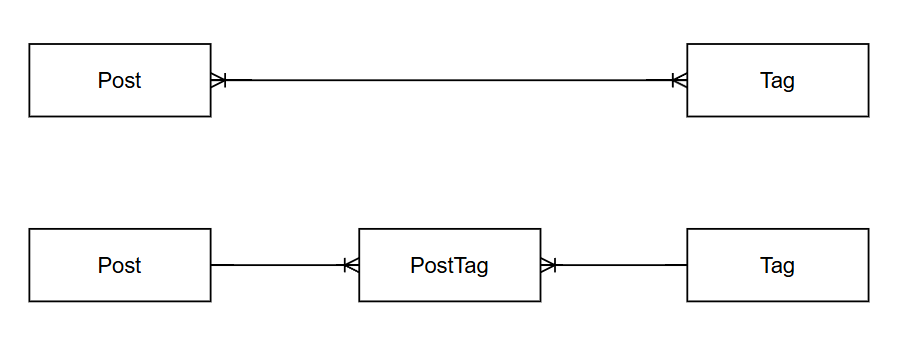

### Model 테이블 join 구현

- Category - Products = 1 : N 관계

```sql
# models/category 일부
products: Mapped[list["Product"]] = relationship("Product", back_populates="category", cascade="all, delete-orphan")

# models/product 일부
category_id: Mapped[int] = mapped_column(ForeignKey("category.id"), nullable=False)
category: Mapped["Category"] = relationship("Category", back_populates="products")
```

- product는 category_id를 FK로 가지니까 컬럼 생성할 때 ForeignKey 사용.
- 관계를 가지는 model에 각각 변수를 활용해서 관계를 갖고 있다고 명시.
    - A 변수명: Mapped[A클래스이름] = relationship(A클래스이름, back_populates=B변수명)
    - B 변수명: Mapped[B클래스이름] = relationship(B클래스이름, back_populates=A변수명)
    - 이런 형태로 구현. 그래서 위의 코드에서도 product는 category 관련된 데이터를, category에서는 product 관련된 데이터를 가지고 있음.
    - 추가로 cascade 속성은 1 : N 관계라고 치면 1 쪽에서 설정.
        - 카테고리와 상품의 관계라면, 카테고리가 사라지면 상품은 어떻게 해야 할까?? 이런 식으로 생각하고 작성해야 한다.

## M : N 관계

Post와 M:N 관계를 가지는 Tag를 생성해보자.

관계형 데이터베이스에서는 두 테이블 사이의 M:N 관계를 직접 형성할 수 없기 때문에 중간에서 양쪽의 ID를 관리해주는 연관 테이블이 반드시 필요하다. SQLAlchemy에서는 이를 크게 두 가지 방식으로 구현한다.

---

## Table() 객체를 활용한 단순 M:N

SQLAlchemy의 `Table()` 함수를 사용하면 클래스를 정의하지 않고도 중간 테이블을 만들 수 있다. 이는 SQLAlchemy가 내부적으로 관계만 매핑해주는 방식이다. 

```python
post_tag = Table(
    "post_tag",
    Base.metadata,
    Column("post_id", ForeignKey("posts.id"), primary_key=True),
    Column("tag_id", ForeignKey("tags.id"), primary_key=True),
)
```

단, 아래의 이유로 사용을 지양한다.

- 컬럼 확장 불가
    
    태그를 등록한 시각, 등록한 사용자 등 추가 정보를 넣을 수 없다.
    
- 비즈니스 로직의 부재
    
    중간 테이블이 단순한 연결 고리일 뿐 파이썬 객체(클래스)가 아니므로, 중간 데이터를 제어하거나 메서드를 추가하는 것이 불가능하다.
    
- 쿼리 제어의 어려움
    
    중간 테이블이 숨겨져 있어 복잡한 통계나 조회 쿼리를 작성할 때 오히려 구조가 불투명해진다.
    

---

## 연결 모델

중간 테이블을 하나의 독립된 엔티티로 작성한다. 일반 1:N 관계와 같이 작성할 수 있어 컬럼 확장, 비즈니스 로직 등을 추가할 수 있다.



---

## 실습

### Tag 기능

tag에 대한 create, read 기능을 만들어보자.

tag는 중복 생성을 허용하지 않기 때문에 생성할 때 중복확인 → 생성의 과정을 거친다.

### Tag 모델 정의

```python
# models/tag.py

from sqlalchemy import String
from sqlalchemy.orm import Mapped, mapped_column
from database import Base

class Tag(Base):
    __tablename__ = "tags"

    id: Mapped[int] = mapped_column(primary_key=True, autoincrement=True)
    name: Mapped[str] = mapped_column(String(50), unique=True, nullable=False)
```

- models/__init__.py에 Tag모델을 추가해준다
    
    ```python
    # models/__init__.py
    from .post import Post
    from .comment import Comment
    from .tag import Tag
    from database import Base
    
    __all__ = ["Base", "Post", "Comment", "Tag"]
    ```
    

### Tag 스키마 정의

```python
# schemas/tag.py

from pydantic import BaseModel, ConfigDict

class TagCreate(BaseModel):
    name: str

class TagResponse(BaseModel):
    id: int
    name: str

    model_config = ConfigDict(from_attributes=True)
```

### Tag Repository 구현

- find_by_name에서는 단일 조회를 위해 `scalar`를 사용한다.

```python
# repositories/tag_repository.py
from sqlalchemy import select
from sqlalchemy.orm import Session
from mysite4.models.tag import Tag

class TagRepository:
    def save(self, db: Session, tag: Tag):
        db.add(tag)
        return tag

    def find_all(self, db: Session):
        # scalars().all()을 사용하여 Tag 객체 리스트를 가져온다.
        return db.scalars(select(Tag)).all()

    def find_by_name(self, db: Session, name: str):
        return db.scalar(select(Tag).where(Tag.name == name))

tag_repository = TagRepository()
```

### Tag Service 구현

- 태그 생성 시 이미 존재하는 이름인지 검증하는 로직을 포함한다.

```python
# services/tag_service.py
from sqlalchemy.orm import Session
from fastapi import HTTPException
from mysite4.models.tag import Tag
from mysite4.schemas.tag import TagCreate
from mysite4.repositories.tag_repository import tag_repository

class TagService:
    def create_tag(self, db: Session, data: TagCreate):
        with db.begin():
            # 1. 이미 존재하는 태그인지 확인
            existing_tag = tag_repository.find_by_name(db, data.name)
            if existing_tag:
                raise HTTPException(status_code=400, detail="이미 존재하는 태그 이름입니다.")

            # 2. 태그 생성 및 저장
            new_tag = Tag(name=data.name)

            tag_repository.save(db, new_tag)

        db.refresh(new_tag)
        return new_tag

    def read_tags(self, db: Session):
        return tag_repository.find_all(db)

tag_service = TagService()
```

### Tag Router 구현

```python
# routers/tag_router.py
from fastapi import APIRouter, Depends, status
from sqlalchemy.orm import Session
from database import get_db
from mysite4.schemas.tag import TagCreate, TagResponse
from mysite4.services.tag_service import tag_service

router = APIRouter(prefix="/tags", tags=["tags"])

@router.post("", response_model=TagResponse, status_code=status.HTTP_201_CREATED)
def create_tag(data: TagCreate, db: Session = Depends(get_db)):
    return tag_service.create_tag(db, data)

@router.get("", response_model=list[TagResponse])
def read_tags(db: Session = Depends(get_db)):
    return tag_service.read_tags(db)
```

- router 등록

```python
# main.py

from mysite4.routers.tag_router import router as tag_router

app = FastAPI()

app.include_router(tag_router)

```

---

## M:N 관계를 위한 PostTag

우선 이미 존재하는 Post에 대해서 Tag를 연결하는 방식으로 진행한다.

### PostTag 모델 정의

- Post, Tag에 대한 1:N 관계를 정의한다. 중간테이블로 정의하면 `created_at`과 같은 추가 컬럼을 등록할 수 있다.
    - `server_default`는 db에서 정하는 기본값이다.

```python
# models/post_tag.py

from datetime import datetime
from sqlalchemy import ForeignKey, func
from sqlalchemy.orm import Mapped, mapped_column, relationship
from database import Base
from typing import TYPE_CHECKING

if TYPE_CHECKING:
    from .post import Post
    from .tag import Tag

class PostTag(Base):
    __tablename__ = "post_tags"
    id: Mapped[int] = mapped_column(primary_key=True)
    
    # 각각 Post와 Tag를 참조하는 외래키
    post_id: Mapped[int] = mapped_column(ForeignKey("posts.id"))
    tag_id: Mapped[int] = mapped_column(ForeignKey("tags.id"))

    # 확장 데이터: 등록일 추가 가능
    created_at: Mapped[datetime] = mapped_column(server_default=func.now())

    post: Mapped["Post"] = relationship(back_populates="post_tags")
    tag: Mapped["Tag"] = relationship(back_populates="post_tags")
```

- 이 때, id를 따로 만들지 않고 다음과 같이 post_id, tag_id를 복합키로 활용할 수 있다.
    
    ```python
    post_id: Mapped[int] = mapped_column(ForeignKey("posts.id"), primary_key=True)
    tag_id: Mapped[int] = mapped_column(ForeignKey("tags.id"), primary_key=True)
    ```
    

- Tag, Post에도 각각 relaionship을 추가해준다.
    
    ```python
    # models/tag.py
    from sqlalchemy import String
    from sqlalchemy.orm import Mapped, mapped_column, relationship
    from database import Base
    from typing import TYPE_CHECKING
    
    if TYPE_CHECKING:
        from .post_tag import PostTag
    
    class Tag(Base):
        __tablename__ = "tags"
    
        # ... 컬럼 생략
    
        post_tags: Mapped[list["PostTag"]] = relationship(back_populates="tag")
    ```
    
    - 이 때, `associationproxy`를 활용해서 
    post → post_tags → tags 로 접근해야 하는 과정을
    post → tags로 바로 접근하도록 할 수 있다.
    
    ```python
    # models/post.py (일부 수정)
    
    from sqlalchemy.ext.associationproxy import association_proxy, AssociationProxy
    
    if TYPE_CHECKING:
        from .comment import Comment
        from .post_tag import PostTag
        from .tag import Tag
    
    class Post(Base):
        __tablename__ = "posts"
        # ... 컬럼 생략
    
        post_tags: Mapped[list["PostTag"]] = relationship(
            back_populates="post", cascade="all, delete-orphan"
        )
        
        # 논리적 지름길: post.tags 로 Tag 객체들에 바로 접근
        tags: AssociationProxy[list["Tag"]] = association_proxy("post_tags", "tag")
    
    ```
    
- models/__init__.py에 Tag모델을 추가해준다
    
    ```python
    # models/__init__.py
    from .post import Post
    from .comment import Comment
    from .tag import Tag
    from .post_tag import PostTag
    from database import Base
    
    __all__ = ["Base", "Post", "Comment", "Tag", "PostTag"]
    
    ```
    
- 모델에 변화가 생겼기 때문에 테이블을 초기화시켜준다
    
    ```python
    # main.py
    
    models.Base.metadata.drop_all(bind=engine)
    
    models.Base.metadata.create_all(bind=engine)
    ```
    

### Repository 구현

```python
# repositories/post_tag_repository.py

from sqlalchemy import select
from sqlalchemy.orm import Session
from mysite4.models.post_tag import PostTag

class PostTagRepository:
    def save(self, db: Session, post_tag: PostTag):
        db.add(post_tag)
        return post_tag

    def exists(self, db: Session, post_id: int, tag_id: int):
        # 이미 해당 게시글에 해당 태그가 있는지 확인
        stmt = select(PostTag).where(
            PostTag.post_id == post_id, PostTag.tag_id == tag_id
        )
        return db.scalar(stmt) is not None

post_tag_repository = PostTagRepository()
```

### Service 구현

- 게시글에 태그를 연결할 때
    - **태그가 없으면 새로 생성**하고
    - **이미 연결되어 있다면 예외**를 던지는
    
    비즈니스 로직을 구현한다.
    
- 이때, tag의 id 확보를 위해 `db.flush()`를 활용한다.
    - 세션에서 db로 데이터를 전달하지만, 아직 확정(commit)된 상태가 아니다.

```python
# services/post_service.py 내 추가

from mysite4.repositories.post_tag_repository import post_tag_repository
from mysite4.repositories.tag_repository import tag_repository
from mysite4.models.post_tag import PostTag
from mysite4.models.tag import Tag

class PostService:
    # ... 기존 로직 생략

    def add_tag_to_post(self, db: Session, post_id: int, tag_name: str):

        with db.begin():
            # 1. 대상 게시글 조회
            post = self.read_post_by_id(db, post_id)

            # 2. 태그 조회 (없으면 생성: orElseGet 패턴)
            tag = tag_repository.find_by_name(db, tag_name)
            if not tag:
                tag = tag_repository.save(db, Tag(name=tag_name))
                db.flush() # 생성된 태그의 ID를 확보하기 위해 flush 사용

            # 3. 중복 연결 확인
            if post_tag_repository.exists(db, post.id, tag.id):
                raise HTTPException(status_code=400, detail="이미 이 게시글에 등록된 태그입니다.")

            # 4. 연결 객체 생성 및 저장
            new_link = PostTag(post=post, tag=tag)
            post_tag_repository.save(db, new_link)

        return post
```

### Router 구현

```python
# routers/post_router.py 내 추가

@router.post("/{post_id}/tags/{tag_name}", status_code=status.HTTP_201_CREATED)
def add_tag_to_post(post_id: int, tag_name: str, db: Session = Depends(get_db)):
    post_service.add_tag_to_post(db, post_id, tag_name)
    return {"message": f"Successfully added tag '{tag_name}' to post {post_id}"}
```

### 조회를 위한 Post 스키마 변경

- `Post` 모델에 정의한 `association_proxy`를 통해 post → post_tags → tags로 접근할 수 있다.

```python
# schemas/post.py

from pydantic import BaseModel, ConfigDict
from mysite4.schemas.comment import CommentResponse
from mysite4.schemas.tag import TagResponse

class PostDetailResponse(BaseModel):
    id: int
    title: str
    content: str
    
    comments: list[CommentResponse] = []
    
    # Post 모델의 association_proxy인 'tags'를 통해 Tag 객체 리스트를 자동으로 매핑한다.
    tags: list[TagResponse] = []

    model_config = ConfigDict(from_attributes=True)
```

---

## Post를 Tag와 함께 생성

게시글을 생성할 때 태그 목록을 함께 전달받아, 태그가 존재하지 않으면 생성하고 존재하면 연결하는 로직을 구현해보자.

### **생성 스키마 정의**

```python
# schemas/post.py

class PostCreateWithTags(PostCreate):
    tags: list[str] = [] # ["Python", "FastAPI"] 형태의 태그 이름 리스트
```

### 서비스 구현

- `Post`모델에 명시한 Cascade(영속성 전이) 옵션 덕분에 post_tag에 대한 명시적인 저장 로직이 없어도 객체 간의 관계에 대해서 명시된다면 저장이 된다.
    - 단, 객체가 세션으로 관리가 되는 상태여야 한다. 실제 데이터베이스에 반영되는 시점인 트랜잭션 확정(Commit) 전까지만 객체 간의 관계를 연결하면 모든 변경 사항이 함께 저장된다.
- `associationproxy` 을 활용하면 `PostTag` 연관테이블을 거치지 않고 바로 tag를 post에 연결할 수 있다. 단, 사용자에게 입력받는 추가적인 정보가 있다면 명시적으로 연관테이블을 거쳐야 한다.

```python
# services/post_service.py

from mysite4.schemas.post import PostCreate, PostCreateWithTags

class PostService:
    def create_post_with_tags(self, db: Session, data: PostCreateWithTags):
        # 1. 게시글 객체 생성 (아직 DB 저장 전)
        new_post = Post(title=data.title, content=data.content)

        with db.begin():
            # 2. 태그 처리 로직
            for name in data.tags:
                # 기존 태그 검색 (findByName)
                tag = tag_repository.find_by_name(db, name)

                # 태그가 없으면 새로 생성
                if not tag:
                    tag = Tag(name=name)
                    tag_repository.save(db, tag)
                    db.flush()  # ID 할당을 위해 flush 호출

                # 3. 연결 모델(PostTag) 생성 및 게시글에 추가
                # cascade 설정 덕분에 post_tags에 추가만 하면 나중에 함께 저장된다.
                post_tag_link = PostTag(post=new_post, tag=tag)
                
                # post_tag_repository.save(post_tag_link)                
                new_post.post_tags.append(post_tag_link)
                
                # 사용자에게 입력받는 추가 컬럼이 없는 경우 아래의 코드도 가능하다.
                # new_post.tags.append(tag)

            # 4. 게시글 저장 (연결된 PostTag들도 함께 저장됨)
            post_repository.save(db, new_post)

        db.refresh(new_post)
        return new_post
```

### 라우터 구현

```python
# routers/post_router.py

from mysite4.schemas.post import PostCreate, PostDetailResponse, PostListResponse, PostCreateWithTags

@router.post("/with-tags", response_model=PostDetailResponse, status_code=status.HTTP_201_CREATED)
def create_post_with_tags(data: PostCreateWithTags, db: Session = Depends(get_db)):
    return post_service.create_post_with_tags(db, data)
```

---

## Tag 삭제

게시글에서 태그를 삭제해보자.

### router 구현

```python
# routers/post_router.py

@router.delete("/{post_id}/tags/{tag_name}", status_code=status.HTTP_204_NO_CONTENT)
def remove_tag_from_post(post_id: int, tag_name: str, db: Session = Depends(get_db)):
    post_service.remove_tag_from_post(db, post_id, tag_name)
    return None # 204 No Content 응답
```

### service 구현

- `associationproxy`를 설정했기 때문에 `post.tags.remove(tag)`가 가능하다. 내부적으로는 post.post_tags 리스트를 훑어 해당 tag를 가진 PostTag 객체를 찾아내고 이를 리스트에서 제거한다. 
이 때 단순히 리스트에서 제거만 하면 DB 상에서는 외래키가 NULL이 된 상태로 데이터가 남을 수 있다.(post_tag의 post_id컬럼이 null) 
하지만 모델 설정 시 cascade="all, delete-orphan"을 부여했기 때문에 관계가 끊어진 중간 테이블(PostTag) 레코드는 즉시 삭제 대상으로 간주되어 DB에서 완전히 삭제된다.

```python
# services/post_service.py

class PostService:
    ...
    
    def remove_tag_from_post(self, db: Session, post_id: int, tag_name: str):
        with db.begin():

            # 1. 게시글 조회
            # 또는 self.read_post_by_id
            post = post_repository.find_by_id(db, post_id)
            if not post:
                raise HTTPException(status_code=404, detail="Post not found")

            # 2. 태그 조회
            # 또는 tag_service.read_tag_by_name 생성 후 호출
            tag = tag_repository.find_by_name(db, tag_name)
            if not tag:
                raise HTTPException(status_code=404, detail="Tag not found")

            # 3. 관계 존재 확인 및 삭제
            if tag not in post.tags:
                raise HTTPException(status_code=400, detail="이 게시글에 해당 태그가 연결되어 있지 않습니다.")
          
            # Association Proxy를 통해 리스트에서 제거
            # delete-orphan 설정 덕분에 PostTag 레코드가 DB에서 실제로 삭제됨
            post.tags.remove(tag)
        
        return {"message": f"Tag '{tag_name}' removed from post {post_id}"}
```

- 또는 `post_tag` 레코드를 명시하여 삭제하거나
    
    ```python
    # repositories/post_tag_repository.py
    def find_link(self, db: Session, post_id: int, tag_id: int):
        return db.scalar(
            select(PostTag).where(PostTag.post_id == post_id, PostTag.tag_id == tag_id)
        )
    
    # services/post_service.py
    def remove_tag_link(self, db: Session, post_id: int, tag_id: int):
        link = post_tag_repository.find_link(db, post_id, tag_id)
        
        if link:
            with db.begin():
                db.delete(link) # 중간 테이블 레코드만 조준 사격하여 삭제
    ```
    
- tag를 하나씩 삭제하는 것이 아니라, post와 연결된 tags 전체를 갈아끼울수도 있다.
    
    ```python
    def update_post_tags(self, db: Session, post: Post, new_tags: list[Tag]):
        # 기존 리스트를 새 리스트로 갈아끼운다.
        # 이때 기존에 있던 PostTag들은 자동으로 delete-orphan 처리되어 삭제된다.
        post.tags = new_tags 
        db.commit()
    ```