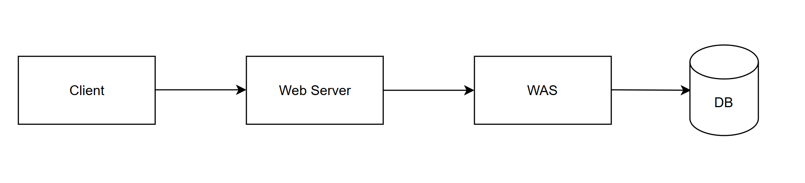
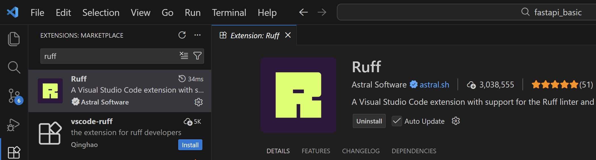
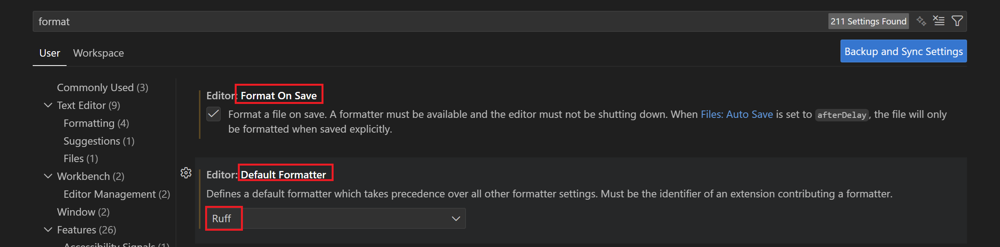
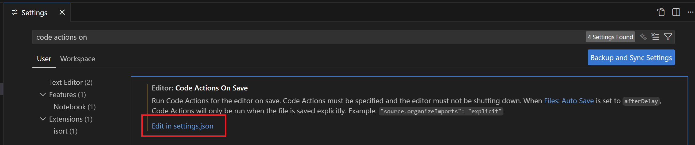
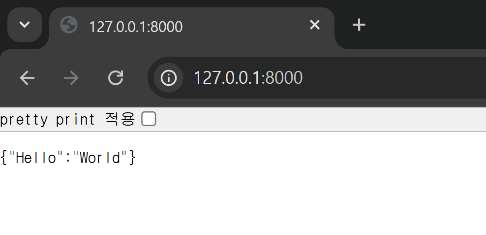

# FastAPI Intro

## 웹 서버와 웹 애플리케이션 서버의 구조



웹 서비스를 구성하는 서버 시스템은 정적 자원을 처리하는 영역과 동적 로직을 처리하는 영역으로 구분된다.

### 웹 서버

웹 서버는 클라이언트로부터 HTTP 요청을 받아 정적인 콘텐츠를 제공하는 역할을 수행한다.

- 정적 자원 처리: HTML, CSS, 이미지 파일 등 변경되지 않는 자원을 직접 전달한다.
- 요청 전달: 동적인 처리가 필요한 요청은 웹 애플리케이션 서버로 전달한다.
- 보안 및 부하 분산: 암호화 처리나 여러 대의 서버로 요청을 나누는 기능을 수행한다.
- 대표적인 소프트웨어: Nginx, Apache

### 웹 애플리케이션 서버 (WAS)

웹 애플리케이션 서버는 데이터베이스 조회나 복잡한 비즈니스 로직을 실행하여 동적인 결과를 생성하는 서버이다. 파이썬 환경에서는 ASGI(Asynchronous Server Gateway Interface)가 이 역할을 담당한다.

- 동적 콘텐츠 생성: 사용자별 맞춤 데이터나 연산 결과 등을 실시간으로 생성한다.
- 비동기 처리: 여러 요청을 동시에 처리하기 위해 비동기 통신 방식을 채택한다.
- 대표적인 소프트웨어: Uvicorn, Gunicorn

---

## FastAPI

- Python 기반의 애플리케이션 개발을 위한 프레임워크이며, python 기반 프레임워크 중 최상위권의 속도를 가진다.
- 웹사이트나 웹 서비스를 만들 때 필요한 많은 기능들을 미리 구현해놓아 개발자가 비즈니스 로직에만 집중할 수 있게 해준다.
- 비동기, Streaming을 지원하며, LangChain생태계에서 공식적으로 사용하는 서빙 도구이다.

### 설치하기

- 가상환경 생성
    - git 관리가 안된 상태면 git init을 한 것처럼 git 관리도 자동으로 추가해줌.
    - 혹시 git으로 관리 중이라면 .venv 폴더가 git에 포함되지 않도록 해줘야 한다.
    - 생성된 폴더가 uv 가상 환경이라고 생각하자. 해당 폴더에 들어가서 가상환경을 사용하는 것.
    
    ```bash
    uv init fastapi_basic
    cd fastapi_basic
    ```
    

- fastapi 및 uvicorn 설치
    - 각자 설치하지 않고 `fastapi[standard]`를 통해 한번에 설치할 수 있다.
    - 위에서 새로 생성한 가상 환경(폴더)에 들어가서 새롭게 설치.
    - 위~~~에 있는 가상환경 활성화 방식이 아니라 uv add를 사용해서 그냥 그때 그때 필요할 때만 쓰는 것.
    
    ```bash
    uv add "fastapi[standard]"
    ```
    

- main.py에 fastapi에 대한 코드를 작성한다.
    - (”/”) = 주소. 해당 주소로 가면 read_root() 실행.
    
    ```python
    from fastapi import FastAPI
    
    app = FastAPI()
    
    @app.get("/")
    def read_root():
        return {"Hello": "World"}
    ```
    

- terminal에 다음 명령어를 통해 서버를 실행한다.
    - `ctrl + c`를 통해 서버를 종료할 수 있다.
    - 코드의 변경사항이 자동으로 반영된다.
    
    ```bash
    uv run fastapi dev
    ```
    
- http://127.0.0.1:8000/에 접속한다.

## Ruff

러스트로 작성된 고성능 파이썬 정적 분석 도구이자 코드 형식 교정 도구이다. 

### 설치 및 환경 구성

uv를 사용하여 프로젝트의 개발 의존성 패키지로 Ruff를 추가한다. 개발 의존성으로 분류함으로써 실제 배포 환경에는 영향을 주지 않도록 설정한다.

- 설치
    - terminal에서 다음 명령어 입력
    - `--dev` 는 개발용 이라는 뜻.
    
    ```bash
    # 개발용 패키지로 Ruff 설치
    uv add --dev ruff
    ```
    

- vscode extention 설치



- `ctrl + ,` 의 설정에서 다음 설정 확인
    
    
    

- 자동 저장을 원하는 사람은 다음 설정 확인
    
    
    
- 사용하지 않은 import 정리를 위한 다음 설정 추가할 수 있다.
    - 수업의 편의성을 위해 수업에선 `설정하지 않는다`.
    
    
    
    `settings.json`에 다음 설정 추가
    
    ```python
    "editor.codeActionsOnSave": {
        "source.organizeImports.ruff": "explicit",
        "source.fixAll.ruff": "explicit"
      }
    ```
    

### 정적 분석 수행

정적 분석은 프로그램을 실행하지 않은 상태에서 소스 코드를 분석하여 구문 오류, 사용되지 않는 변수, 잘못된 호출 구문 등을 찾아내는 과정이다.

```bash
# 현재 디렉토리 및 하위 디렉토리의 모든 파이썬 파일 검사
uv run ruff check .

# 발견된 문제점 중 자동 수정이 가능한 항목을 즉시 반영
uv run ruff check --fix .

# 특정 파일만 지정하여 검사 수행
uv run ruff check main.py
```

### 코드 형식 교정

코드 형식 교정은 코드의 가독성을 높이고 협업 시 일관된 스타일을 유지하기 위해 공백, 들여쓰기, 따옴표 등을 자동으로 조정하는 작업이다.

```bash
# 프로젝트 전체 파일에 대해 코드 스타일 서식 적용
uv run ruff format .
```

## 간단한 API 구현

- main.py
    
    ```python
    from fastapi import FastAPI
    
    app = FastAPI()
    
    @app.get("/")
    def read_root():
        return {"Hello": "World"}
    ```
    

- FastAPI() 객체
    
    API 서비스의 핵심이 되는 애플리케이션 객체
    
    이 객체를 통해 경로(Route)를 설정하고 서버를 실행한다.
    

- @app.get("/")
    - HTTP GET 요청을 특정 함수와 연결하는 데코레이터
    - 괄호 안에는 접속할 URL 경로를 지정한다. 여기서는 메인 페이지("/")를 의미한다.
    - 함수의 return값이 URL에 대한 response로 전달된다.

- `uv run dev fastapi`를 통해 서버를 실행하면 `/` 루트에 대한 응답을 확인할 수 있다.
    
    
    
- 여러 개의 endpoint를 만들 수 있다.
    
    ```python
    @app.get("/hello")
    def hello():
        return "Hello World!"
    ```
    

## 자동 문서화

- 서버에 대한 API 명세서를 자동으로 생성하며, 기능을 시각적으로 확인하고 테스트할 수 있다.
- [`http://127.0.0.1:8000/docs`](http://127.0.0.1:8000/docs) - Swagger UI
- [`http://127.0.0.1:8000/redoc`](http://127.0.0.1:8000/redoc) - redoc

을 통해 접속할 수 있다.

- 각종 api를 테스트할 수 있도록 자동으로 Swagger, redoc를 생성해줌.