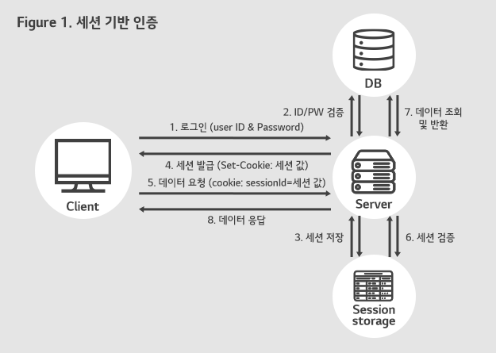
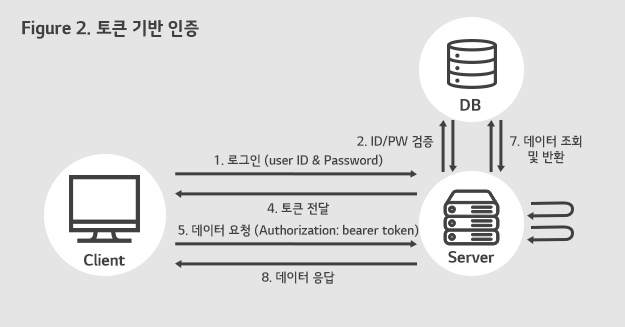
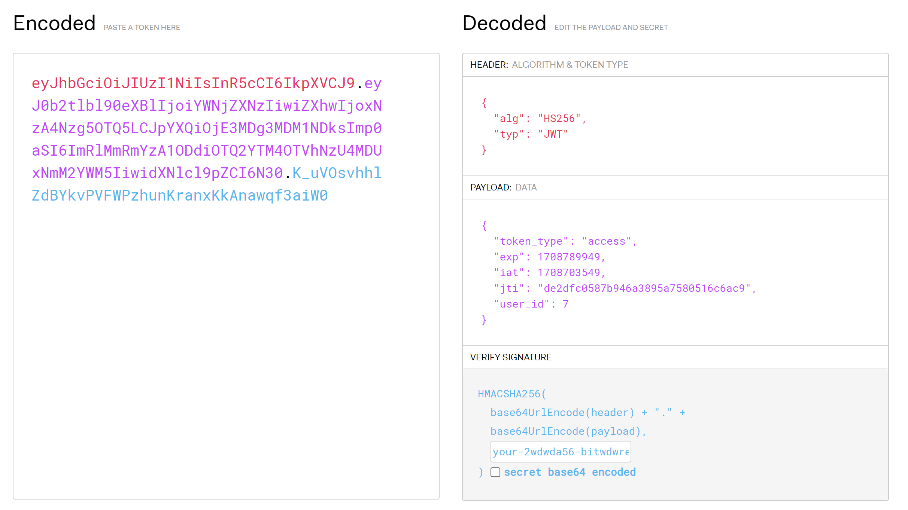

## Authentication & Authorization

- Authentication(인증)
    - 사용자, 장치의 신원을 확인하는 과정
    - 즉, 로그인

- Authorization(권한 부여)
    - 인증된 사용자나 시스템이 수행할 수 있는 작업의 유형과 범위를 결정하는 과정
    - ex) 관리자는 공지사항을 작성할 수 있지만, 개인 사용자는 불가능

| 인증 | 권한 | 결과 |
| --- | --- | --- |
| X | - | 민증을 놓고와서 술집에 못 들어감 |
| O | X | 고등학교 학생증을 들고가서 술집에 못 들어감 |
| O | O | 민증을 들고가서 술집에 들어감 |

---

- HTTP 특징
    - 비연결성(Connectionless)
        - 클라이언트가 서버에 요청을 보내고 서버가 그 요청에 응답을 한 후, 연결이 바로 끊어진다.
        - 요청이 독립적이다.
        - 단, HTTP/1.1부터는 Keep-Alive를 통해 일정 시간 동안 연결을 유지할 수 있다
    - 무상태(Stateless)
        - 이전 요청에 대한 정보나 상태를 저장하지 않는다.
    - 클라이언트-서버 구조
    
    → 하지만 한번 로그인 하면 계속 로그인이 되어있다!
    

---

## 쿠키와 세션

### **쿠키**

- 쿠키(Cookies)란 사용자의 웹 브라우저에 저장되는 작은 데이터 조각이다.
- 이 데이터는 사용자가 웹사이트를 방문할 때마다 헤더를 통해 서버에 다시 전송된다.
- 사용자의 세션 관리, 개인화 설정, 사용자 행동 기록 등에 사용된다.
- 주요 속성
    - Expires / Max-Age
        - 쿠키의 유효 기간을 설정
        - Expires: 만료 날짜를 지정
        - Max-Age: 현재부터 만료까지의 시간(초)을 지정
        - 둘 다 없으면 세션 쿠키로 동작 (브라우저 종료시 삭제)
    - HttpOnly
        - JavaScript로의 접근을 차단
        - javascript의 document.cookie로 접근 불가
    - Secure
        - HTTPS 프로토콜에서만 전송 가능
        

---

### **세션**

- 세션(Sessions)은 서버 측에서 사용자 정보를 저장하는 방법이다.
- 세션 ID를 통해 사용자를 식별하며, 이 ID는 쿠키를 통해 사용자의 브라우저에 저장됩니다.
- 사용자의 로그인 상태를 유지하고, 사용자별로 개인화된 정보를 관리한다.

- 특징
    - 서버 자원 사용
        - 서버의 메모리나 DB에 정보가 저장된다
        - 클라이언트 수가 많아지면 서버 부하가 증가한다
    - 보안성
        - 중요 정보가 서버에 저장되어 안전하다
        - 세션 ID만 클라이언트에 전달된다
        - 세션 ID는 유추하기 어려운 긴 문자열로 생성된다
        - 서버에서 세션을 강제로 만료시킬 수 있다



출처 : https://www.lgcns.com/blog/cns-tech/security/1786/

---

## 토큰

- 토큰(Tokens)은  인증 정보를 안전하게 전송하기 위해 사용되는 암호화된 문자열이다.
- 사용자의 로그인 정보를 서버에 저장하는 대신, 클라이언트 측에 저장한다.



출처 : https://www.lgcns.com/blog/cns-tech/security/1786/

---

### JWT

[JWT.IO](https://jwt.io/)

- JWT(JSON Web Token)는 웹 표준으로, 두 개체 사이에서 JSON 객체를 사용하여 가볍고 자가 수용적인(self-contained) 방식으로 정보를 안전하게 전송하기 위해 설계되었다.
- 주로 인증 및 정보 교환에 사용된다.

- 자가 수용성(Self-contained): 필요한 모든 정보를 자체적으로 포함하고 있어서, 별도의 정보 조회 없이도 검증과 사용자 식별이 가능하다.
- 확장성(Scalability): 상태를 서버에 저장하지 않기 때문에, 애플리케이션의 확장성이 높아진다.
- 다양한 플랫폼과 언어에서 사용 가능: JWT는 JSON 포맷을 기반으로 하기 때문에 다양한 프로그래밍 언어와 플랫폼에서 쉽게 사용할 수 있다.
- 즉, MSA에 적합하다.

- 헤더, 페이로드, 서명 세 개의 파트로 구성되어있다.
    - 헤더 : 토큰 타입, 암호화 알고리즘이 명시되어있다.
    - 페이로드 : 토큰으로 관리할 데이터가 저장되어있다.
        - 민감한 정보는 저장하지 않아야 한다.
    - 서명 : 서명을 통해 JWT가 유효한지 확인할 수 있다.
    
    
    
    출처 : https://jwt.io/
    

- 보안을 위해 `Access Token`과 `Refresh Token`을 활용한다.
    - Access Token
        - 실제 리소스에 접근할 때 사용
        - 비교적 짧은 유효기간
    - Refresh Token
        - Access Token 재발급에 사용
        - 비교적 긴 유효기간
        - 보안을 위해 서버 DB에 저장하기도 한다.

- 단,
    - 토큰 크기가 세션 ID보다 크다.
    - 한번 발급된 토큰은 만료 전까지 강제 회수가 어렵다.
    - 페이로드 정보가 암호화되지 않는다. (Base64 인코딩만 됨)
    - Stateless하기 때문에 토큰 발급 후 사용자의 권한을 변경하기 어렵다.

---

### MSA와 모놀리식 아키텍처

- 모놀리식 아키텍처(Monolithic Architecture)
    - 하나의 큰 애플리케이션에 모든 기능이 포함된 형태
    - 모든 비즈니스 로직이 하나의 프로젝트에 통합되어 있다
    - 하나의 데이터베이스를 사용한다

- MSA(Microservices Architecture)
    - 작은 독립적인 서비스들의 집합
    - 각 서비스가 독립적인 비즈니스 로직과 데이터베이스를 가진다
    - 서비스 간 통신은 API를 통해 이루어진다

- 장점
    - 서비스 별 독립적인 개발과 배포가 가능하다
    - 서비스 별 다양한 기술 스택 사용이 가능하다
    - 장애가 다른 서비스에 영향을 주지 않는다
    - 필요한 서비스만 확장이 가능하다
    - 서비스 별 독립적인 팀 운영이 가능하다

- 단점
    - 서비스 간 통신 비용이 발생한다
    - 트랜잭션 관리가 복잡하다
    - 테스트와 배포가 복잡하다
    - 서비스 간 데이터 정합성 유지가 어렵다
    - 모니터링과 로깅이 복잡하다

---

### 참고) 실시간 통신 방식

- HTTP 프로토콜
    - Polling
        - 클라이언트가 주기적으로 서버에 요청을 보내는 방식
        - 특징
            - 구현이 간단하다
            - 불필요한 요청이 많이 발생한다
            - 실시간성이 떨어진다
        - 사용 예
            - 주기적인 데이터 업데이트가 필요한 경우
            - 실시간성이 크게 중요하지 않은 경우
    
    - Long Polling
        - 클라이언트가 서버에 요청을 보내고, 서버는 이벤트가 발생할 때까지 응답을 보류하는 방식
        - 특징
            - Polling보다 불필요한 요청이 적다
            - 서버 부하가 Polling보다 적다
            - 여전히 연결을 주기적으로 맺고 끊어야 한다
        - 사용 예
            - 실시간 알림
            - 메시지 전송 확인
    
    - Server-Sent Events(SSE)
        - 서버가 클라이언트로 단방향 통신을 하는 방식
        - 특징
            - 서버에서 클라이언트로의 단방향 통신만 가능
            - WebSocket보다 가볍다
        - 사용 예
            - 실시간 알림
            - 주가 정보 업데이트
            - 뉴스 피드

- WebSocket
    - 양방향 실시간 통신이 가능한 프로토콜
    - 특징
        - 연결을 한번 맺으면 계속 유지된다
        - 양방향 통신이 가능하다
        - 실시간성이 높다
        - HTTP보다 오버헤드가 적다
        - 서버 자원을 지속적으로 사용하여 클라이언트 수가 많아지면 서버 부하가 크다
        - 방화벽이나 프록시 설정에 따라 연결이 차단될 수 있다
    - 사용 예
        - 실시간 채팅
        - 온라인 게임
        - 실시간 협업 도구

---

Auth관련 기능을 위해 다음과 같은 API를 만든다.

| Method | Path | 설명 |
| --- | --- | --- |
| POST | `/auth/signup` | 회원가입 |
| POST | `/auth/login` | 로그인 → JWT 토큰 발급 |
| GET | `/me` | 내 정보 조회 (로그인 필요) |
- 다음과 같은 폴더구조를 사용한다.

```markdown

mysite4
├── dependencies.py              # 인증 의존성 (get_current_user)
├── models/
│   └── user.py                  # User 테이블 정의
├── repositories/
│   └── user_repository.py       # DB 접근 계층
├── schemas/
│   └── user.py                  # 요청/응답 형식 정의
├── services/
│   └── auth_service.py          # 비즈니스 로직
│   └── user_service.py          # 비즈니스 로직
└── routers/
    └── auth_router.py           # API 엔드포인트 정의
	  └── user_router.py           # API 엔드포인트 정의

```

---

## 준비

- 필요한 library를 설치한다.

```bash
uv add PyJWT bcrypt email-validator
```

- **PyJWT**
    
    JWT 토큰을 만들고 검증하는 라이브러리
    
- **bcrypt**
    
    비밀번호를 안전하게 해싱하는 라이브러리이다
    
- **email-validator**
    
    이메일 형식을 검증하는 라이브러리이다 (Pydantic의 `EmailStr`에서 사용)
    

### 환경 변수 설정

`.env` 파일에 JWT 관련 설정을 추가한다.

```
JWT_SECRET_KEY=your-secret-key
JWT_ALGORITHM=HS256
JWT_EXPIRE_MINUTES=30
```

- JWT_SECRET_KEY
    
    토큰을 암호화/복호화할 때 사용하는 비밀 키이다. 절대 외부에 노출하면 안 된다.
    
- JWT_ALGORITHM
    
    암호화 알고리즘이다. HS256이 가장 일반적으로 사용된다.
    
- JWT_EXPIRE_MINUTES
    
    토큰 만료 시간 (분)이다. 30이면 로그인 후 30분 뒤 토큰이 만료된다.
    

secret key는 terminal에 다음 명령어를 통해 생성한다.

```python
openssl rand -hex 32
```

---

## 회원가입

회원가입은 User에 대한 Create 로직이다.

### User 모델 정의

```python
# models/user.py

from datetime import datetime

from sqlalchemy import String, DateTime, func
from sqlalchemy.orm import Mapped, mapped_column
from database import Base

class User(Base):
    __tablename__ = "users"

    id: Mapped[int] = mapped_column(primary_key=True, autoincrement=True)
    email: Mapped[str] = mapped_column(String(120), unique=True, nullable=False)
    password: Mapped[str] = mapped_column(String(200), nullable=False)
    created_at: Mapped[datetime] = mapped_column(
        DateTime, server_default=func.now(), nullable=False
    )
```

- 모델 등록을 위해 `models/__init__.py`에 import해준다.

```python
# mysite4/models/__init__.py

from .post import Post
from .comment import Comment
from .tag import Tag
from .post_tag import PostTag
from .user import User    # 추가
from database import Base

__all__ = ["Base", "Post", "Comment", "Tag", "PostTag", "User"]
```

### 스키마 정의

- `EmailStr`을 사용하면 이메일 형식이 자동으로 검증된다

```python
# schemas/user.py

from datetime import datetime
from pydantic import BaseModel, ConfigDict, EmailStr

class UserCreate(BaseModel):
    email: EmailStr
    password: str

class UserResponse(BaseModel):
    id: int
    email: str
    created_at: datetime

    model_config = ConfigDict(from_attributes=True)
```

---

### Repository 구현

```python
# repositories/user_repository.py

from sqlalchemy.orm import Session
from sqlalchemy import select
from mysite4.models.user import User

class UserRepository:
    def save(self, db: Session, user: User):
        db.add(user)
        return user

    def find_by_email(self, db: Session, email: str):
        stmt = select(User).where(User.email == email)
        return db.scalars(stmt).first()

    def find_by_id(self, db: Session, user_id: int):
        return db.get(User, user_id)

user_repository = UserRepository()
```

---

### Service 구현

비밀번호를 저장할 때는 **평문이 아닌 해시값**으로 저장한다.

해시의 경우 단방향 변환이여서 DB가 해킹당하더라도 원본 비밀번호를 알 수 없다.

```python
# services/auth_service.py
import os
from datetime import datetime, timedelta, timezone

import bcrypt
import jwt
from sqlalchemy.orm import Session
from fastapi import HTTPException, status
from dotenv import load_dotenv

from mysite4.repositories.user_repository import user_repository
from mysite4.models.user import User
from mysite4.schemas.user import UserCreate

load_dotenv()
SECRET_KEY = os.getenv("JWT_SECRET_KEY")
ALGORITHM = os.getenv("JWT_ALGORITHM", "HS256")
EXPIRE_MINUTES = int(os.getenv("JWT_EXPIRE_MINUTES", "30"))

class AuthService:
    def _hash_password(self, password: str) -> str:
        """비밀번호를 bcrypt로 해싱한다."""
        return bcrypt.hashpw(password.encode("utf-8"), bcrypt.gensalt()).decode("utf-8")

    def signup(self, db: Session, data: UserCreate):
        with db.begin():
            # 1. 이메일 중복 검사
            existing_user = user_repository.find_by_email(db, data.email)
            if existing_user:
                raise HTTPException(
                    status_code=status.HTTP_409_CONFLICT,
                    detail="이미 등록된 이메일입니다.",
                )

            # 2. 비밀번호 해싱
            hashed_password = self._hash_password(data.password)

            # 3. 사용자 저장
            new_user = User(email=data.email, password=hashed_password)
            user_repository.save(db, new_user)

        db.refresh(new_user)

        return new_user
        
auth_service = AuthService()

```

---

### Router 구현

```python
# routers/auth_router.py

from fastapi import APIRouter, Depends, status
from sqlalchemy.orm import Session
from database import get_db
from mysite4.services.auth_service import auth_service
from mysite4.schemas.user import (
    UserCreate,
    UserResponse,
)

router = APIRouter(prefix="/auth", tags=["Auth"])

@router.post("/signup", response_model=UserResponse, status_code=status.HTTP_201_CREATED)
def signup(data: UserCreate, db: Session = Depends(get_db)):
    return auth_service.signup(db, data)
```

- main.py에 auth_router를 등록한다.

```python
# main.py

from mysite4.routers.auth_router import router as auth_router  # 추가

app = FastAPI()

app.include_router(auth_router)  # 추가
```

---

## 로그인 구현

로그인은 이메일/비밀번호를 확인하고, 맞으면 JWT 토큰을 발급하는 과정이다.

토큰은 서버에서 저장하지 않으며, 클라이언트가 토큰을 보내면 서버는 SECRET_KEY로 서명을 검증해서 유효한 토큰인지 판단한다. SECRET_KEY를 모르면 토큰을 위조할 수 없다.

---

### 스키마 추가

```python
# schemas/user.py에 로그인 관련 스키마를 추가한다.
class UserLogin(BaseModel):
    email: str
    password: str

class TokenResponse(BaseModel):
    access_token: str
    token_type: str = "bearer"
```

---

### Service 구현

입력받은 data를 바탕으로 user를 조회한 후, password를 해싱해 비교한다.

이때, 예외처리는 이메일/비밀번호 중 어떤것이 틀렸는지 명시하지 않는 것이 보안상 좋다.

```python
# services/auth_service.py

from mysite4.schemas.user import UserCreate, UserLogin

class AuthService:

    def _verify_password(self, password: str, hashed: str) -> bool:
        """입력된 비밀번호와 해시된 비밀번호를 비교한다."""
        return bcrypt.checkpw(password.encode("utf-8"), hashed.encode("utf-8"))
        
    def login(self, db: Session, data: UserLogin) -> str:
        # 1. 이메일로 사용자 조회
        user = user_repository.find_by_email(db, data.email)
        if not user:
            raise HTTPException(
                status_code=status.HTTP_401_UNAUTHORIZED,
                detail="이메일 또는 비밀번호가 올바르지 않습니다.",
            )

        # 2. 비밀번호 검증
        if not self._verify_password(data.password, user.password):
            raise HTTPException(
                status_code=status.HTTP_401_UNAUTHORIZED,
                detail="이메일 또는 비밀번호가 올바르지 않습니다.",
            )

        # 3. JWT 토큰 생성
        access_token = self._create_access_token(user.id)
        return access_token

    def _create_access_token(self, user_id: int) -> str:
        expire = datetime.now(timezone.utc) + timedelta(minutes=EXPIRE_MINUTES)
        payload = {
            "sub": str(user_id),
            "exp": expire,
        }
        return jwt.encode(payload, SECRET_KEY, algorithm=ALGORITHM)
```

- JWT의 Payload에 들어가는 정보
    - sub는 `subject`를 의미하며, 사용자에 대한 식별자를 담는다.

```json
{
    "sub": "1",           // subject: 사용자 ID
    "exp": 1709123456     // expiration: 만료 시간 (Unix timestamp)
}
```

---

### Router 구현

```python
from mysite4.schemas.user import (
    UserCreate,
    UserResponse,
    TokenResponse,
    UserLogin
)

@router.post("/login", response_model=TokenResponse)
def login(data: UserLogin, db: Session = Depends(get_db)):
    access_token = auth_service.login(db, data)
    return {"access_token": access_token}
```