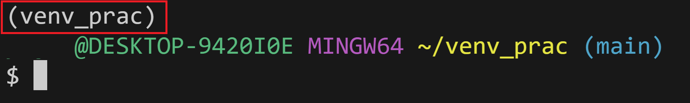

# 파이썬 가상환경과 uv

파이썬 가상환경은 프로젝트별로 독립적인 실행 환경을 구성하는 기술이다. 시스템 전체에 설치된 패키지와의 충돌을 방지하고, 프로젝트마다 서로 다른 버전의 패키지를 사용할 수 있도록 격리된 공간을 생성한다.

## uv의 정의 및 특징

uv는 러스트로 작성된 파이썬 패키지 및 프로젝트 관리 도구이다. 

기존의 pip, pip-tools, virtualenv를 대체하며 처리 속도가 빠르고 단일 실행 파일로 동작한다.

## 설치

powershell에서 다음 명령어 입력

```sql
powershell -ExecutionPolicy ByPass -c "irm https://astral.sh/uv/install.ps1 | iex"
```

```sql
# 설치 확인 및 버전 체크
uv --version
```

### 프로젝트 초기화 및 가상환경 생성

uv를 사용하여 새로운 프로젝트를 생성하면 가상환경 설정과 의존성 관리 파일인 pyproject.toml이 자동으로 구성된다.

```bash
# 새로운 프로젝트 디렉토리 생성 및 초기화
# 뒤에 프로젝트 이름을 명시하지 않으면 현재 디렉토리에 가상환경이 만들어진다.
uv init my-project

# 프로젝트 디렉토리로 이동
cd my-project

# .venv 디렉토리에 가상환경 생성
# uv add를 통해 패키지를 설치하면 자동으로 .venv가 만들어진다.
uv venv
```

### 프로젝트 초기화 및 가상환경 생성

uv를 사용하여 새로운 프로젝트를 생성하면 가상환경 설정과 의존성 관리 파일인 pyproject.toml이 자동으로 구성된다.

```bash
# 새로운 프로젝트 디렉토리 생성 및 초기화
# 뒤에 프로젝트 이름을 명시하지 않으면 현재 디렉토리에 가상환경이 만들어진다.
uv init my-project

# 프로젝트 디렉토리로 이동
cd my-project

# .venv 디렉토리에 가상환경 생성
# uv add를 통해 패키지를 설치하면 자동으로 .venv가 만들어진다.
uv venv
```

### 가상환경 활성화

생성된 가상환경을 현재 터미널 세션에 적용하기 위해서는 활성화 과정이 필요하다. 운영체제에 따라 활성화 스크립트의 경로가 다르다.

```bash
# macOS 및 Linux 환경에서 활성화
source .venv/bin/activate

# Windows 환경에서 활성화
source .venv/Scripts/activate
```

가상환경을 활성화하면 terminal에 다음과 같이 가상환경의 이름이 나타나게 된다



`deactivate`을 통해 가상환경을 비활성화할 수 있다.

### 패키지 설치 및 의존성 관리

uv는 프로젝트의 의존성을 관리하기 위해 uv.lock 파일을 사용한다. 이는 패키지의 정확한 버전을 기록하여 환경 간 동일성을 보장한다.

```bash
# 외부 패키지(예: requests) 설치 및 pyproject.toml 기록
uv add requests

# 특정 버전의 패키지 설치
uv add pandas==2.1.0

# 개발 환경에서만 사용하는 패키지 설치
uv add --dev pytest
```

### 가상환경 내 스크립트 실행

가상환경을 수동으로 활성화하지 않고도 uv run 명령어를 사용하여 가상환경 내의 파이썬 인터프리터로 스크립트를 즉시 실행할 수 있다.

```python
# main.py 파일 내용
from rich import print

print("[bold red]가상환경[/bold red]에서 사용 가능!")
```

```bash
# uv run을 이용한 격리된 실행
uv run main.py
```

## 의존성 동기화

다른 환경에서 공유받은 pyproject.toml 파일을 바탕으로 현재 가상환경의 패키지 상태를 일치시킬 때 사용한다.

```bash
# lock 파일에 정의된 상태로 가상환경 패키지 동기화
uv sync
```

### pyproject.toml와 uv.lock의 차이

- pyproject.toml
    - 사람이 직접 수정 가능하며, 필요한 패키지와 대략적인 버전 범위를 기록한다.
- uv.lock
    - uv가 자동 관리하며, 실제로 설치된 패키지의 정확한 버전과 해시값을 기록한다.