# 배포

개발한 애플리케이션을 다른 사람이 사용할 수 있도록 인터넷에 올리는 과정이다. `localhost`에서만 동작하던 서비스에 공개 URL을 부여하여, 누구든 브라우저에서 접근할 수 있게 만드는 것이다.

---

## 서버를 직접 관리하는 방식

### IaaS (Infrastructure as a Service)

AWS EC2, GCP Compute Engine 같은 서비스에서 컴퓨터를 빌려 쓰는 방식이다. 빈 Linux 서버를 받아서 직접 세팅한다.

```
서버 생성 → SSH 접속 → Python 설치 → 코드 배포 → 실행 → 포트 열기 → HTTPS 설정 → ...
```

자유도가 가장 높지만 할 일이 많다. OS 업데이트, 보안 패치, 장애 대응까지 모두 직접 해야 한다. 서버를 끄지 않는 한 비용이 계속 발생한다.

Docker를 함께 사용하면 애플리케이션과 실행 환경(런타임, 라이브러리)을 하나의 컨테이너로 묶을 수 있다. 어디서 실행하든 동일한 환경이 보장되어 "내 컴퓨터에서는 되는데" 문제가 사라진다.

---

## 서버를 관리하지 않는 방식

직접 서버를 세팅하는 대신, 코드만 올리면 나머지를 플랫폼이 처리해주는 서비스들이 있다.

### PaaS (Platform as a Service)

코드를 올리면 알아서 빌드하고 실행해주는 서비스다. 서버 세팅, HTTPS, 스케일링을 플랫폼이 처리한다.

```
GitHub push → 자동 빌드 → 자동 배포 → URL 발급
```

대표 서비스: Railway, Render, Heroku

### 정적 호스팅

React 같은 SPA는 빌드하면 HTML, CSS, JS 정적 파일이 된다. 서버 로직이 없으므로 CDN에 올리는 것만으로 배포가 완료된다.

```
GitHub push → 빌드 → CDN 배포 → 전 세계에서 빠르게 접근
```

대표 서비스: Vercel, Netlify

### BaaS (Backend as a Service)

인증, 데이터베이스, 파일 저장소 같은 백엔드 기능을 이미 만들어진 API로 제공하는 서비스다. 간단한 앱은 백엔드 코드 없이도 만들 수 있다.

```
회원가입 → Supabase Auth API 호출 (백엔드 코드 없음)
데이터 저장 → Supabase DB API 호출 (백엔드 코드 없음)
```

백엔드 전체를 대체할 수도 있고, DB 호스팅처럼 일부 기능만 가져다 쓸 수도 있다.

대표 서비스: Supabase(PostgreSQL 기반), Firebase(NoSQL 기반)

pgvector : 벡터DB를 지원하는 PostgreSQL의 확장 프로그램. 원래 RDB 따로 벡터DB 따로 배포해야 하지만 이 확장 프로그램을 Supabase에서 지원해줌. 그래서 이걸 사용해서 배포할 생각.

### 서버리스 (Serverless)

서버가 항상 켜져 있지 않고, 요청이 올 때만 함수가 실행된다. 요청이 없으면 비용이 0이다.

```
요청 → 함수 실행 → 응답 → 종료
```

대표 서비스: AWS Lambda, Vercel Functions, Cloudflare Workers

콜드 스타트(함수가 깨어나는 지연)가 있고 실행 시간 제한이 있어서, LangGraph처럼 오래 걸리는 작업에는 맞지 않다. 간단한 API나 웹훅 처리에 적합하다.

---

| 방식 | 서버 관리 | 자유도 | 난이도 | 적합한 용도 |
| --- | --- | --- | --- | --- |
| IaaS  | 직접 | 최고 | 높음 | 세밀한 제어가 필요한 서비스 |
| PaaS  | 플랫폼 | 중간 | 낮음 | 백엔드 API 서버 |
| 정적 호스팅  | 플랫폼 | 낮음 | 낮음 | 프론트엔드 SPA |
| BaaS  | 플랫폼 | 낮음 | 낮음 | DB, 인증, 스토리지 |
| 서버리스 | 플랫폼 | 중간 | 중간 | 단발성 함수 실행 |

---

## 배포 시 알아야 할 개념

### CORS

프론트엔드(`vercel.app`)와 백엔드(`railway.app`)의 도메인이 다르면 브라우저가 요청을 차단한다. 백엔드에서 허용할 도메인을 명시해야 한다.

```python
app.add_middleware(
    CORSMiddleware,
    allow_origins=["https://my-app.vercel.app"],
    allow_methods=["*"],
    allow_headers=["*"],
)
```

### 환경 변수

API 키나 DB 접속 정보 같은 민감한 값은 코드에 직접 쓰지 않고 환경 변수로 관리한다.

로컬 개발 시에는 `.env` 파일에 값을 넣어두고, `.gitignore`에 추가하여 Git에 올라가지 않도록 해야 한다.

```
# .env
OPENAI_API_KEY=sk-...
LANGSMITH_API_KEY=lsv2-...
DATABASE_URL=postgresql://...
```

배포 환경에서는 플랫폼이 제공하는 환경 변수 설정을 사용한다. Railway, Vercel 등 대부분의 플랫폼은 대시보드에서 키-값 쌍을 등록할 수 있다. `.env` 파일을 서버에 올리는 것이 아니라, 플랫폼에 직접 등록하는 방식이다.

### CI/CD

CI(Continuous Integration)는 코드를 push할 때마다 자동으로 테스트·빌드하는 것이고, CD(Continuous Deployment)는 그 결과를 자동으로 배포하는 것이다.

```
git push → 테스트 → 빌드 → 배포
```

Vercel이나 Railway 같은 플랫폼은 GitHub 연동 시 CI/CD가 내장되어 있다. `main` 브랜치에 push하면 자동으로 빌드·배포된다. 별도 설정 없이 바로 쓸 수 있어 간편하지만, 테스트 실행이나 조건부 배포 같은 세밀한 제어는 어렵다.

더 복잡한 파이프라인이 필요하면 별도의 CI/CD 도구를 사용한다. push 시 자동 테스트, 특정 브랜치에만 배포, PR 생성 시 프리뷰 배포 같은 세밀한 제어가 가능하다.

대표적인 CI/CD 도구:

- GitHub Actions — GitHub에 내장되어 있어 별도 설정 없이 바로 사용할 수 있다. 현재 가장 많이 쓰인다.
- Jenkins — 오픈소스 CI/CD 도구로, 자체 서버에 설치해서 운영한다. 오래된 만큼 기존 프로젝트에서 많이 사용하고 있다.

---

## 배포 환경 전환

로컬 → 배포로 전환할 때 변경되는 부분을 정리한다.

## FastAPI

### Chroma → pgvector

LangChain의 Retriever 인터페이스가 동일하므로 저장소만 교체하면 된다. 벡터 DB 연결은 `VECTOR_DB_URL` 환경변수로 분리한다.

```python
# 로컬 (VECTOR_DB_URL 미설정)
from langchain_chroma import Chroma
vectorstore = Chroma(embedding_function=embeddings, collection_name="ai_chatbot")

# 배포 (VECTOR_DB_URL 설정)
from langchain_postgres import PGVector

ASYNC_VECTOR_DB_URL = VECTOR_DB_URL.replace("postgresql://", "postgresql+asyncpg://")
vectorstore = PGVector(
    connection=ASYNC_VECTOR_DB_URL,
    embeddings=embeddings,
    collection_name="ai_chatbot",
    async_mode=True,
)
```

`async_mode=True`로 설정하면 FastAPI의 async 엔드포인트에서 사용할 수 있다. connection URL도 `asyncpg` 드라이버를 사용하도록 변환해야 한다.

`vectorstore.as_retriever()` 이후 코드는 변경 없음.

### 체크포인터 전환

로컬에서는 `MemorySaver()`를 사용하고, 배포 환경에서는 `AsyncPostgresSaver`를 사용한다.

```python
# 로컬
from langgraph.checkpoint.memory import MemorySaver
graph = graph_builder.compile(checkpointer=MemorySaver())

# 배포 (DATABASE_URL 설정)
from psycopg import AsyncConnection
from langgraph.checkpoint.postgres.aio import AsyncPostgresSaver

conn = await AsyncConnection.connect(os.environ["DATABASE_URL"])
checkpointer = AsyncPostgresSaver(conn)
await checkpointer.setup()  # 체크포인트 테이블 자동 생성
graph = graph_builder.compile(checkpointer=checkpointer)
```

`graph_builder.compile(checkpointer=checkpointer)` 이후 코드는 변경 없음.

### Procfile

Railway가 앱을 실행할 명령어를 지정하는 파일이다.

```
web: uvicorn main:app --host 0.0.0.0 --port $PORT
```

### 환경변수 (Railway)

| 변수 | 설명 |
| --- | --- |
| `OPENAI_API_KEY` | OpenAI API 키 |
| `DATABASE_URL` | Supabase PostgreSQL 연결 URL (체크포인터 + SQLAlchemy) |
| `VECTOR_DB_URL` | Supabase PostgreSQL 연결 URL (pgvector 벡터 저장소) |

### CORS 설정 (배포 시)

`CORS_ORIGINS` 환경변수로 허용 도메인을 관리한다. 기본값은 로컬 개발용 `http://localhost:5173`이다.

```python
import os

app.add_middleware(
    CORSMiddleware,
    allow_origins=os.getenv("CORS_ORIGINS", "<http://localhost:5173>").split(","),
    allow_credentials=True,
    allow_methods=["*"],
    allow_headers=["*"],
)
```

Railway 환경변수에 Vercel 도메인을 설정한다.

```
CORS_ORIGINS=https://your-app.vercel.app
```

## React

### 프론트엔드 API URL (Vercel)

프론트엔드는 `VITE_API_URL` 환경변수로 백엔드 주소를 설정한다.

```jsx
// store/useChatStore.js
const API_URL = import.meta.env.VITE_API_URL || "<http://localhost:8000>";
```

로컬에서는 환경변수 없이 `localhost:8000`으로 동작하고, Vercel 배포 시 Environment Variables에 Railway 백엔드 URL을 설정한다.

| 환경 | `VITE_API_URL` |
| --- | --- |
| 로컬 | 미설정 (`http://localhost:8000`) |
| Vercel | `https://your-backend.up.railway.app` |

### SPA 라우팅 설정 (Vercel)

React Router는 브라우저 안에서 동작하는 클라이언트 라우팅이다. 새로고침이나 URL 직접 입력 시에는 Vercel 서버가 먼저 요청을 받는데, `/chat` 경로에 해당하는 파일이 없으므로 404가 발생한다.

프론트엔드 루트에 `vercel.json`을 추가해서 모든 요청을 `index.html`로 보내면 React Router가 라우팅을 처리할 수 있다.

```json
{
  "rewrites": [
    { "source": "/(.*)", "destination": "/index.html" }
  ]
}
```

> 로컬에서는 Vite 개발 서버가 SPA fallback을 자동으로 처리하므로 이 설정이 필요 없다.
> 

## Supabase

[Supabase | The Postgres Development Platform.](https://supabase.com/)

- 회원가입 후 진행한다.

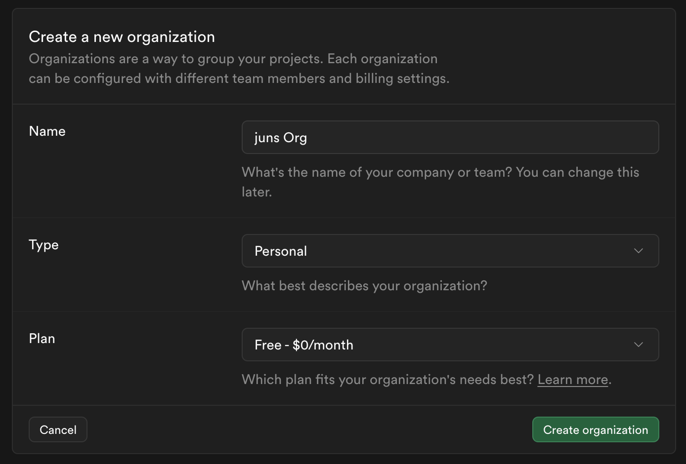

- 아래 체크박스는 해제해도 무방

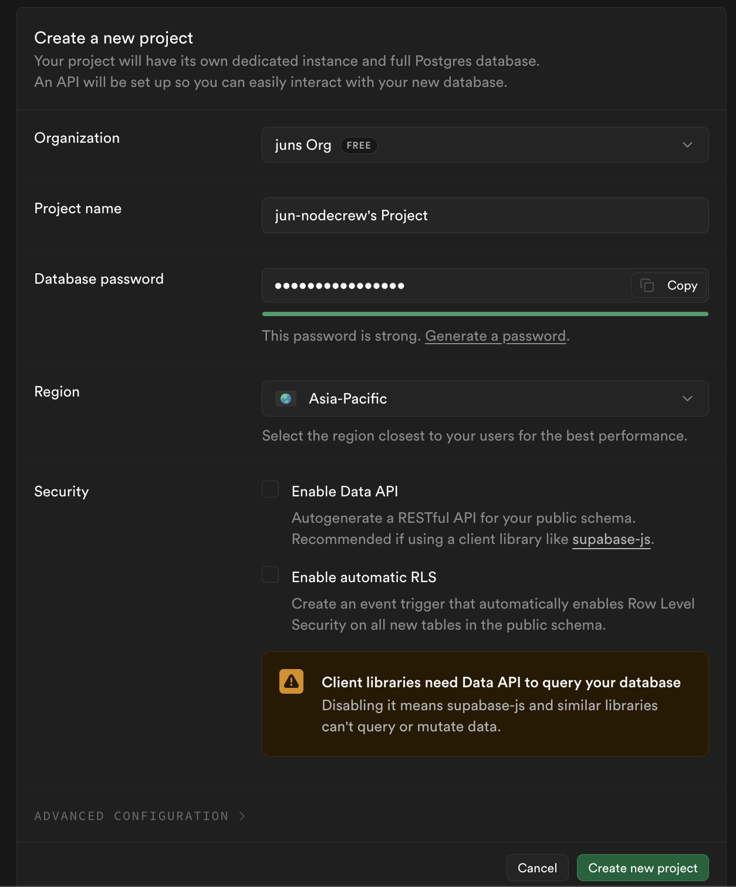

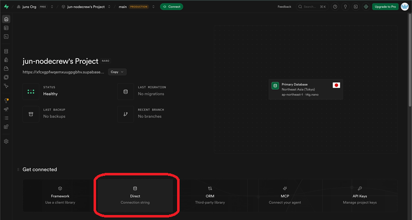

- DB URL 메모

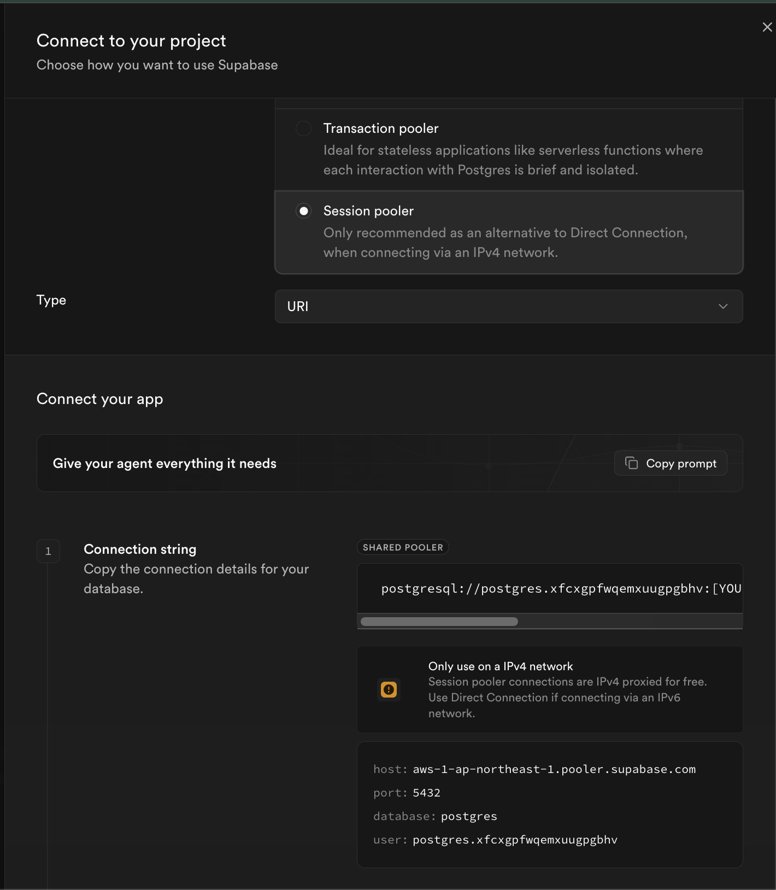

- VectorDB인 Postgres의 pgvector를 사용하기 위한 extension 생성

```jsx
create extension if not exists vector;
```

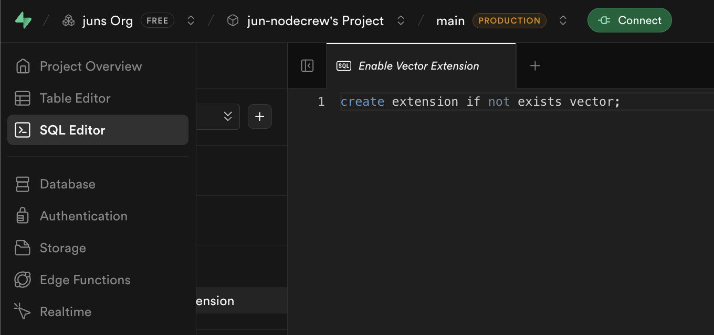

- SQL Editor에 입력하고 Run 하면 된다.
- 백엔드에 있는 init_vectordb.py 실행하여 데이터 임베딩
    - .env에 `VECTOR_DB_URL` , `OPENAI_API_KEY` 입력
    
    ```jsx
    uv sync
    uv add psycopg2
    uv run init_vectordb.py
    ```
    
- supabase의 sql editor에서 다음 명령어 입력하면 embedding된 데이터를 확인할 수 있다.

```jsx
select document, cmetadata from langchain_pg_embedding limit 3;
```

## Railway

- backend에 대한 프로젝트를 github에 업로드한다.

[Loading...](https://railway.com/)

- 회원가입 후 진행한다

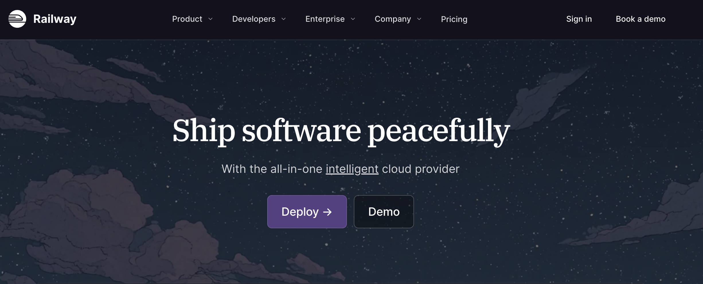

- repository를 연결해준다.

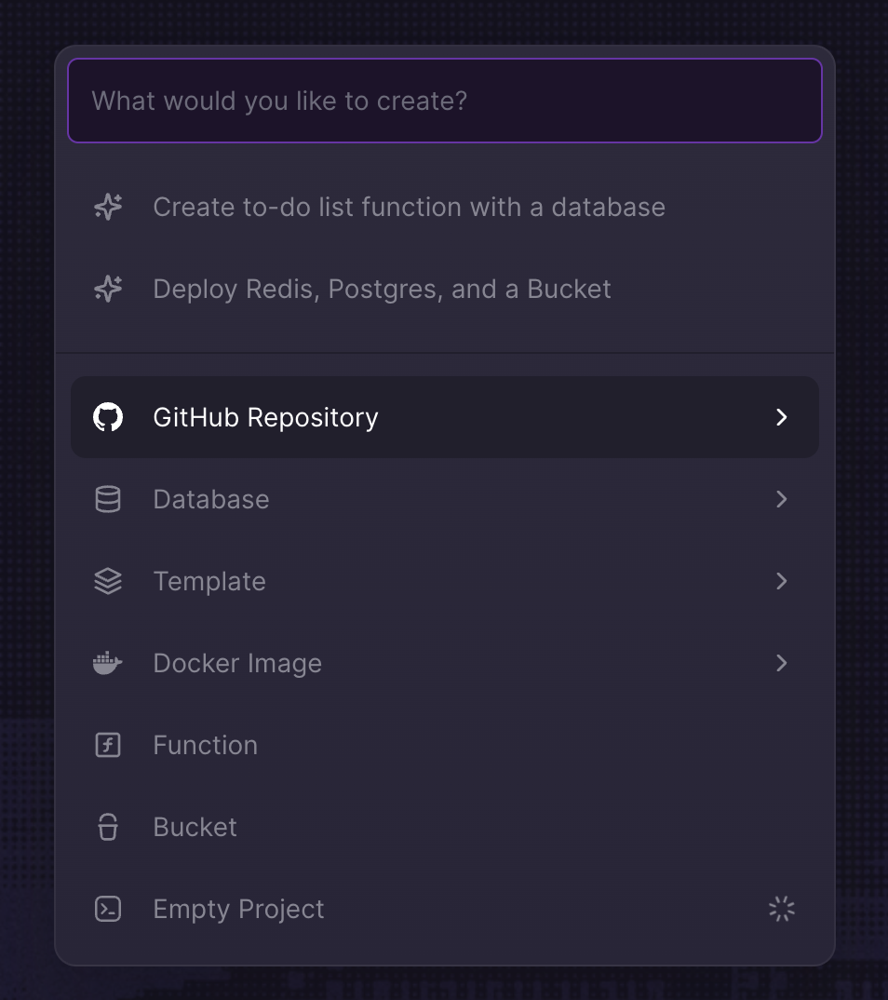

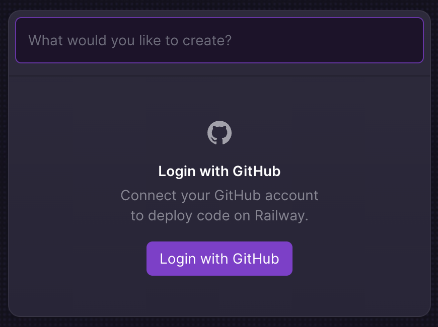

- 환경변수를 입력해준다.
    - 여기선 localhost라고 하면 인식을 못함. 그래서 supabase에서 썻던 url을 써야함. 지금은 DATABASE_URL과 VECTOR_DB_URL이 동일하지만, 나중에 달라질 수도 있다.

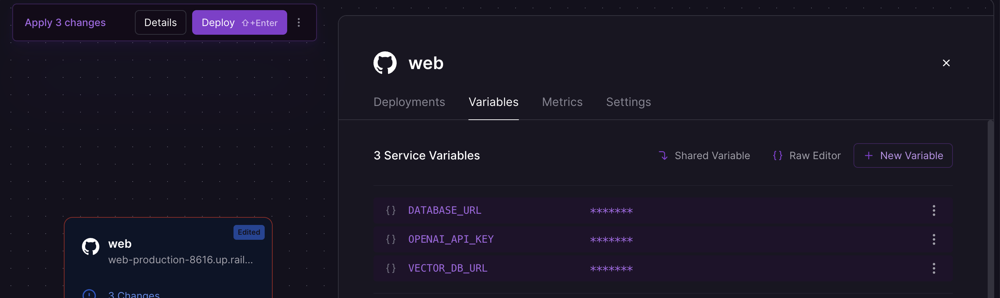

- push할 때마다 자동으로 재배포된다.
- Settings에 Networking 부분에 도메인 추가하는 버튼이 있음. AI랑 커스텀. 도메인 추가하고 포트 설정해주자(보통은 8080)

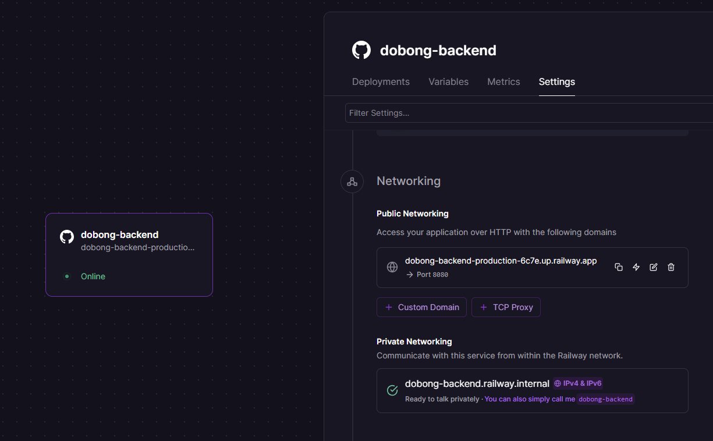

- 그러면 url이 나오게 되고, 그거 누르면 페이지 열림.
- 잘 열렸나 확인하기 위해 url/health 로 가서 ok 출력 되나 확인.

## Vercel

- frontend에 대한 프로젝트를 github에 업로드한다.

[Vercel: Build and deploy the best web experiences with the AI Cloud](https://vercel.com/)

- 회원가입 후 진행한다

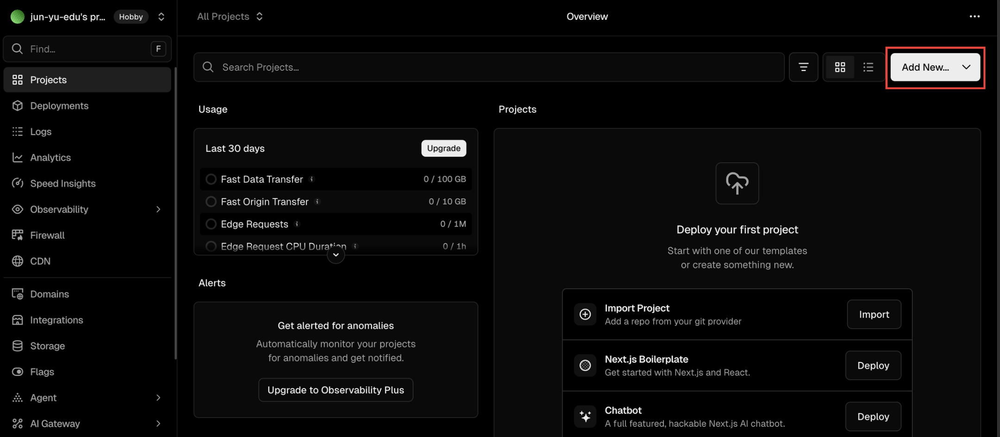

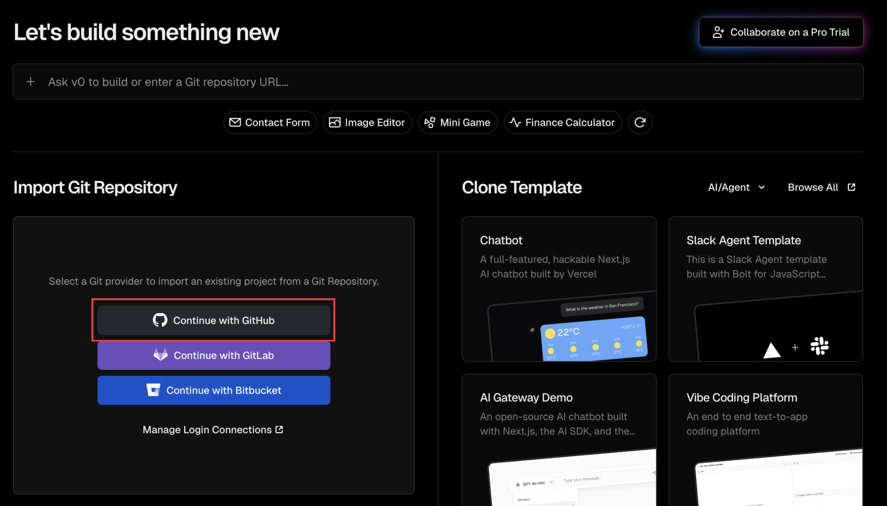

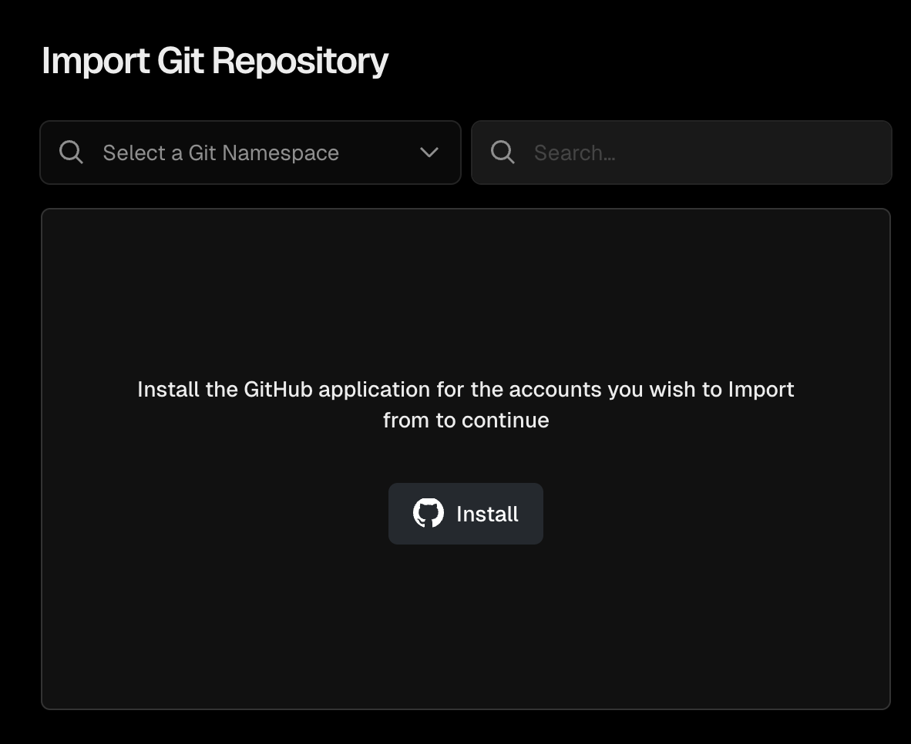

- repository를 연결해준다.
    - front 연결

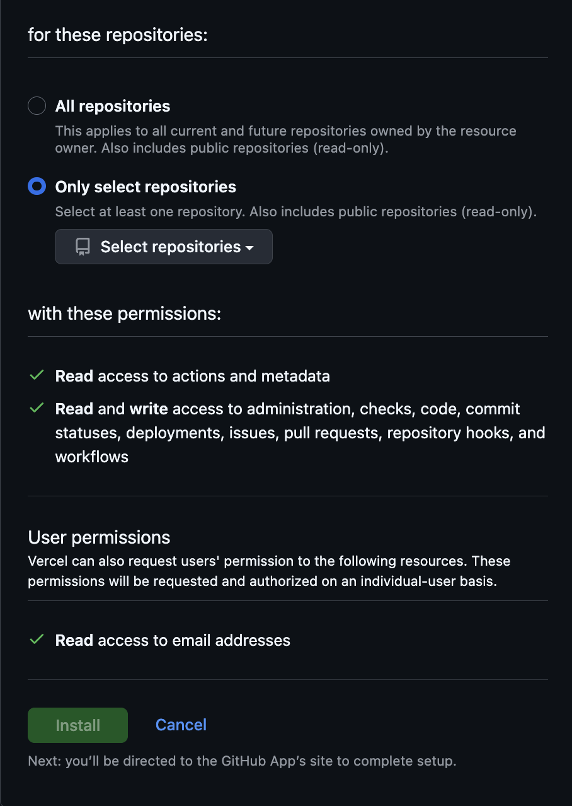

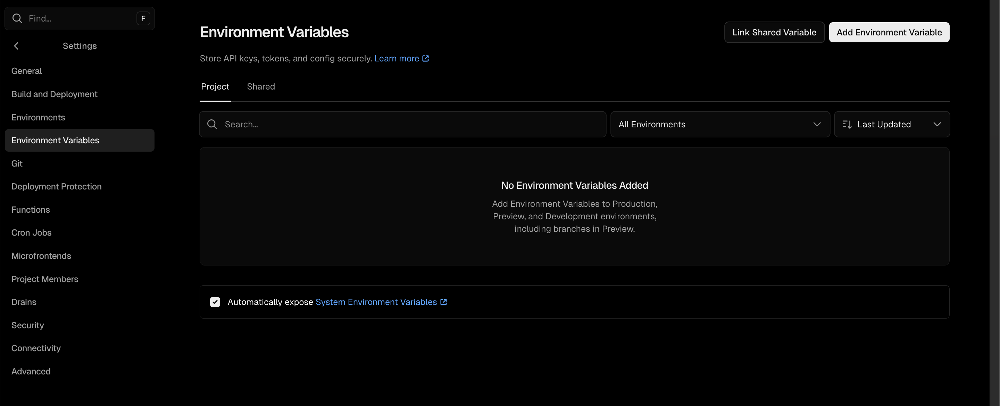

- backend에 대한 api를 연결해준다.
    - 환경 변수로 백엔드의 주소를 넣어줘야 한다.
    - 왼쪽 사이드 바에 설정 → **Environment Variables**
    - 환경 변수 추가.
    - https가 붙어있어야 하고, 뒤에 / 가 있으면 안된다.
    - `ex) https://dobong-backend-production-6c7e.up.railway.app`

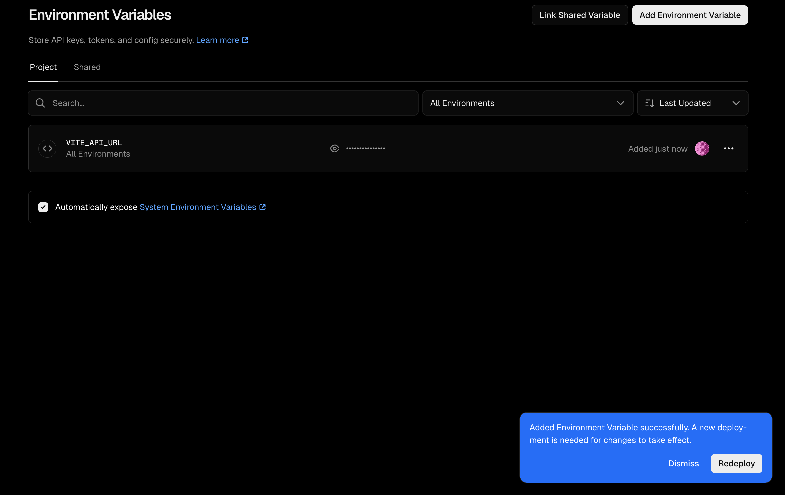

- push할 때마다 자동으로 재배포된다.